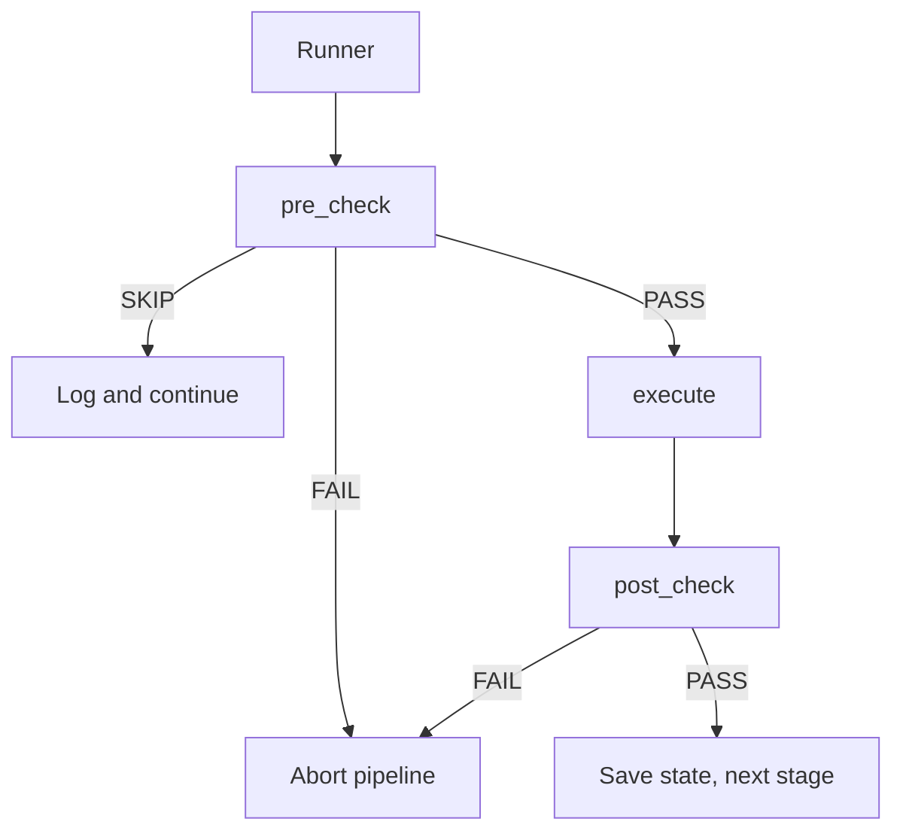
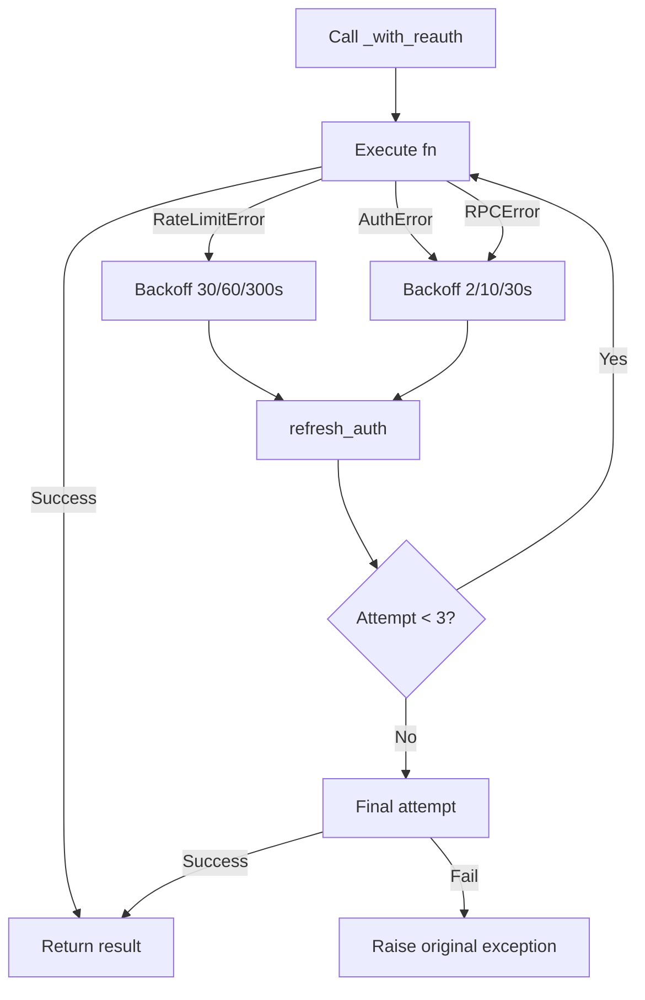
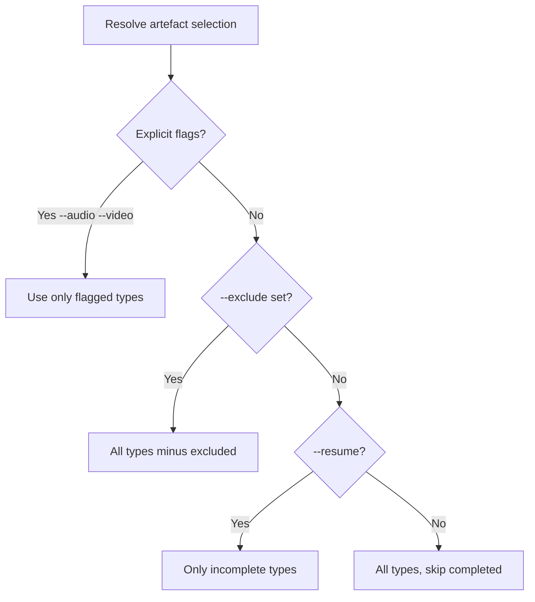
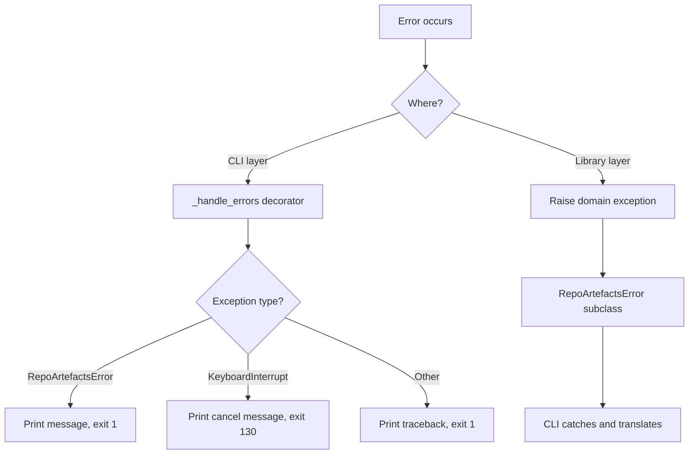

# Architecture Deep Dive — notebooklm-repo-artefacts

> Detailed walkthrough of key patterns, code snippets, and design decisions. Written for learning.

## 1. The Stage Pattern

### What Is It?

Each pipeline stage implements a three-phase gate: **pre-check → execute → post-check**. This is a form of the [Template Method pattern](https://en.wikipedia.org/wiki/Template_method_pattern) where the runner controls the flow but each stage provides its own logic.



### Why This Pattern?

| Problem | Solution |
|---------|----------|
| Expensive operations fail silently | Post-checks validate results |
| Missing prerequisites waste time | Pre-checks fail fast |
| Network failures mid-pipeline | State persistence enables resume |
| Conditional stages (e.g. cleanup) | SKIP status handles this cleanly |

### How It Works

The runner iterates through stages, calling each phase in order:

```python
# pipeline.py — simplified runner
for stage in ALL_STAGES:
    pre = stage.pre_check(ctx)
    if pre.status == Status.SKIP:
        console.print(f"Skipped: {pre.message}")
        continue
    if pre.status == Status.FAIL:
        console.print(f"Pre-check failed: {pre.message}")
        break  # Abort pipeline

    result = stage.execute(ctx)  # Do the work

    post = stage.post_check(ctx)
    if post.status == Status.FAIL:
        console.print(f"Post-check failed: {post.message}")
        break  # Abort pipeline

    ctx.save_state()  # Persist after each successful stage
```

### Concrete Example: CleanupStage

```python
class CleanupStage:
    name = "cleanup"

    def pre_check(self, ctx: PipelineContext) -> StageResult:
        # Gate 1: Should we even attempt cleanup?
        if ctx.keep_notebook:
            return StageResult(Status.SKIP, "Keeping notebook")
        if not ctx.state.notebook_id:
            return StageResult(Status.SKIP, "No notebook to clean up")

        # Only clean up if ALL artefacts completed (or quota-exhausted)
        acceptable = {"completed", "quota_exhausted"}
        all_done = all(
            ctx.state.artefacts.get(name) in acceptable
            for name in ARTEFACT_CONFIG
        )
        if not all_done:
            return StageResult(
                Status.SKIP,
                "Not all artefacts completed — keeping notebook for retry",
            )
        return StageResult(Status.PASS)

    def execute(self, ctx: PipelineContext) -> StageResult:
        # Phase 2: Actually delete the notebook
        asyncio.run(delete_notebook(ctx.state.notebook_id))
        return StageResult(Status.PASS, f"Deleted notebook {ctx.state.notebook_id}")

    def post_check(self, ctx: PipelineContext) -> StageResult:
        # Phase 3: Validate (nothing to validate here — deletion is fire-and-forget)
        return StageResult(Status.PASS)
```

**Key insight**: The pre-check does the heavy lifting here — it decides whether cleanup should happen at all. The execute phase is trivial. This is common for cleanup stages.

### The Context Object

`PipelineContext` is a dataclass that carries state between stages:

```python
@dataclass
class PipelineContext:
    repo_path: Path
    store_slug: str | None = None
    output_dir: Path = field(default_factory=lambda: Path("docs/artefacts"))
    keep_notebook: bool = False
    force_regen: bool = False
    dry_run: bool = False
    timeout: int = 900
    state: PipelineState = field(default_factory=PipelineState)
    state_path: Path = field(default_factory=lambda: Path(STATE_FILENAME))
    artefact_selection: list[str] | None = None

    # Set during execution
    pdf_path: Path | None = None
    md_path: Path | None = None
```

**Why a dataclass?** It's immutable by default (except for the `pdf_path`/`md_path` fields set during execution), type-safe, and self-documenting. Each stage reads what it needs and writes what it produces.

---

## 2. The Auth Retry Wrapper

### The Problem

NotebookLM uses Google auth cookies that expire after ~15 minutes. Generation can take 5-20 minutes per artefact. Without retry logic, any API call during a long generation could fail with a stale token.

### The Solution: `_with_reauth()`

```python
async def _with_reauth(
    client: NotebookLMClient,
    fn: Callable[[], Awaitable[T]],
    label: str = "",
) -> T:
    """Run an async call, refreshing auth/CSRF tokens on RPC errors."""
    last_exc: Exception | None = None
    backoffs = REAUTH_BACKOFF  # [2, 10, 30] seconds

    for attempt, wait in enumerate(backoffs, 1):
        try:
            return await fn()  # Try the operation
        except RateLimitError as e:
            last_exc = e
            bk = RATE_LIMIT_BACKOFF[min(attempt - 1, len(RATE_LIMIT_BACKOFF) - 1)]
            get_console().print(f"Rate limited — backoff {bk}s then re-auth")
            await asyncio.sleep(bk)
            await client.refresh_auth()
        except AuthError as e:
            last_exc = e
            get_console().print(f"Auth expired — refreshing")
            await asyncio.sleep(wait)
            await client.refresh_auth()
        except RPCError as e:
            last_exc = e
            get_console().print(f"RPC error: {e} — refreshing auth")
            await asyncio.sleep(wait)
            await client.refresh_auth()

    # Final attempt after all backoffs exhausted
    return await fn()
```

### How It Works



### Usage Pattern

Every API call is wrapped:

```python
# Instead of:
sources = await client.sources.list(notebook_id)

# We write:
sources = await _with_reauth(
    client,
    lambda: client.sources.list(notebook_id),
    "list sources",
)
```

**Why lambdas?** The wrapper needs to be able to retry the exact same operation. Using `lambda` defers execution so the wrapper can call it multiple times.

**Why the `label` parameter?** For debugging — it tells you which operation failed in the console output.

### The Lambda Capture Gotcha

When using lambdas in loops, you need to capture the loop variable:

```python
# WRONG — all lambdas capture the same variable
for artefact in artefacts:
    pending[artefact] = await _with_reauth(
        client,
        lambda: _request_artefact(client, notebook_id, artefact),  # BUG!
        artefact,
    )

# CORRECT — default argument captures the value
for artefact in artefacts:
    pending[artefact] = await _with_reauth(
        client,
        lambda a=artefact: _request_artefact(client, notebook_id, a),
        artefact,
    )
```

This is a classic Python closure gotcha. The `a=artefact` default argument captures the value at definition time, not at call time.

---

## 3. Generation with Upstream `wait_for_completion()`

### The Old Approach (Before Refactor)

```python
# OLD: Custom polling with raw array parsing
before = await _snapshot_artefact_ids(client, notebook_id)  # Snapshot all IDs
raw = await client.artifacts._list_raw(notebook_id)  # Private API!
parsed = _parse_raw_artefacts(raw)  # Manual parsing by array index

# Poll every 30s, checking if new IDs appeared
for label in pending:
    status = await _poll_by_type(client, notebook_id, label, before[label])
    if status == "completed":
        completed.add(label)
```

**Problems:**
- Used private `_list_raw()` API (breaks on upstream changes)
- Manual array parsing by index (fragile — VIDEO/SLIDES swap bug)
- Fixed 30s polling interval (slow)
- No media-readiness check (reported COMPLETED before URLs populated)

### The New Approach

```python
# NEW: Use upstream public API
status = await _request_artefact(client, notebook_id, "audio")
# status.task_id = "abc123"

final_status = await _with_reauth(
    client,
    lambda: client.artifacts.wait_for_completion(
        notebook_id,
        status.task_id,
        initial_interval=2.0,    # Start with 2s
        max_interval=10.0,       # Cap at 10s
        timeout=remaining_time,  # Respect overall timeout
    ),
    "wait audio",
)

if final_status.is_complete:
    completed.add("audio")
elif final_status.is_failed:
    # Handle failure
```

### What `wait_for_completion()` Does Internally

```python
# From upstream notebooklm-py
async def wait_for_completion(self, notebook_id, task_id, ...):
    current_interval = initial_interval  # 2.0s

    while True:
        status = await self.poll_status(notebook_id, task_id)

        if status.is_complete or status.is_failed:
            return status

        # Check timeout
        elapsed = loop.time() - start_time
        if elapsed > timeout:
            raise TimeoutError(...)

        # Sleep with exponential backoff
        sleep_duration = min(current_interval, remaining_time)
        await asyncio.sleep(sleep_duration)

        # Double the interval, capped at max_interval
        current_interval = min(current_interval * 2, max_interval)
```

**Polling intervals:** 2s → 4s → 8s → 10s → 10s → 10s → ...

### The Media-Readiness Check

Inside `poll_status()`, upstream checks if media URLs are actually populated:

```python
# If status=COMPLETED but URLs not ready, downgrade to PROCESSING
if status_code == ArtifactStatus.COMPLETED:
    if not self._is_media_ready(art, artifact_type):
        status_code = ArtifactStatus.PROCESSING  # Keep polling!
```

This prevents the "COMPLETED but download fails because URL is empty" bug.

---

## 4. Type-Safe Artefact Mapping

### The Old Approach (Fragile)

```python
class ArtefactType(IntEnum):
    AUDIO = 1
    SLIDES = 3       # Was VIDEO before upstream changed it!
    INFOGRAPHIC = 7
    VIDEO = 8        # Was 2 before!

NAME_TO_TYPE = {t.name.lower(): t for t in ArtefactType}
# {"audio": 1, "slides": 3, "infographic": 7, "video": 8}

# Usage: parse raw arrays by index
type_code = arr[2]  # Position 2 = type code
if type_code == ArtefactType.VIDEO:  # 8
    ...
```

**Problem:** When upstream changed VIDEO from 2 to 3, our hardcoded mapping was wrong. The VIDEO artefact was being treated as SLIDES.

### The New Approach (Stable)

```python
from notebooklm import ArtifactType  # str enum from upstream

NAME_TO_ARTIFACT_TYPE: dict[str, str] = {
    "audio": ArtifactType.AUDIO,       # "audio"
    "video": ArtifactType.VIDEO,       # "video"
    "slides": ArtifactType.SLIDE_DECK, # "slide_deck"
    "infographic": ArtifactType.INFOGRAPHIC,  # "infographic"
}

# Usage: type-filtered listing
artifacts = await client.artifacts.list(
    notebook_id,
    artifact_type=NAME_TO_ARTIFACT_TYPE["video"],
)
for art in artifacts:
    if art.is_failed:
        await client.artifacts.delete(notebook_id, art.id)
```

**Why this is stable:** `ArtifactType` is a str enum (`"audio"`, `"video"`, etc.) — it doesn't depend on integer codes that can change.

---

## 5. State Persistence for Resumability

### The State File

```json
{
  "repo_name": "my-project",
  "notebook_id": "abc123",
  "content_hash": "sha256:deadbeef...",
  "artefacts": {
    "audio": "completed",
    "video": "completed",
    "slides": "failed",
    "infographic": "completed"
  },
  "stages": {
    "collect": {"status": "pass", "at": "2026-04-04T10:00:00Z"},
    "upload": {"status": "pass", "at": "2026-04-04T10:01:00Z"},
    "generate": {"status": "fail", "at": "2026-04-04T10:15:00Z", "reason": "slides failed"}
  },
  "started_at": "2026-04-04T10:00:00Z",
  "updated_at": "2026-04-04T10:15:00Z"
}
```

### Load/Save Logic

```python
@dataclass
class PipelineState:
    repo_name: str = ""
    notebook_id: str = ""
    content_hash: str = ""
    artefacts: dict[str, str] = field(default_factory=dict)
    stages: dict[str, dict] = field(default_factory=dict)
    started_at: str = ""
    updated_at: str = ""

    def save(self, path: Path) -> None:
        self.updated_at = datetime.now(UTC).isoformat()
        path.write_text(json.dumps(asdict(self), indent=2))

    @classmethod
    def load(cls, path: Path) -> "PipelineState":
        if not path.exists():
            return cls()  # Empty state — start fresh
        try:
            data = json.loads(path.read_text())
            return cls(**{k: v for k, v in data.items() if k in cls.__dataclass_fields__})
        except (json.JSONDecodeError, TypeError):
            return cls()  # Corrupted — start fresh
```

**Key design decisions:**
- **Graceful degradation**: Missing or corrupted state file = start fresh (no crash)
- **Unknown keys ignored**: Future versions can add fields without breaking old state files
- **Atomic saves**: Write complete JSON, not incremental updates

### Resume Logic

```python
# In run_pipeline()
state = PipelineState.load(state_path) if resume else PipelineState()

for stage in ALL_STAGES:
    if resume and state.stage_status(stage.name) == "pass":
        console.print(f"  [dim]Stage {stage.name} already passed — skipping[/dim]")
        continue

    # Execute the stage...
```

---

## 6. Artefact Selection Modes

The pipeline supports four ways to select which artefacts to generate:



### Code Implementation

```python
# cli.py — resolve selection
selected = [a for a, flag in [("audio", audio), ("video", video), ...] if flag]

if selected:
    artefact_selection = selected  # Explicit: only these
elif exclude:
    artefact_selection = [a for a in ALL_ARTEFACTS if a not in bad]  # Exclude
else:
    artefact_selection = None  # All types

# pipeline.py — GenerateStage uses it
target = ctx.artefact_selection or list(ARTEFACT_CONFIG)

# notebooklm.py — generate_artefacts filters completed
already_completed = await get_completed_artefacts(notebook_id)
to_generate = [a for a in artefacts if a not in already_completed]
```

---

## 7. The Download Flow

```python
async def download_artefacts(notebook_id: str, output_dir: Path) -> None:
    async with await NotebookLMClient.from_storage() as client:
        for label, list_method, dl_method, filename in _DOWNLOAD_SPECS:
            # 1. List artefacts of this type
            items = await getattr(client.artifacts, list_method)(notebook_id)

            # 2. Filter to completed ones
            ready = [i for i in items if i.is_completed]
            if not ready:
                continue

            # 3. Download (handle multiples with numbered suffixes)
            if len(ready) == 1:
                path = str(output_dir / filename)
                await getattr(client.artifacts, dl_method)(
                    notebook_id, path, artifact_id=ready[0].id
                )
            else:
                stem, ext = filename.rsplit(".", 1)
                for i, artifact in enumerate(ready, 1):
                    path = str(output_dir / f"{stem}_{i:02d}.{ext}")
                    await getattr(client.artifacts, dl_method)(
                        notebook_id, path, artifact_id=artifact.id
                    )
```

**Why `getattr`?** The download specs are data-driven:

```python
_DOWNLOAD_SPECS = [
    ("audio", "list_audio", "download_audio", "audio_overview.mp3"),
    ("video", "list_video", "download_video", "video_overview.mp4"),
    ("slides", "list_slide_decks", "download_slide_deck", "slides.pdf"),
    ("infographic", "list_infographics", "download_infographic", "infographic.png"),
]
```

This avoids repeating the same logic four times. Adding a new artefact type is just adding a tuple.

---

## 8. Error Handling Strategy



### Domain Exceptions

```python
class RepoArtefactsError(Exception):
    """Base for all errors — catch this to handle any error."""

class GitRemoteError(RepoArtefactsError):
    """Could not determine org/repo from git remote."""

class CollectionError(RepoArtefactsError):
    """Failed to collect repository content."""

class StoreError(RepoArtefactsError):
    """Error during artefact store operations."""
```

### CLI Error Handler

```python
def _handle_errors(fn):
    @functools.wraps(fn)
    def wrapper(*args, **kwargs):
        try:
            return fn(*args, **kwargs)
        except KeyboardInterrupt:
            get_console().print("\n[yellow]Cancelled.[/yellow]")
            raise typer.Exit(130)
        except RepoArtefactsError as e:
            get_console().print(f"[red]Error: {e}[/red]")
            raise typer.Exit(1)
        except Exception:
            get_console().print_exception()
            raise typer.Exit(1)
    return wrapper
```

**Why this pattern?**
- Library code raises typed exceptions (testable, composable)
- CLI layer translates to user-friendly output + exit codes
- `KeyboardInterrupt` handled separately for clean Ctrl+C
- `RepoArtefactsError` base class means one `except` clause catches all domain errors
