# Architecture Deep Dive

> Educational reference for understanding the repo-artefacts codebase.
> Includes diagrams, code patterns, and design rationale.

---

## Table of Contents

1. [System Overview](#1-system-overview)
2. [Pipeline Architecture](#2-pipeline-architecture)
3. [Stage Design Pattern](#3-stage-design-pattern)
4. [Module Relationships](#4-module-relationships)
5. [Data Flow](#5-data-flow)
6. [State Persistence](#6-state-persistence)
7. [Error Handling Strategy](#7-error-handling-strategy)
8. [Testing Strategy](#8-testing-strategy)
9. [Design Patterns Used](#9-design-patterns-used)
10. [Collector Architecture](#10-collector-architecture)
11. [Notebook Lifecycle Management](#11-notebook-lifecycle-management)
12. [Retry and Timeout Strategy](#12-retry-and-timeout-strategy)
13. [Target Architecture Improvements](#13-target-architecture-improvements)

---

## 1. System Overview

### What This Tool Does

```
┌─────────────────────────────────────────────────────────────────────┐
│                        repo-artefacts CLI                           │
│                                                                     │
│  Input: Any git repository                                          │
│  Output: Audio, Video, Slides, Infographic artefacts via NotebookLM │
│  Publish: GitHub Pages or centralised artefact store                │
└─────────────────────────────────────────────────────────────────────┘
```

### High-Level Component Diagram

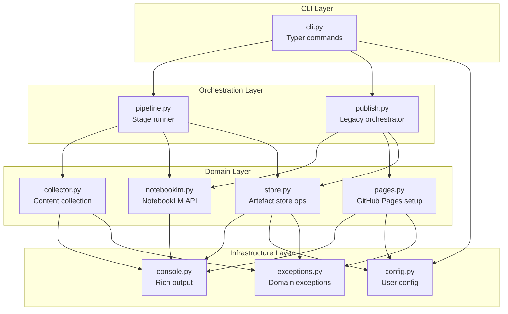

### Why This Layering?

**Teaching moment**: Layered architecture separates concerns so each layer has a single responsibility. The CLI layer handles user input/output, the orchestration layer coordinates workflow, the domain layer contains business logic, and the infrastructure layer provides shared utilities. This means you can swap out the CLI (e.g., build a web interface) without touching domain logic.

---

## 2. Pipeline Architecture

### The Stage-Based Pipeline

The pipeline is the recommended entry point. It runs 9 stages sequentially, each with three gates:

```mermaid
stateDiagram-v2
    [*] --> CollectStage

    state CollectStage {
        [*] --> pre_check
        pre_check --> execute: PASS
        pre_check --> [*]: FAIL/SKIP
        execute --> post_check
        post_check --> [*]: PASS
        post_check --> [*]: FAIL
    }

    CollectStage --> UploadStage: PASS
    CollectStage --> [*]: FAIL/SKIP

    state UploadStage {
        [*] --> pre_check
        pre_check --> execute: PASS
        pre_check --> [*]: FAIL/SKIP
        execute --> post_check
        post_check --> [*]: PASS
        post_check --> [*]: FAIL
    }

    UploadStage --> GenerateStage: PASS
    UploadStage --> [*]: FAIL/SKIP

    state GenerateStage {
        [*] --> pre_check
        pre_check --> execute: PASS
        pre_check --> [*]: FAIL/SKIP
        execute --> post_check
        post_check --> [*]: PASS
        post_check --> [*]: FAIL
    }

    GenerateStage --> DownloadStage: PASS
    GenerateStage --> [*]: FAIL/SKIP

    state DownloadStage {
        [*] --> pre_check
        pre_check --> execute: PASS
        pre_check --> [*]: FAIL/SKIP
        execute --> post_check
        post_check --> [*]: PASS
        post_check --> [*]: FAIL
    }

    DownloadStage --> PublishBranch
    DownloadStage --> LocalPublishBranch

    state PublishBranch <<choice>>
    state LocalPublishBranch <<choice>>

    PublishBranch --> PublishStage: store_slug set
    PublishBranch --> [*]: no store

    state PublishStage {
        [*] --> pre_check
        pre_check --> execute: PASS
        pre_check --> [*]: FAIL/SKIP
        execute --> post_check
        post_check --> [*]
    }

    PublishStage --> VerifyStage

    state VerifyStage {
        [*] --> pre_check
        pre_check --> execute: PASS
        pre_check --> [*]: FAIL/SKIP
        execute --> post_check
        post_check --> [*]
    }

    VerifyStage --> ReadmeStage

    state ReadmeStage {
        [*] --> pre_check
        pre_check --> execute: PASS
        pre_check --> [*]: FAIL/SKIP
        execute --> post_check
        post_check --> [*]
    }

    ReadmeStage --> CleanupStage

    LocalPublishBranch --> LocalPublishStage: no store_slug
    LocalPublishBranch --> [*]: store set

    state LocalPublishStage {
        [*] --> pre_check
        pre_check --> execute: PASS
        pre_check --> [*]: FAIL/SKIP
        execute --> post_check
        post_check --> [*]
    }

    LocalPublishStage --> LocalVerifyStage

    state LocalVerifyStage {
        [*] --> pre_check
        pre_check --> execute: PASS
        pre_check --> [*]: FAIL/SKIP
        execute --> post_check
        post_check --> [*]
    }

    LocalVerifyStage --> CleanupStage

    state CleanupStage {
        [*] --> pre_check
        pre_check --> execute: PASS
        pre_check --> [*]: FAIL/SKIP
        execute --> post_check
        post_check --> [*]
    }

    CleanupStage --> [*]
```

### Simplified Pipeline Flow (Linear View)

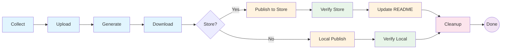

**Color key**:
- 🔵 Blue = Content processing (collect, upload, generate, download)
- 🟠 Orange = Publishing (store or local)
- 🟢 Green = Verification
- 🟡 Yellow = Metadata updates (README)
- 🔴 Pink = Cleanup
- 🟣 Purple = Terminal state

### Each Stage Has Three Gates

```python
# pipeline.py — the gate pattern
class CollectStage:
    name = "collect"

    def pre_check(self, ctx: PipelineContext) -> StageResult:
        """Validate prerequisites BEFORE execution."""
        if not ctx.repo_path.exists():
            return StageResult(Status.FAIL, "Repo path does not exist")
        if not (ctx.repo_path / ".git").is_dir():
            return StageResult(Status.FAIL, "Not a git repo")
        return StageResult(Status.PASS)

    def execute(self, ctx: PipelineContext) -> StageResult:
        """Do the actual work. Return PASS/FAIL/SKIP."""
        ctx.output_dir.mkdir(parents=True, exist_ok=True)
        md_path = ctx.output_dir / f"{ctx.state.repo_name}_content.md"
        collect_repo_content(ctx.repo_path, md_path)
        pdf_path = render_to_pdf(md_path)
        ctx.pdf_path = pdf_path
        return StageResult(Status.PASS, f"Collected {pdf_path.stat().st_size / 1024:.1f} KB")

    def post_check(self, ctx: PipelineContext) -> StageResult:
        """Validate outcomes AFTER execution."""
        if ctx.pdf_path and ctx.pdf_path.exists() and ctx.pdf_path.stat().st_size > 0:
            return StageResult(Status.PASS)
        return StageResult(Status.FAIL, "PDF not created or empty")
```

**Teaching moment**: This is the **Gateway Pattern** (also called **Validation Gate Pattern**). Each stage has three phases:
1. **Pre-check**: "Do we have everything we need to run?" — validates inputs, prerequisites, skip conditions
2. **Execute**: "Do the work" — performs the actual operation
3. **Post-check**: "Did the work succeed?" — validates outputs, side effects, invariants

This pattern makes failures easy to diagnose because you know exactly which phase failed and why. It also enables the `--resume` feature — if a stage's pre-check passes but execute hasn't run, you know where to resume from.

### The Runner Loop

```python
# pipeline.py:635-691 — simplified runner
for stage in ALL_STAGES:
    # Dry run: skip everything
    if dry_run:
        console.print(f"  [dim]Would execute: {stage.name}[/dim]")
        ctx.state.set_stage(stage.name, "dry_run")
        continue

    # Gate 1: Pre-check
    pre = stage.pre_check(ctx)
    if pre.status == Status.SKIP:
        ctx.state.set_stage(stage.name, "skipped", reason=pre.message)
        ctx.save_state()
        continue
    if pre.status == Status.FAIL:
        ctx.state.set_stage(stage.name, "failed", reason=pre.message)
        ctx.save_state()
        all_passed = False
        break  # ← Stop the pipeline on first failure

    # Gate 2: Execute
    try:
        result = stage.execute(ctx)
    except Exception as e:
        ctx.state.set_stage(stage.name, "error", error=str(e))
        ctx.save_state()
        all_passed = False
        break

    if result.status == Status.FAIL:
        ctx.state.set_stage(stage.name, "failed", reason=result.message)
        ctx.save_state()
        all_passed = False
        break

    # Gate 3: Post-check
    post = stage.post_check(ctx)
    if post.status == Status.FAIL:
        ctx.state.set_stage(stage.name, "post_check_failed", reason=post.message)
        ctx.save_state()
        all_passed = False
        break

    # Success: record and persist
    ctx.state.set_stage(stage.name, "pass", **result.data)
    ctx.save_state()
```

**Teaching moment**: Notice the `break` on every failure path. This is **fail-fast** behaviour — the pipeline stops at the first problem rather than continuing and potentially causing cascading failures. The state is persisted after every stage, so `--resume` can pick up exactly where it left off.

---

## 3. Stage Design Pattern

### The Stage Protocol

Every stage implements the same interface (a **protocol** in Python typing terms):

```python
# Implicit protocol — all stages must have these:
class StageProtocol(Protocol):
    name: str

    def pre_check(self, ctx: PipelineContext) -> StageResult: ...
    def execute(self, ctx: PipelineContext) -> StageResult: ...
    def post_check(self, ctx: PipelineContext) -> StageResult: ...
```

**Teaching moment**: Python doesn't enforce interfaces like Java or TypeScript. Instead, it uses **duck typing** — "if it walks like a duck and quacks like a duck, it's a duck." The `ALL_STAGES` list works because every stage class has `name`, `pre_check`, `execute`, and `post_check`. You could add a formal `Protocol` from `typing` for IDE support, but it's not required for runtime correctness.

### Stage Result Types

```python
class Status(StrEnum):
    PASS = "pass"       # Gate succeeded
    FAIL = "fail"       # Gate failed — pipeline stops
    SKIP = "skip"       # Conditionally skipped — pipeline continues
    RETRY = "retry"     # Transient failure — could retry (not yet used)


@dataclass
class StageResult:
    status: Status
    message: str = ""
    data: dict[str, Any] = field(default_factory=dict)
```

**Teaching moment**: Using `StrEnum` instead of plain `Enum` means the values serialize to JSON as strings automatically (`"pass"` not `Status.PASS`). This is important because `PipelineState` saves to JSON. The `data` dict carries stage-specific information (file paths, notebook IDs, URLs) that downstream stages or the resume mechanism might need.

### Stage Dependency Diagram

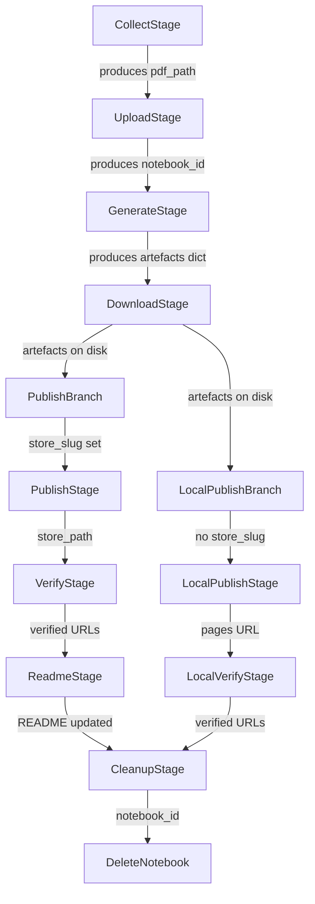

---

## 4. Module Relationships

### Import Dependency Graph

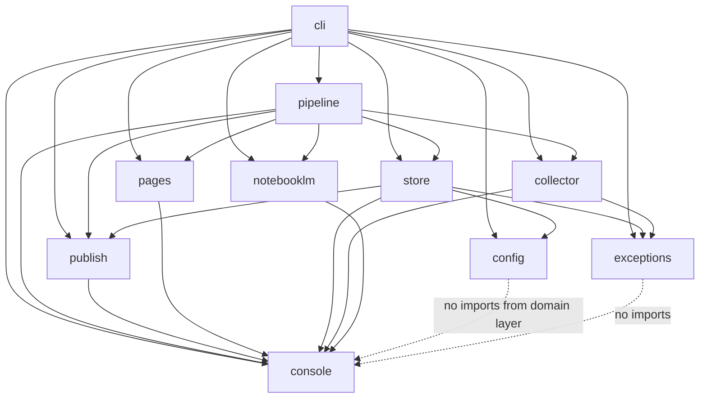

**Teaching moment**: Notice the **dependency direction**. The CLI layer depends on everything (it's the entry point). The domain layer modules (`collector`, `notebooklm`, `pages`, `store`) depend on infrastructure (`console`, `exceptions`, `config`) but NOT on each other — except `store` which depends on `publish` for `check_artefacts()`. This is mostly a **clean architecture** pattern where dependencies point inward. The `store → publish` dependency is a minor violation that could be fixed by moving `check_artefacts()` to a shared utilities module.

### Module Responsibility Matrix

| Module | Responsibility | Depends On | Used By |
|--------|---------------|------------|---------|
| `cli.py` | User interface, argument parsing, command routing | All modules | User |
| `pipeline.py` | Stage orchestration, state persistence, resume logic | collector, notebooklm, store, pages, publish | cli |
| `collector.py` | Scan git repo, collect files, render PDF | console, exceptions | cli, pipeline |
| `notebooklm.py` | NotebookLM API: upload, generate, download, manage | console, upstream `notebooklm-py` | cli, pipeline |
| `pages.py` | GitHub Pages setup, README injection, token resolution | console, config | cli, pipeline, publish |
| `store.py` | Artefact store: clone, publish, manifest, cleanup | console, config, publish, exceptions | cli, pipeline |
| `publish.py` | Artefact checking, page verification, git commit/push | console | cli, pipeline, store |
| `config.py` | User config load/save | None | cli, pages, store |
| `exceptions.py` | Domain exception hierarchy | None | cli, collector, store |
| `console.py` | Shared Rich console singleton | rich | All modules |

---

## 5. Data Flow

### End-to-End Data Flow

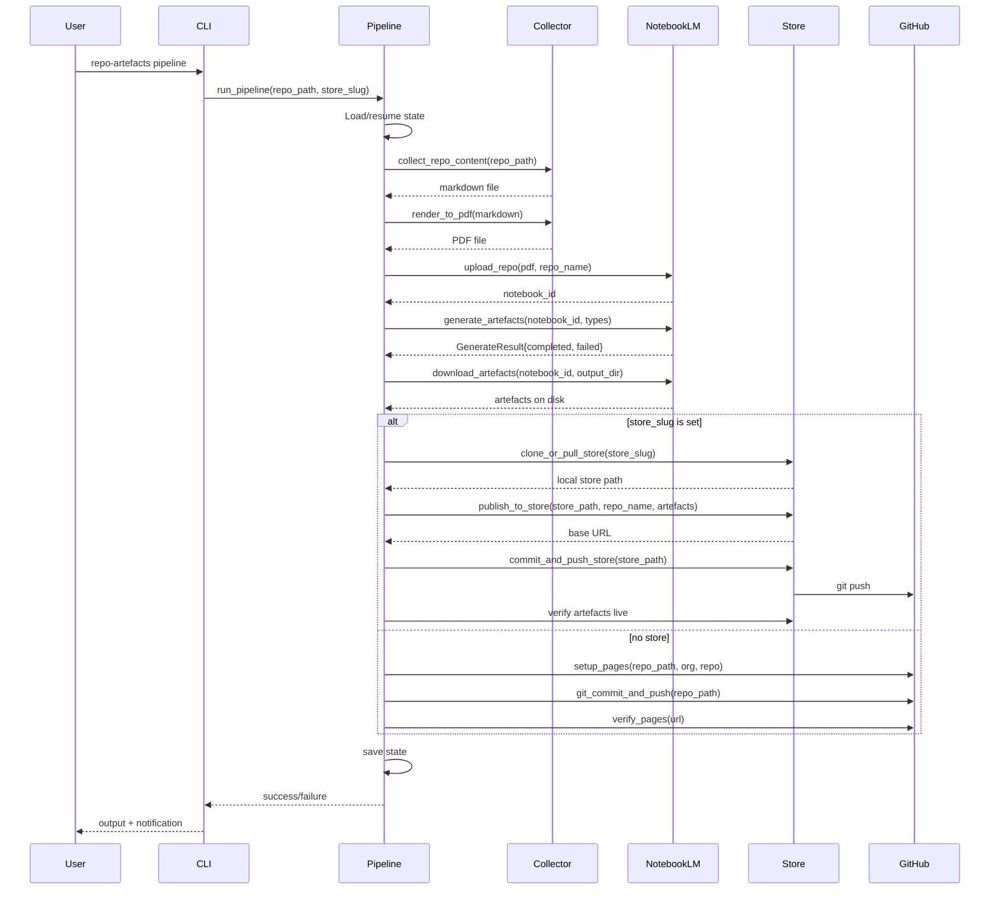

### Artefact Data Flow

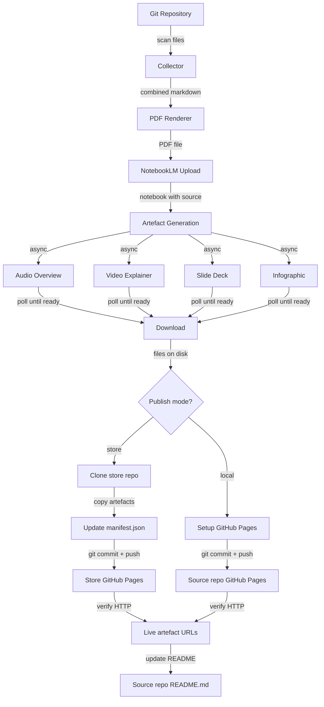

---

## 6. State Persistence

### Pipeline State JSON Structure

```json
{
  "repo_name": "my-project",
  "notebook_id": "abc123def456",
  "content_hash": "e3b0c44298fc1c149afbf4c8996fb924...",
  "source_replaced": true,
  "stages": {
    "collect": {
      "status": "pass",
      "at": "2026-04-04T10:30:00+00:00",
      "duration_s": 3.2,
      "pdf_path": "/path/to/docs/artefacts/my-project_content.pdf",
      "content_hash": "e3b0c44298fc..."
    },
    "upload": {
      "status": "pass",
      "at": "2026-04-04T10:30:05+00:00",
      "duration_s": 5.1,
      "notebook_id": "abc123def456",
      "source_replaced": true
    },
    "generate": {
      "status": "pass",
      "at": "2026-04-04T10:35:00+00:00",
      "duration_s": 295.0,
      "completed": ["audio", "video", "slides", "infographic"]
    }
  },
  "artefacts": {
    "audio": "completed",
    "video": "completed",
    "slides": "completed",
    "infographic": "quota_exhausted"
  },
  "started_at": "2026-04-04T10:29:55+00:00",
  "updated_at": "2026-04-04T10:35:00+00:00"
}
```

### State Machine Diagram

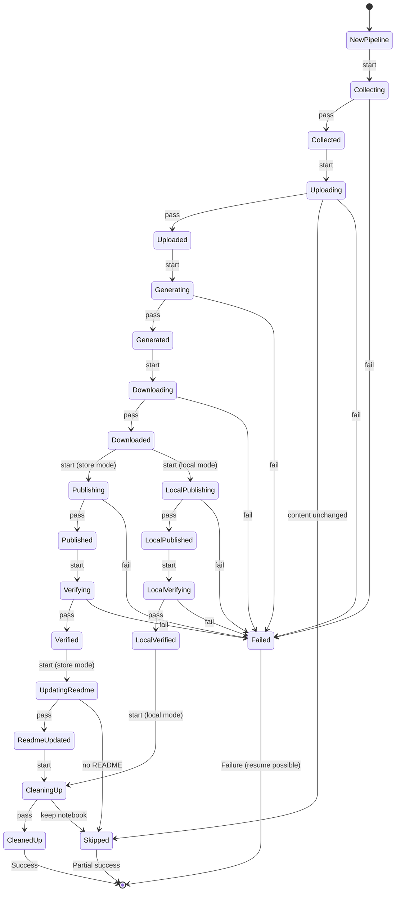

### Resume Logic

```python
# How --resume works:
# 1. Load previous state from .pipeline-state.json
# 2. For each stage, check if it already has a "pass" status
# 3. If yes, the pre_check will SKIP it (content hash match, notebook exists, etc.)
# 4. If no, the stage runs normally

# Example: resume after generate failure
# State shows: collect=pass, upload=pass, generate=failed
# On resume:
#   - collect: pre_check passes, but upload already has notebook_id → could skip
#   - upload: pre_check sees content_hash match → SKIP
#   - generate: pre_check passes (notebook_id exists) → RUN
#   - download+: run normally
```

**Teaching moment**: The resume mechanism doesn't explicitly skip stages by checking the state file in the runner. Instead, each stage's `pre_check` method encodes the logic for whether it should run. For example, `UploadStage.pre_check` compares the current PDF's content hash against the stored hash — if they match, it returns `SKIP`. This is **decentralised skip logic** — each stage decides for itself whether it needs to run. The alternative would be **centralised skip logic** in the runner, which would need to know the internals of every stage.

---

## 7. Error Handling Strategy

### Exception Hierarchy

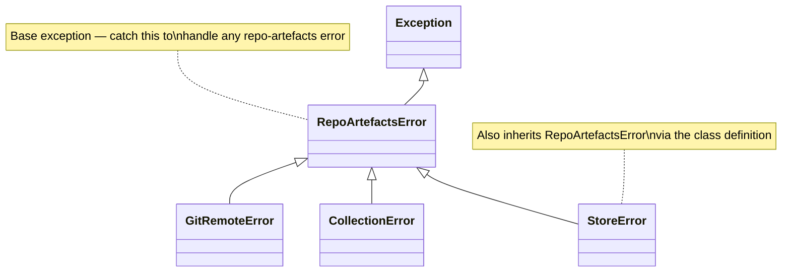

```python
# exceptions.py
class RepoArtefactsError(Exception):
    """Base exception for all repo-artefacts errors."""

class GitRemoteError(RepoArtefactsError):
    """Could not determine GitHub org/repo from git remote."""

class CollectionError(RepoArtefactsError):
    """Failed to collect repository content."""

# store.py
class StoreError(RepoArtefactsError):
    """Error during artefact store operations."""
```

### Error Flow Through Layers

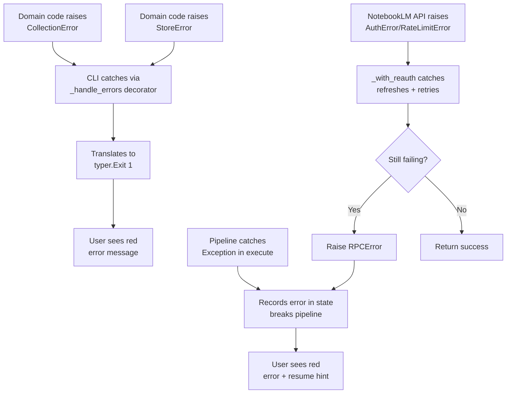

### The Error Handler Decorator

```python
# cli.py — decorator pattern
def _handle_errors(func):
    """Decorator: catch domain exceptions and translate to typer.Exit."""
    @functools.wraps(func)
    def wrapper(*args, **kwargs):
        try:
            return func(*args, **kwargs)
        except RepoArtefactsError as exc:
            get_console().print(f"[red]Error:[/red] {exc}")
            raise typer.Exit(code=1) from exc
    return wrapper
```

**Teaching moment**: This is the **Decorator Pattern** — it wraps functions to add cross-cutting behaviour (error handling) without modifying the functions themselves. `@functools.wraps(func)` preserves the original function's name and docstring, which is important for Typer's help text. The `from exc` in `raise typer.Exit(code=1) from exc` preserves the exception chain so the original traceback is available for debugging.

### NotebookLM Retry Strategy

```python
# notebooklm.py — handles three failure modes:
#
# 1. AuthError: stale CSRF/session → refresh_auth + quick retry
# 2. RateLimitError: throttled → exponential backoff then refresh + retry
# 3. Other RPCError: transient server issue → refresh + retry
#
# Backoff schedules:
#   REAUTH_BACKOFF = [2, 10, 30]        # seconds between re-auth retries
#   RATE_LIMIT_BACKOFF = [30, 60, 300]  # escalating backoff for rate limits

async def _with_reauth(client, fn, label=""):
    last_exc = None
    for attempt, wait in enumerate(REAUTH_BACKOFF, 1):
        try:
            return await fn()
        except RateLimitError as e:
            last_exc = e
            bk = RATE_LIMIT_BACKOFF[min(attempt - 1, len(RATE_LIMIT_BACKOFF) - 1)]
            await asyncio.sleep(bk)
            await client.refresh_auth()
        except AuthError as e:
            last_exc = e
            await asyncio.sleep(wait)
            await client.refresh_auth()
        except RPCError as e:
            last_exc = e
            await asyncio.sleep(wait)
            await client.refresh_auth()

    # Final attempt after all backoffs exhausted
    return await fn()  # May raise — caller handles it
```

**Teaching moment**: This is the **Retry Pattern** with **exponential backoff**. The key insight is that different error types need different strategies:
- **AuthError**: The session token expired — refresh and retry immediately (short backoff)
- **RateLimitError**: The server is throttling — wait longer before retrying (longer backoff)
- **RPCError**: Could be transient — refresh auth and retry (medium backoff)

The `enumerate(REAUTH_BACKOFF, 1)` gives us `(1, 2), (2, 10), (3, 30)` — attempt number and wait time. After all retries are exhausted, there's one final attempt that lets the exception propagate to the caller.

---

## 8. Testing Strategy

### Test Pyramid

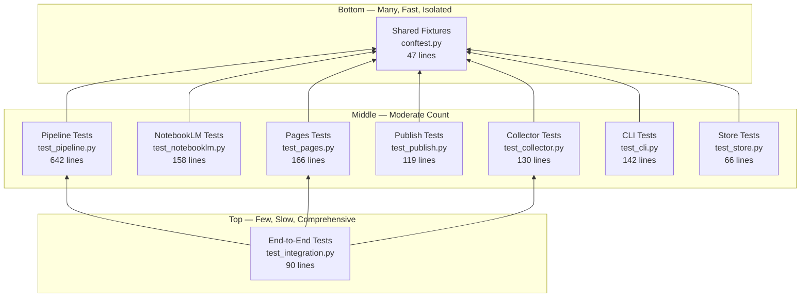

### Test Coverage by Module

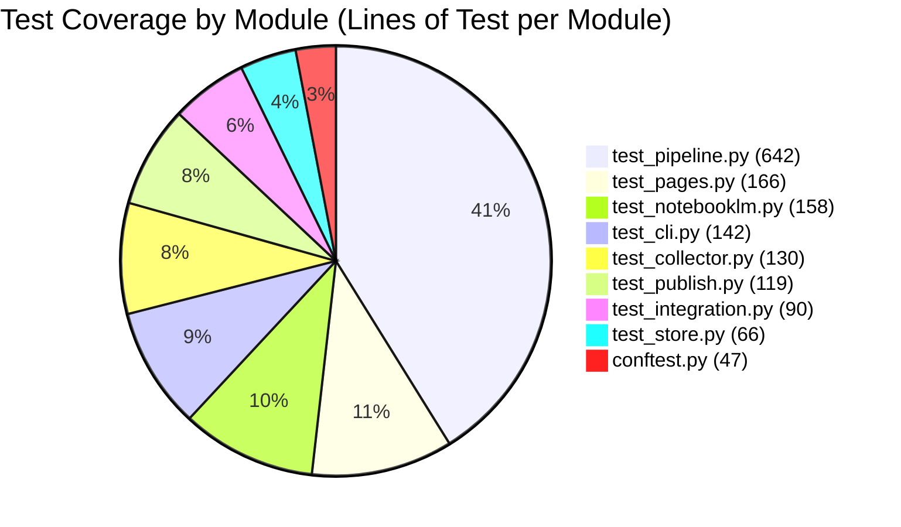

### What Gets Tested vs What Doesn't

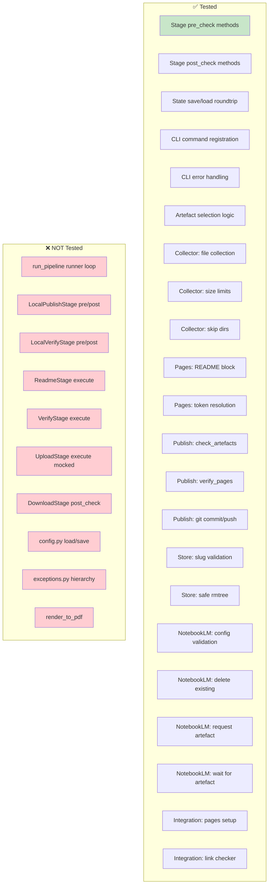

### Testing Patterns Used

```python
# Pattern 1: Factory fixture (conftest.py)
@pytest.fixture
def make_repo(tmp_path: Path) -> Callable[[dict[str, str]], Path]:
    def _make(files: dict[str, str]) -> Path:
        repo = tmp_path / "repo"
        repo.mkdir(exist_ok=True)
        (repo / ".git").mkdir(exist_ok=True)
        for name, content in files.items():
            p = repo / name
            p.parent.mkdir(parents=True, exist_ok=True)
            p.write_text(content)
        return repo
    return _make

# Usage:
def test_collects_readme(make_repo):
    repo = make_repo({"README.md": "# Hello\n\nWorld."})
    out = repo / "out.md"
    collect_repo_content(repo, out)
    assert "# Hello" in out.read_text()


# Pattern 2: Pre-built fixture (conftest.py)
@pytest.fixture
def artefacts_repo(tmp_path: Path) -> Path:
    repo = tmp_path / "repo"
    repo.mkdir()
    (repo / ".git").mkdir()
    arts = repo / "docs" / "artefacts"
    arts.mkdir(parents=True)
    (arts / "audio_overview.mp3").write_bytes(b"fake-audio")
    # ... more artefacts
    return repo


# Pattern 3: Helper function with sensible defaults (test_pipeline.py)
def _make_ctx(tmp_path, *, repo_path=None, store_slug=None, ...):
    rp = repo_path or tmp_path / "repo"
    output_dir = rp / "docs" / "artefacts"
    output_dir.mkdir(parents=True, exist_ok=True)
    state = PipelineState(repo_name="test-repo", ...)
    return PipelineContext(repo_path=rp, state=state, ...)


# Pattern 4: Mocking external services (test_publish.py)
def test_verify_pages_success():
    mock_resp = MagicMock()
    mock_resp.status = 200
    with patch("urllib.request.urlopen", return_value=mock_resp):
        site_ok, _ = verify_pages("https://example.github.io/repo/artefacts/")
        assert site_ok


# Pattern 5: Parametrised tests (test_cli.py)
@pytest.mark.parametrize(
    "flags,expected_types",
    [
        ([], ["audio", "video", "slides", "infographic"]),
        (["--audio", "--video"], ["audio", "video"]),
        (["--exclude", "slides"], ["audio", "video", "infographic"]),
    ],
)
def test_artefact_selection_flags(flags, expected_types):
    # ... test logic
```

**Teaching moment**: These are five fundamental pytest patterns:
1. **Factory fixture**: Returns a function that creates test data with varying inputs. More flexible than a single pre-built fixture.
2. **Pre-built fixture**: Creates a complete test scenario. Faster when you always need the same setup.
3. **Helper function with defaults**: Like a factory but not a pytest fixture — useful when you need to create multiple contexts in a single test.
4. **Mocking**: Replace external dependencies (HTTP calls, subprocess) with controlled doubles. The `patch` context manager ensures cleanup.
5. **Parametrised tests**: Run the same test logic with different inputs. Reduces duplication and makes edge cases explicit.

---

## 9. Design Patterns Used

### Pattern Inventory

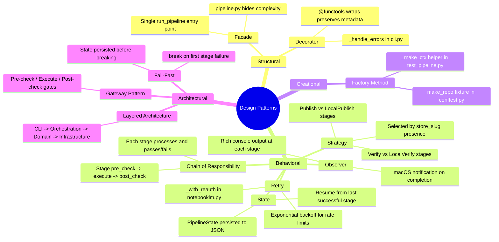

### The Gateway Pattern in Detail

```
┌─────────────────────────────────────────────────────────────┐
│                      Stage Execution                         │
│                                                              │
│   ┌──────────┐    ┌──────────┐    ┌──────────┐              │
│   │ Pre-Check│───▶│ Execute  │───▶│Post-Check│              │
│   │          │    │          │    │          │              │
│   │ Validate │    │ Do the   │    │ Validate │              │
│   │ inputs   │    │ work     │    │ outputs  │              │
│   │ Skip if  │    │          │    │ Invariant│              │
│   │ not needed│   │          │    │ checks   │              │
│   └──────────┘    └──────────┘    └──────────┘              │
│        │               │               │                    │
│        ▼               ▼               ▼                    │
│   PASS/FAIL/SKIP   PASS/FAIL      PASS/FAIL                │
│                                                              │
│   Any FAIL → pipeline breaks, state saved, user notified    │
└─────────────────────────────────────────────────────────────┘
```

**Teaching moment**: The Gateway Pattern is named because each gate acts as a checkpoint that either allows passage to the next phase or blocks progress. It's similar to the **Circuit Breaker** pattern in distributed systems, but applied to sequential pipeline stages rather than network calls.

### Why Not Use a Formal Abstract Base Class?

```python
# What we COULD do (but don't):
from abc import ABC, abstractmethod

class BaseStage(ABC):
    name: str

    @abstractmethod
    def pre_check(self, ctx: PipelineContext) -> StageResult: ...

    @abstractmethod
    def execute(self, ctx: PipelineContext) -> StageResult: ...

    @abstractmethod
    def post_check(self, ctx: PipelineContext) -> StageResult: ...

# What we DO instead:
class CollectStage:
    name = "collect"
    def pre_check(self, ctx): ...
    def execute(self, ctx): ...
    def post_check(self, ctx): ...
```

**Teaching moment**: Python's **duck typing** means we don't need a formal base class. The runner iterates over `ALL_STAGES` and calls `.pre_check(ctx)`, `.execute(ctx)`, `.post_check(ctx)` on each. If a stage is missing a method, you get an `AttributeError` at runtime — which is caught by the runner's `except Exception` handler and reported as a stage error. An ABC would give you a clearer error at class definition time, but the current approach is simpler and works fine because the test `test_all_stages_have_required_methods` catches missing methods.

---

## 10. Collector Architecture

### Pattern-Based File Collection

The collector uses a **priority-based pattern matching system** instead of hardcoded paths. Each rule defines globs, include/exclude regexes, and a priority level.

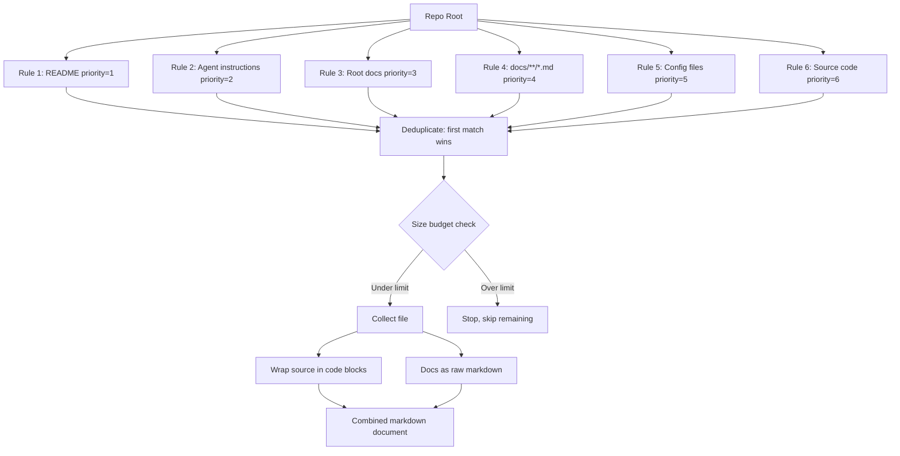

### Collection Rules

```python
# collector.py — pattern-based collection rules
@dataclass
class CollectionPattern:
    name: str
    globs: list[str]              # Glob patterns relative to repo root
    include_regex: list[str]      # Must match (after glob)
    exclude_regex: list[str]      # Exclude even if glob matches
    max_lines: int | None = None  # Per-file line limit
    priority: int = 10            # Lower = collected first

COLLECTION_RULES: list[CollectionPattern] = [
    CollectionPattern(
        name="README",
        globs=["README.md", "README.rst", "README.txt", "README"],
        priority=1,
    ),
    CollectionPattern(
        name="Agent instructions",
        globs=["AGENTS.md", "CLAUDE.md", "GEMINI.md", "CODING.md"],
        priority=2,
    ),
    CollectionPattern(
        name="Documentation",
        globs=["docs/**/*.md"],
        exclude_regex=[
            r"^docs/internal/",   # Brainstorming noise
            r"^docs/research/",   # Research notes
            r"^docs/brainstorming/",
        ],
        priority=4,
    ),
    CollectionPattern(
        name="Source code",
        globs=["packages/*/src/**/*", "src/**/*"],  # Monorepo support
        include_regex=[r"\.(py|ts|js|rs|java|go|rb)$"],
        exclude_regex=[
            r"test_", r"/tests/",   # Skip test files
            r"/migrations/",        # Skip generated files
        ],
        max_lines=500,
        priority=6,
    ),
]
```

**Teaching moment**: This is the **Specification Pattern** — each `CollectionPattern` is a reusable specification that combines multiple matching criteria (globs + regexes + priority). The collector evaluates all rules in priority order, deduplicating so each file is only collected once. This is far more flexible than the old approach of hardcoding `src/` and `docs/` paths.

### Monorepo Support

```python
# Old approach: only found src/ at repo root
src_dir = repo_path / "src"
search_dirs = [src_dir] if src_dir.is_dir() else [repo_path]

# New approach: also finds packages/*/src/
for pkg in sorted(packages_dir.iterdir()):
    pkg_src = pkg / "src"
    if pkg_src.is_dir():
        search_dirs.append(pkg_src)
```

### Size Budget Management

```python
# Files collected in priority order until budget exhausted
total_bytes = 0
for rule_name, file_path, max_lines in matched_files:
    content = _read_safe(file_path, max_lines=max_lines)
    content_bytes = len(content.encode("utf-8"))
    if total_bytes + content_bytes > MAX_TOTAL_BYTES:
        get_console().print("  [yellow]⚠[/yellow] Size limit reached")
        break
    # ... collect file
    total_bytes += content_bytes
```

**Real-world result for socratic-study-mentor** (monorepo, 130 files, 699.6 KB):
- ✅ README, GEMINI.md, CONTRIBUTING.md (root docs)
- ✅ 15 docs/ files (excluding 14 internal/ brainstorming files)
- ✅ 4 config files (pyproject.toml, mkdocs.yml, cliff.toml, .pre-commit-config.yaml)
- ✅ 40 agent-session-tools source files
- ✅ 69 studyctl source files (CLI, content, doctor, history, web, etc.)
- ❌ 2 files cut off (tui/sidebar.py, web/static/sw.js — non-critical)

---

## 11. Notebook Lifecycle Management

### The Duplicate Artefact Problem

When a pipeline runs against a repo that already has a NotebookLM notebook:

```
Old behaviour (bug):
  1. Find existing notebook by title → reuse it
  2. Upload new source (replaces old source)
  3. Generate artefacts with force_regen=False
  4. _delete_existing_by_type(failed_only=True)
  5. Result: old completed artefacts remain → DUPLICATES

New behaviour (fixed):
  1. Fresh run: delete existing notebook → create new one
  2. Upload source to clean notebook
  3. Generate artefacts with force_regen=True (source_replaced)
  4. Result: no duplicates, clean slate
```

### Notebook Decision Flow

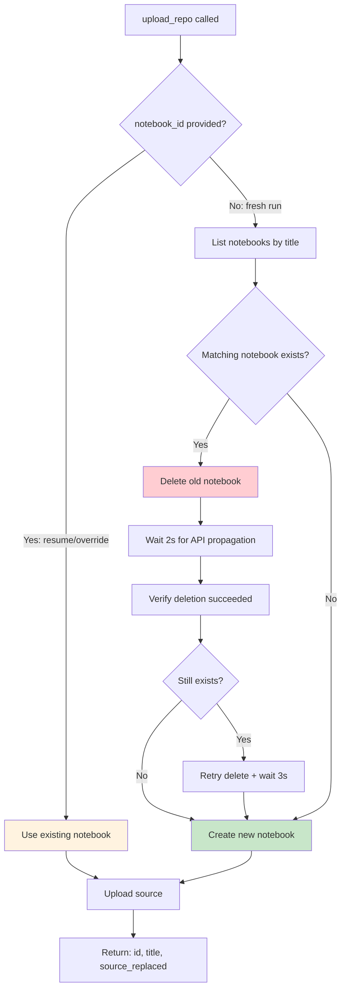

### Source Replacement Tracking

```python
# notebooklm.py — upload_repo returns source_replaced flag
async def upload_repo(...) -> dict[str, str | bool]:
    source_replaced = False
    # ... delete existing sources with same name ...
    for src in sources:
        if src.title == filename:
            await client.sources.delete(nb_id, src.id)
            source_replaced = True  # ← Track that we replaced a source
    return {"id": nb_id, "title": nb_title, "source_replaced": source_replaced}

# pipeline.py — GenerateStage uses source_replaced to decide force_regen
force = ctx.force_regen or ctx.state.source_replaced
result = await generate_artefacts(nb_id, target, force_regen=force)
```

**Teaching moment**: This is **context propagation** — information flows from the upload stage through the pipeline state to the generate stage. Each stage enriches the shared state, and downstream stages use that enriched state to make decisions. The alternative would be passing parameters between stages directly, which creates tight coupling.

---

## 12. Retry and Timeout Strategy

### The Timeout Starvation Bug

The original bug: a single long-running `wait_for_artefact` could consume the entire timeout, starving retries of failed items.

```
Timeline (900s timeout):
  0s    ┃ Request all 4 artefacts
  5s    ┃ audio fails → queued for retry
  5s    ┃ video, slides, infographic → pending
  5s    ┃ Retry audio (backoff 30s)
  35s   ┃ audio succeeds ✅
  35s   ┃ Wait for video, slides, infographic
  ...   ┃ infographic still in_progress
  870s  ┃ infographic wait timeout (consumed 835s!)
  870s  ┃ Only 30s remaining — not enough for video/slides retry (30s backoff each)
  870s  ┃ video, slides marked "timed out" ❌
  900s  ┃ Pipeline ends: 1 completed, 3 failed
```

### The Fix: Fair Timeout Allocation

```python
# notebooklm.py — cap wait time per artefact
for label in list(pending):
    remaining = deadline - time.monotonic()

    # Reserve time for retries of other pending items
    other_pending = len(pending) - 1 + len(needs_retry)
    reserved = other_pending * 35  # 30s backoff + 5s buffer each
    max_wait = max(remaining - reserved, 30)  # At least 30s per check

    final_status = await _wait_for_artefact(
        client, notebook_id, task_id, max_wait, label
    )
```

With the fix, the same timeline becomes:

```
Timeline (900s timeout, fair allocation):
  0s    ┃ Request all 4 artefacts
  5s    ┃ audio fails → queued for retry
  5s    ┃ video, slides, infographic → pending
  5s    ┃ Retry audio (backoff 30s)
  35s   ┃ audio succeeds ✅
  35s   ┃ infographic wait capped to: 900 - (2 * 35) = 830s
  ...   ┃ infographic still in_progress after 830s wait
  865s  ┃ infographic returns "still in progress" → stays pending
  865s  ┃ video wait capped to: 35s (35 remaining - 35 reserved)
  900s  ┃ video timeout → queued for retry
  900s  ┃ Pipeline continues, next iteration retries video
```

**Teaching moment**: This is the **Fair Scheduling** pattern — when multiple items share a limited resource (time), each item gets a capped allocation so no single item can starve the others. It's the same principle used in OS process schedulers and network bandwidth allocation.

### Retry Strategy Overview

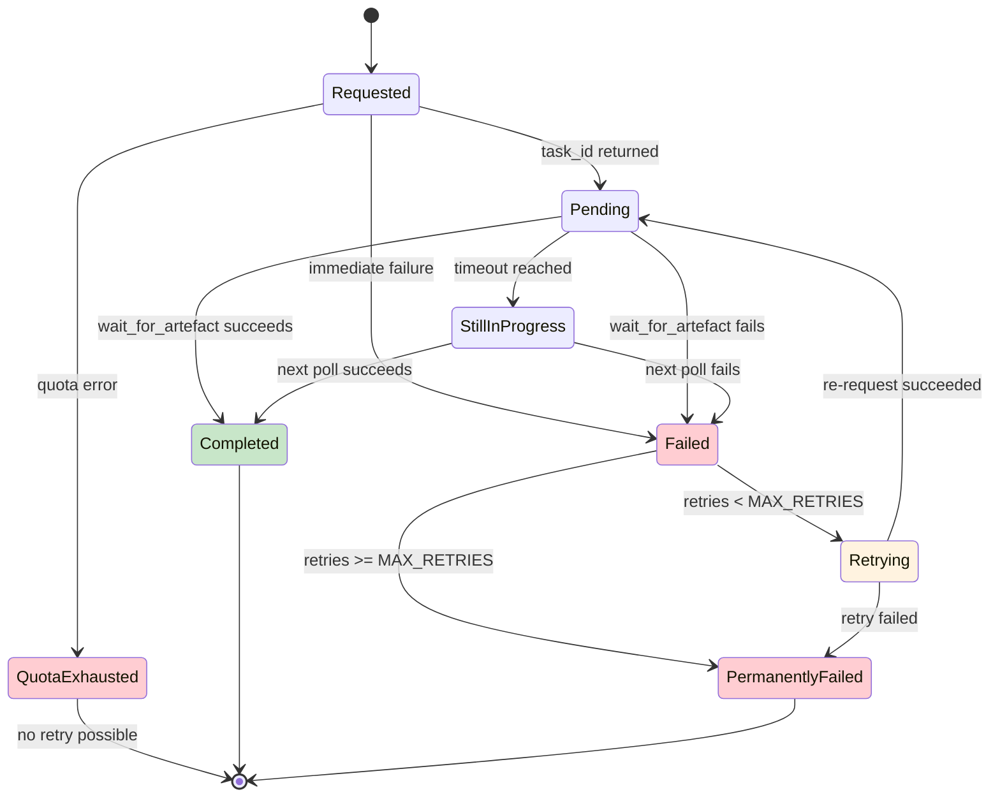

---

## 13. Target Architecture Improvements

### Current vs Target State

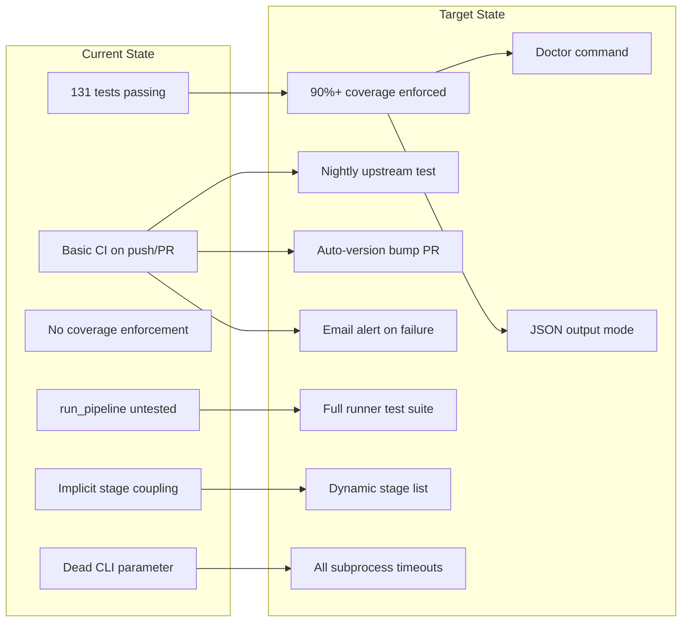

### Target CI/CD Pipeline

```mermaid
flowchart TD
    subgraph "PR CI (Current + Enhanced)"
        PR[Pull Request] --> LINT[Lint: ruff + pyright]
        LINT --> TEST[Test: pytest --cov --cov-fail-under=80]
        TEST --> BUILD[Build: uv build]
        BUILD --> MERGE[✅ Merge allowed]
    end

    subgraph "Nightly CI (New)"
        SCHEDULE[Nightly 2am UTC] --> CHECK[Check latest notebooklm-py]
        CHECK --> INSTALL[Install without version cap]
        INSTALL --> NIGHTLY_TEST[Test: full suite]
        NIGHTLY_TEST --> NIGHTLY_LINT[Lint: ruff + pyright]

        NIGHTLY_TEST --> RESULT{All pass?}
        RESULT -->|Yes| BUMP[Open PR: bump notebooklm-py version]
        RESULT -->|No| EMAIL[Send email to andy@andytaylor.dev]

        EMAIL --> DETAILS[Include: failing tests,<br/>diff, notebooklm-py version]
        BUMP --> DETAILS
    end

    subgraph "Release CI (Future)"
        TAG[Git tag] --> RELEASE_TEST[Full regression suite]
        RELEASE_TEST --> PUBLISH[uv publish to PyPI]
        PUBLISH --> ANNOUNCE[Release notes + changelog]
    end

    style PR fill:#e1f5fe
    style SCHEDULE fill:#fff3e0
    style TAG fill:#e8f5e9
    style EMAIL fill:#ffcdd2
    style BUMP fill:#c8e6c9
```

### Nightly Workflow Implementation

```yaml
# .github/workflows/nightly-deps.yml
name: Nightly Dependency Test

on:
  schedule:
    - cron: '0 2 * * *'  # 2am UTC daily
  workflow_dispatch:     # Manual trigger

permissions:
  contents: write
  pull-requests: write

jobs:
  test-latest-upstream:
    runs-on: ubuntu-latest
    strategy:
      matrix:
        python-version: ['3.11', '3.12', '3.13']

    steps:
      - uses: actions/checkout@v4

      - uses: astral-sh/setup-uv@v4
        with:
          python-version: ${{ matrix.python-version }}

      - name: Install with latest notebooklm-py
        run: |
          # Temporarily remove the upper bound to test latest
          uv sync --frozen --all-extras --dev
          uv pip install --upgrade "notebooklm-py[browser]>=0.3.4"

      - name: Run tests with coverage
        run: uv run pytest -v --cov=repo_artefacts --cov-report=term-missing

      - name: Run lint
        run: |
          uv run ruff check src/ tests/
          uv run pyright

      - name: Check for version bump
        if: success()
        id: version-check
        run: |
          CURRENT=$(uv pip show notebooklm-py | grep Version | awk '{print $2}')
          PINNED=$(grep 'notebooklm-py' pyproject.toml | grep -oP '>=\K[0-9.]+')
          if [ "$CURRENT" != "$PINNED" ]; then
            echo "bump_needed=true" >> $GITHUB_OUTPUT
            echo "new_version=$CURRENT" >> $GITHUB_OUTPUT
          fi

      - name: Open version bump PR
        if: steps.version-check.outputs.bump_needed == 'true'
        uses: peter-evans/create-pull-request@v6
        with:
          title: "chore: bump notebooklm-py to ${{ steps.version-check.outputs.new_version }}"
          body: |
            Nightly test passed with notebooklm-py ${{ steps.version-check.outputs.new_version }}.
            All tests and lint checks passed across Python 3.11-3.13.
          branch: auto-bump-notebooklm-py
          commit-message: "chore: bump notebooklm-py to ${{ steps.version-check.outputs.new_version }}"

      - name: Send failure email
        if: failure()
        uses: dawidd6/action-send-mail@v3
        with:
          server_address: smtp.gmail.com
          server_port: 465
          username: ${{ secrets.SMTP_USERNAME }}
          password: ${{ secrets.SMTP_PASSWORD }}
          subject: "❌ Nightly dependency test failed — notebooklm-repo-artefacts"
          body: |
            Nightly dependency test failed for notebooklm-repo-artefacts.

            Python version: ${{ matrix.python-version }}
            notebooklm-py version: (latest)
            Run: ${{ github.server_url }}/${{ github.repository }}/actions/runs/${{ github.run_id }}

            Check the workflow run for detailed failure output.
          to: andy@andytaylor.dev
          from: GitHub Actions <ci@notebooklm-repo-artefacts>
```

### Target Test Architecture

```mermaid
flowchart TD
    subgraph "Unit Tests (Fast, Isolated)"
        U1[Stage pre_check tests — all 9 stages]
        U2[Stage post_check tests — all 9 stages]
        U3[State save/load — edge cases]
        U4[CLI commands — all 11 commands]
        U5[Collector — file types, limits, edge cases]
        U6[NotebookLM — config, retry, quota detection]
        U7[Pages — token resolution, README blocks]
        U8[Publish — artefact check, verify, git ops]
        U9[Store — slug validation, manifest, cache]
        U10[Config — load, save, missing file, invalid]
        U11[Exceptions — hierarchy, string repr]
    end

    subgraph "Integration Tests (Moderate)"
        I1[run_pipeline runner — mock all stages]
        I2[Collect -> Pages -> Link validation]
        I3[Full pipeline mock — all stages]
        I4[Resume logic — state persistence]
        I5[Dry-run mode — no side effects]
    end

    subgraph "Contract Tests (External API)"
        C1[notebooklm-py API surface unchanged]
        C2[Expected classes exist]
        C3[Expected methods exist]
        C4[Method signatures compatible]
    end

    subgraph "CI Enforcement"
        CI1[Coverage >= 80%]
        CI2[All tests pass Python 3.11-3.13]
        CI3[Lint: ruff + pyright clean]
        CI4[Nightly upstream test]
        CI5[Auto PR on version bump]
    end

    U1 --> I1
    U2 --> I1
    U3 --> I1
    U4 --> I1
    I1 --> CI1
    I2 --> CI1
    I3 --> CI1
    I4 --> CI1
    I5 --> CI1
    C1 --> CI4
    C2 --> CI4
    C3 --> CI4
    C4 --> CI4
```

### Dynamic Stage List (Proposed Fix)

```python
# Current (implicit coupling via SKIP gates):
ALL_STAGES = [
    CollectStage(),
    UploadStage(),
    GenerateStage(),
    DownloadStage(),
    PublishStage(),        # ← Skips if no store_slug
    LocalPublishStage(),   # ← Skips if store_slug set
    VerifyStage(),         # ← Skips if no store_slug
    LocalVerifyStage(),    # ← Skips if store_slug set
    CleanupStage(),
]

# Proposed (explicit, explicit is better than implicit):
def _build_stage_list(store_slug: str | None) -> list:
    """Build the stage list based on configuration.

    This makes the pipeline structure explicit and easier to reason about.
    No stage needs to know about the existence of other stages.
    """
    stages = [
        CollectStage(),
        UploadStage(),
        GenerateStage(),
        DownloadStage(),
    ]

    if store_slug:
        # Store mode: publish to external store, verify, update README
        stages.extend([
            PublishStage(),
            VerifyStage(),
            ReadmeStage(),
        ])
    else:
        # Local mode: publish to source repo's GitHub Pages
        stages.extend([
            LocalPublishStage(),
            LocalVerifyStage(),
        ])

    stages.append(CleanupStage())
    return stages
```

**Teaching moment**: This follows the **Explicit is Better Than Implicit** principle from the Zen of Python. The current approach works but requires reading each stage's `pre_check` to understand which stages actually run. The proposed approach makes the pipeline structure visible at a glance. The tradeoff is that `_build_stage_list` now needs to know about all stage classes, creating a central point of change when new stages are added.

---

## Appendix A: Key File Locations

```
src/repo_artefacts/
├── __init__.py          # Package docstring
├── cli.py               # 11 Typer commands (entry point)
├── pipeline.py          # Stage-based pipeline runner
├── collector.py         # Repo content collection + PDF rendering
├── notebooklm.py        # NotebookLM API integration
├── publish.py           # Legacy orchestrator + git operations
├── pages.py             # GitHub Pages setup + token resolution
├── store.py             # Artefact store operations
├── config.py            # User config load/save
├── console.py           # Shared Rich console singleton
├── exceptions.py        # Domain exception hierarchy
└── template.html        # HTML player page template

tests/
├── conftest.py          # Shared fixtures
├── test_cli.py          # CLI command tests
├── test_collector.py    # Content collection tests
├── test_integration.py  # End-to-end local flow tests
├── test_notebooklm.py   # NotebookLM API tests (mocked)
├── test_pages.py        # GitHub Pages tests
├── test_pipeline.py     # Pipeline stage tests (largest file)
├── test_publish.py      # Publish module tests
└── test_store.py        # Store module tests

.github/workflows/
└── ci.yml               # PR CI: lint + test + build

docs/
├── TODO.md              # Remediation tasks from code review
├── architecture.md      # This file
├── codemap.md           # Architecture overview
├── how-it-works.md      # End-to-end workflow
├── pipeline.md          # Pipeline architecture
└── ...                  # Other documentation
```

## Appendix B: Quick Reference Commands

```bash
# Run the pipeline
repo-artefacts pipeline                          # Full pipeline, all artefacts
repo-artefacts pipeline --audio --video          # Only audio + video
repo-artefacts pipeline --exclude infographic    # All except infographic
repo-artefacts pipeline --resume                 # Resume from last successful stage
repo-artefacts pipeline --force-regen            # Delete all artefacts and regenerate
repo-artefacts pipeline --clean                  # Delete artefacts dir before running
repo-artefacts pipeline --store Org/repo         # Publish to artefact store
repo-artefacts pipeline --keep-notebook          # Don't delete notebook after publish

# Run tests
uv run pytest                                    # All tests
uv run pytest tests/test_pipeline.py -v          # Pipeline tests only
uv run pytest --cov=repo_artefacts               # With coverage
uv run pytest --cov=repo_artefacts --cov-fail-under=80  # Enforce 80% coverage

# Run lint
uv run ruff check src/ tests/                    # Lint
uv run ruff format src/ tests/                   # Format
uv run pyright                                   # Type check

# Pre-commit (runs all checks)
pre-commit run --all-files

# Build package
uv build
```
