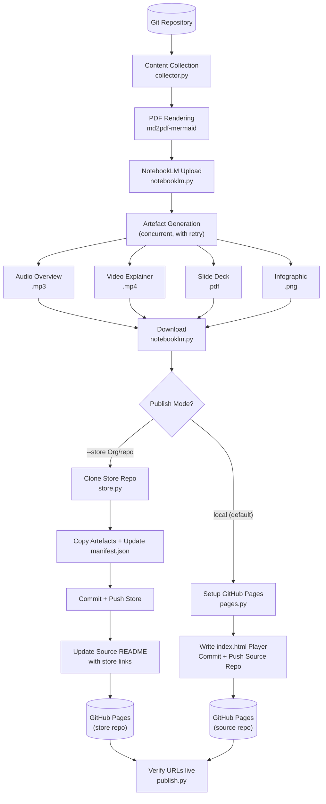
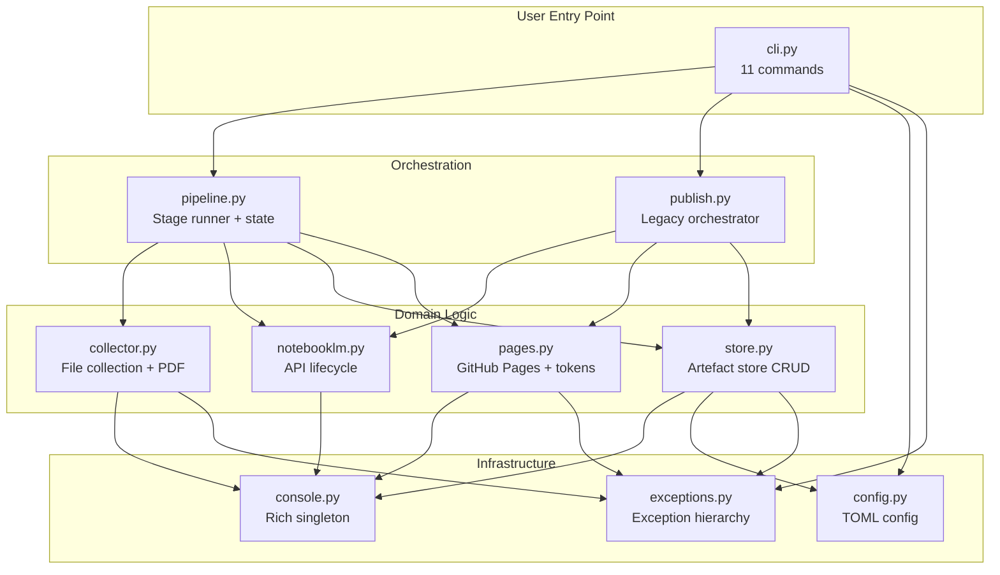
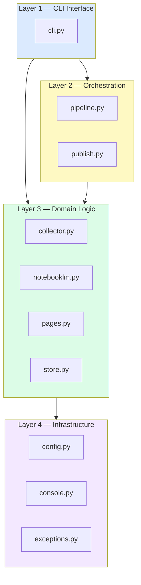
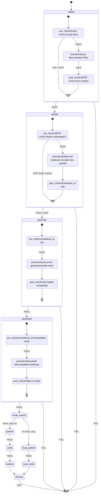
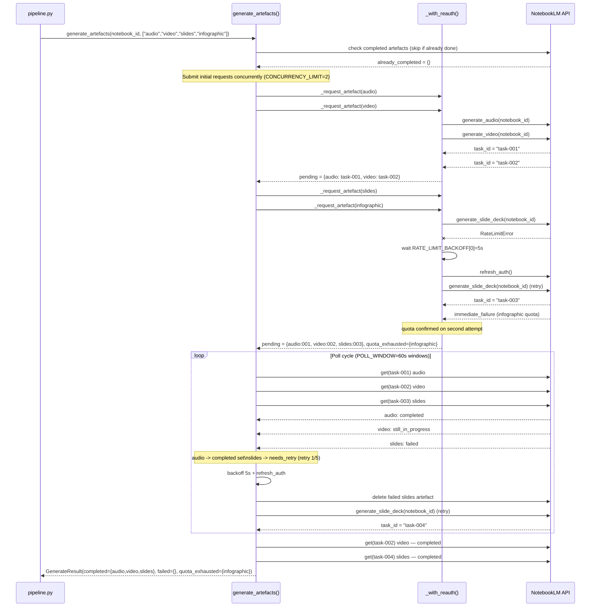
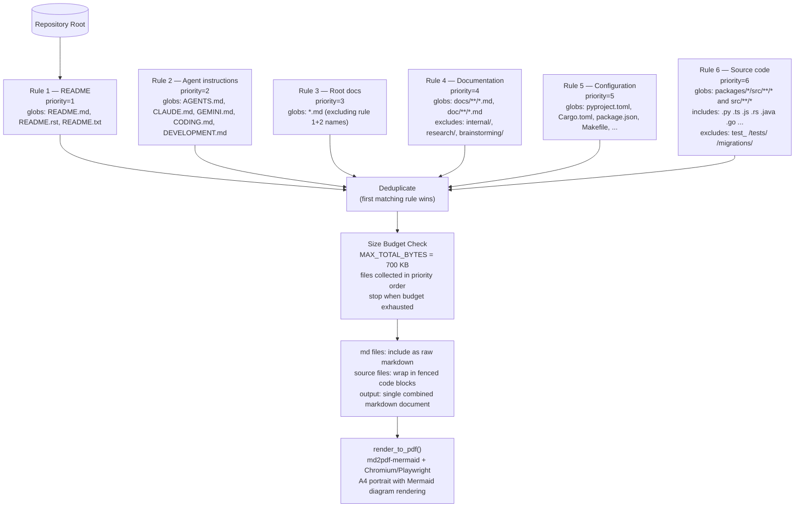
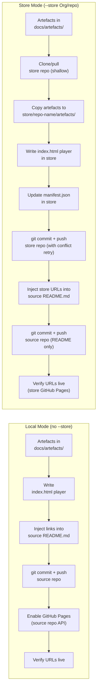
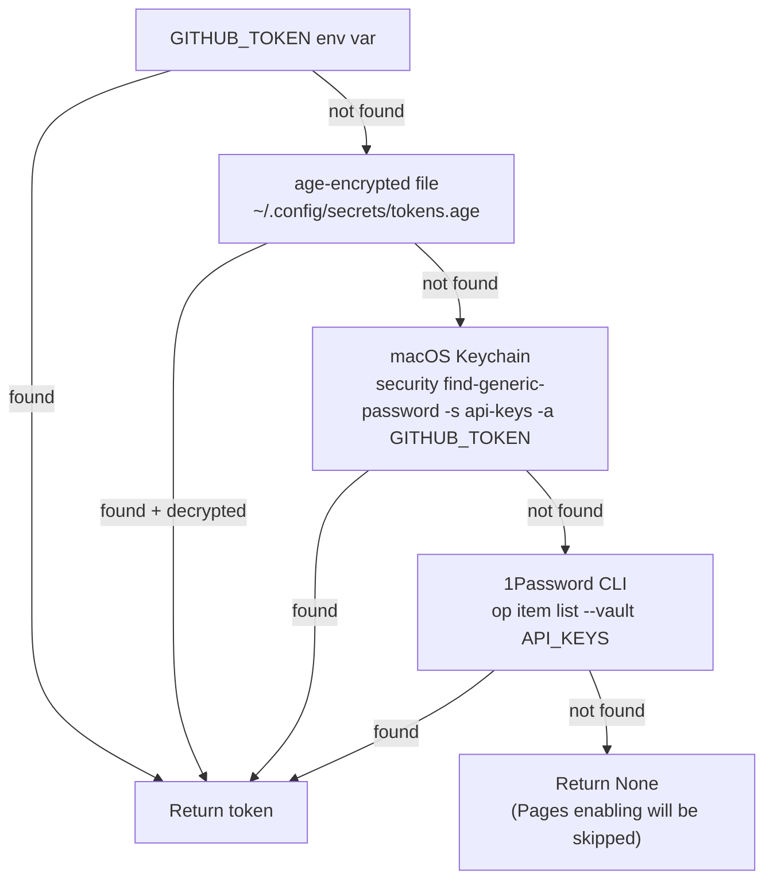
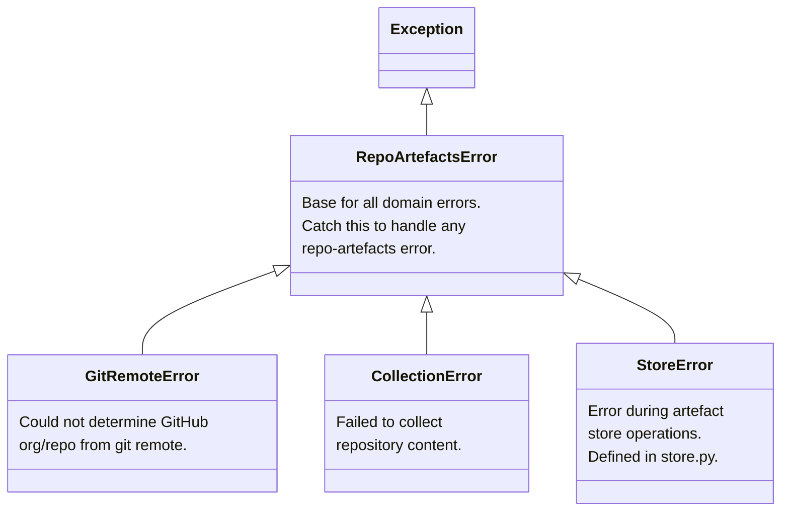
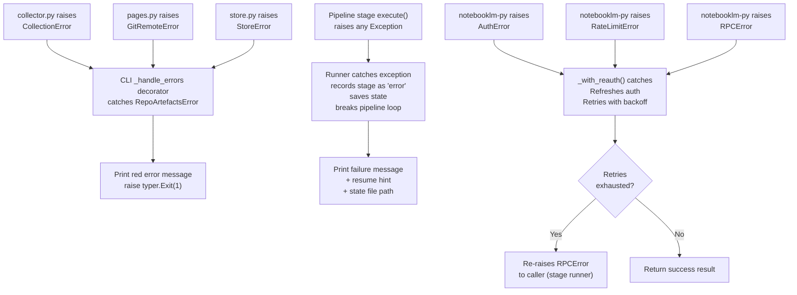

# Architecture — notebooklm-repo-artefacts v0.1.0

> Comprehensive reference for developers new to this codebase.
> Covers every layer, module, and key design decision with diagrams and source-grounded examples.

---

## Table of Contents

1. [Executive Summary](#1-executive-summary)
2. [System Overview](#2-system-overview)
3. [Architectural Layers](#3-architectural-layers)
4. [Deep Dive: Pipeline Architecture](#4-deep-dive-pipeline-architecture)
5. [Deep Dive: NotebookLM Integration](#5-deep-dive-notebooklm-integration)
6. [Deep Dive: Content Collection](#6-deep-dive-content-collection)
7. [Deep Dive: Publishing](#7-deep-dive-publishing)
8. [Deep Dive: Error Handling](#8-deep-dive-error-handling)
9. [Module Interface Reference](#9-module-interface-reference)
10. [External Dependencies](#10-external-dependencies)
11. [Design Decisions](#11-design-decisions)

---

## 1. Executive Summary

`notebooklm-repo-artefacts` is a Python CLI tool that transforms any git repository into a set of AI-generated learning artefacts — audio overview, video explainer, slide deck, and infographic — using Google NotebookLM as the generation engine.

The tool collects the key content from a repository (README, documentation, configuration, source code), renders it to PDF, uploads it to NotebookLM, triggers parallel artefact generation, downloads the results, and publishes them to GitHub Pages.

**Key architectural qualities:**

- **Resumability.** The pipeline persists state to `.pipeline-state.json` after every stage. A failed run can be restarted from the last successful stage with `--resume`, avoiding redundant API calls.
- **Retry resilience.** NotebookLM API calls are wrapped in a retry layer that handles auth expiry, rate limiting, and transient RPC errors with differentiated backoff strategies.
- **Two publish modes.** Artefacts can be committed directly to the source repository's `docs/artefacts/` directory (local mode, served by the repo's own GitHub Pages), or pushed to a separate centralised artefact store repository (store mode, keeping binary files out of source history).

---

## 2. System Overview

### End-to-End Flow



### Component Responsibilities at a Glance



---

## 3. Architectural Layers

The system has four layers with a strict downward dependency direction: CLI depends on Orchestration, which depends on Domain, which depends on Infrastructure. No layer imports from a layer above it.



### Layer 1 — CLI Interface (`cli.py`)

The entry point for all user interaction. Provides 11 Typer commands:

| Command | Purpose |
|---------|---------|
| `pipeline` | Recommended path. Full end-to-end run with stage-based state machine. |
| `publish` | Legacy orchestrator. Generates, sets up Pages, pushes, verifies. |
| `process` | Collect repo content and upload to NotebookLM only. |
| `generate` | Trigger artefact generation on an existing notebook. |
| `download` | Download completed artefacts from a notebook. |
| `list` | List all notebooks, or sources within a notebook. |
| `delete` | Delete a notebook and its contents. |
| `pages` | Set up GitHub Pages player for an existing artefacts directory. |
| `migrate` | Move artefacts from source repo to the artefact store. |
| `validate` | Check that artefact URLs in README are reachable. |
| `clean` | Find and optionally remove orphaned artefacts in the store. |

The `_handle_errors` decorator applied to most commands catches `RepoArtefactsError` and translates it to `typer.Exit(1)` with a red error message, keeping domain exceptions out of the user-facing output:

```python
def _handle_errors(func):
    @functools.wraps(func)
    def wrapper(*args, **kwargs):
        try:
            return func(*args, **kwargs)
        except RepoArtefactsError as exc:
            get_console().print(f"[red]Error:[/red] {exc}")
            raise typer.Exit(code=1) from exc
    return wrapper
```

Entry point registered in `pyproject.toml`:

```toml
[project.scripts]
repo-artefacts = "repo_artefacts.cli:app"
```

### Layer 2 — Orchestration (`pipeline.py`, `publish.py`)

**`pipeline.py`** is the recommended orchestration path. It implements a stage-based runner with 9 stages, state persistence to JSON, and `--resume` support. Each stage follows a pre-check → execute → post-check gateway pattern. State is written to disk after every stage, enabling recovery from any failure point.

**`publish.py`** is the legacy orchestrator kept for backward compatibility. It provides three utility functions also used by the pipeline: `check_artefacts`, `verify_pages`, and `git_commit_and_push`. The `publish` CLI command invokes these directly for a simpler, less-resumable workflow.

The pipeline is the preferred path for new usage. The `publish` command is retained for cases where the stage-based overhead is unwanted.

### Layer 3 — Domain Logic

**`collector.py`** scans a git repository using 6 priority-based `CollectionPattern` rules, collects matching files up to a 700 KB size budget, and renders the combined markdown to PDF using md2pdf-mermaid.

**`notebooklm.py`** manages the full NotebookLM lifecycle: creating notebooks, uploading sources, triggering concurrent generation with retry, polling for completion, and downloading results. All API calls pass through the `_with_reauth()` retry wrapper.

**`pages.py`** handles GitHub Pages configuration: writing the HTML player page from a template, injecting artefact links into README.md, enabling GitHub Pages via the GitHub API, and resolving the `GITHUB_TOKEN` from multiple sources.

**`store.py`** manages the centralised artefact store: shallow cloning the store repository, copying artefacts and generating the player page, updating `manifest.json`, and pushing with conflict retry.

### Layer 4 — Infrastructure (`config.py`, `console.py`, `exceptions.py`)

**`config.py`** loads and saves user configuration from `~/.config/repo-artefacts/config.toml`. The `Config` dataclass holds three settings:

```python
@dataclass
class Config:
    default_store: str | None = None        # e.g., "Org/artefact-store"
    default_timeout: int = 900              # seconds per artefact
    store_cache_dir: Path = ...             # ~/.cache/repo-artefacts/stores
```

**`console.py`** provides a shared `rich.Console` singleton. All modules call `get_console()` rather than creating their own instances, allowing future `--quiet` support without touching domain code.

**`exceptions.py`** defines the domain exception hierarchy. `StoreError` is defined in `store.py` rather than `exceptions.py` because it is only raised there; it still inherits from `RepoArtefactsError`.

---

## 4. Deep Dive: Pipeline Architecture

### The 9 Stages



### Stage Gateway Pattern

Every stage implements the same three-phase interface without a formal base class (duck typing):

```python
class CollectStage:
    name = "collect"

    def pre_check(self, ctx: PipelineContext) -> StageResult:
        """Validate prerequisites. Return SKIP to bypass this stage,
        FAIL to stop the pipeline, PASS to proceed to execute."""
        if not ctx.repo_path.exists():
            return StageResult(Status.FAIL, f"Repo path does not exist: {ctx.repo_path}")
        if not (ctx.repo_path / ".git").is_dir():
            return StageResult(Status.FAIL, f"Not a git repo: {ctx.repo_path}")
        return StageResult(Status.PASS)

    def execute(self, ctx: PipelineContext) -> StageResult:
        """Do the work. Mutate ctx to pass information to downstream stages."""
        ...

    def post_check(self, ctx: PipelineContext) -> StageResult:
        """Verify the outcome. Called only if execute returned PASS."""
        if ctx.pdf_path and ctx.pdf_path.exists() and ctx.pdf_path.stat().st_size > 0:
            return StageResult(Status.PASS)
        return StageResult(Status.FAIL, "PDF not created or empty")
```

`StageResult` carries a status, an optional human-readable message, and an optional data dict that is merged into the persisted stage state:

```python
class Status(StrEnum):
    PASS = "pass"
    FAIL = "fail"
    SKIP = "skip"
    RETRY = "retry"   # reserved for future use

@dataclass
class StageResult:
    status: Status
    message: str = ""
    data: dict[str, Any] = field(default_factory=dict)
```

`StrEnum` is used so values serialize to JSON strings directly (e.g., `"pass"` rather than `Status.PASS`), which matters because stage state is written to `.pipeline-state.json` after each stage.

### The Runner Loop

The runner in `run_pipeline()` iterates `ALL_STAGES` and applies the gateway sequence. Fail-fast: on the first failure, state is persisted and the loop breaks.

```python
for stage in ALL_STAGES:
    # Resume: stages that already have "pass" status are skipped immediately
    if resume and ctx.state.stage_status(stage.name) == "pass":
        console.print("  [dim]Already passed — skipping (resume)[/dim]")
        continue

    # Gate 1: Pre-check
    pre = stage.pre_check(ctx)
    if pre.status == Status.SKIP:
        ctx.state.set_stage(stage.name, "skipped", reason=pre.message)
        ctx.save_state()
        continue
    if pre.status == Status.FAIL:
        ctx.state.set_stage(stage.name, "failed", reason=pre.message)
        ctx.save_state()
        all_passed = False
        break  # stop pipeline

    # Gate 2: Execute
    try:
        result = stage.execute(ctx)
    except Exception as e:
        ctx.state.set_stage(stage.name, "error", error=str(e))
        ctx.save_state()
        all_passed = False
        break

    if result.status == Status.FAIL:
        ctx.state.set_stage(stage.name, "failed", reason=result.message, **result.data)
        ctx.save_state()
        all_passed = False
        break

    # Gate 3: Post-check
    post = stage.post_check(ctx)
    if post.status == Status.FAIL:
        ctx.state.set_stage(stage.name, "post_check_failed", reason=post.message)
        ctx.save_state()
        all_passed = False
        break

    # Success: record with duration, persist, continue
    stage_duration = round(time.monotonic() - stage_start, 1)
    ctx.state.set_stage(stage.name, "pass", duration_s=stage_duration, **result.data)
    ctx.save_state()
```

### State Persistence and Resume

State is written to `docs/artefacts/.pipeline-state.json`. The structure carries everything needed to resume:

```json
{
  "repo_name": "my-project",
  "notebook_id": "abc123def456",
  "content_hash": "e3b0c44298fc1c149afbf4c8996fb924...",
  "source_replaced": false,
  "stages": {
    "collect": {
      "status": "pass",
      "at": "2026-04-07T10:30:00+00:00",
      "duration_s": 3.2,
      "pdf_path": "/path/to/docs/artefacts/my-project_content.pdf",
      "content_hash": "e3b0c44298fc..."
    },
    "upload": {
      "status": "pass",
      "at": "2026-04-07T10:30:05+00:00",
      "duration_s": 5.1,
      "notebook_id": "abc123def456",
      "source_replaced": false,
      "content_hash": "e3b0c44298fc..."
    },
    "generate": {
      "status": "failed",
      "at": "2026-04-07T10:40:00+00:00",
      "reason": "Failed: infographic. Completed: audio, slides, video"
    }
  },
  "artefacts": {
    "audio": "completed",
    "video": "completed",
    "slides": "completed",
    "infographic": "failed"
  },
  "started_at": "2026-04-07T10:29:55+00:00",
  "updated_at": "2026-04-07T10:40:00+00:00"
}
```

On `--resume`, the runner first checks whether a stage already has `"pass"` status and skips it immediately. Each stage's `pre_check` also carries skip logic: `UploadStage.pre_check` compares the current PDF content hash against the stored hash; if they match and a `notebook_id` exists, it returns `SKIP` rather than re-uploading the same content.

### Mutual Exclusion of Publish Modes

`PublishStage` and `LocalPublishStage` (and their corresponding verify stages) are mutually exclusive at the pre-check level. Each inspects `ctx.store_slug`:

```python
class PublishStage:
    def pre_check(self, ctx: PipelineContext) -> StageResult:
        if not ctx.store_slug:
            return StageResult(Status.SKIP, "No store configured")
        ...

class LocalPublishStage:
    def pre_check(self, ctx: PipelineContext) -> StageResult:
        if ctx.store_slug:
            return StageResult(Status.SKIP, "Store mode — skipping local publish")
        ...
```

All 9 stages are always in `ALL_STAGES`. The publish mode selection happens through skip gates, not through building a different stage list.

---

## 5. Deep Dive: NotebookLM Integration

### Generation Flow with Retries



### Auth Retry Wrapper

Every NotebookLM API call passes through `_with_reauth()`, which handles three error classes with different backoff strategies:

```python
REAUTH_BACKOFF = [2, 10, 30]          # seconds between retries for auth/RPC errors
RATE_LIMIT_BACKOFF = [5, 15, 30, 60, 120]  # escalating backoff for rate limit errors

async def _with_reauth(client, fn, label=""):
    last_exc = None
    for attempt, wait in enumerate(REAUTH_BACKOFF, 1):
        try:
            return await fn()
        except RateLimitError as e:
            bk = RATE_LIMIT_BACKOFF[min(attempt - 1, len(RATE_LIMIT_BACKOFF) - 1)]
            await asyncio.sleep(bk)           # longer wait for throttling
            await client.refresh_auth()
        except AuthError as e:
            await asyncio.sleep(wait)         # short wait, then refresh
            await client.refresh_auth()
        except RPCError as e:
            await asyncio.sleep(wait)         # medium wait, then refresh
            await client.refresh_auth()
    # Final attempt — lets exception propagate to caller
    return await fn()
```

| Error type | Cause | Strategy |
|------------|-------|----------|
| `AuthError` | Stale CSRF or session token | Short wait (2-30s), refresh auth |
| `RateLimitError` | API throttling | Longer wait (5-120s), refresh auth |
| `RPCError` | Transient server error | Medium wait (2-30s), refresh auth |

### Concurrent Generation with Semaphore

Generation requests are submitted concurrently using `asyncio.Semaphore(CONCURRENCY_LIMIT=2)`. This prevents overloading the API while still running two requests in parallel:

```python
sem = asyncio.Semaphore(CONCURRENCY_LIMIT)  # max 2 concurrent requests

async def _submit_one(artefact: str) -> None:
    async with sem:
        await _delete_existing_by_type(client, notebook_id, artefact, failed_only=not force_regen)
        status = await _request_artefact(client, notebook_id, artefact)
        ...

await asyncio.gather(*[_submit_one(a) for a in to_generate])
```

After initial submission, polling uses `POLL_WINDOW=60`-second windows. All pending artefacts are polled concurrently in each window. Failures are queued in `needs_retry` and retried as a batch with a shared backoff after each poll cycle.

### Quota Detection

Infographics and slide decks have stricter daily generation caps than audio/video. Quota errors are detected by inspecting both the error message text and the `error_code` field:

```python
QUOTA_ERROR_PATTERNS = ["rate limit", "quota exceeded", "quota"]

def _is_quota_error(error_msg: str | None, error_code: str | None = None) -> bool:
    if error_code and error_code.upper() == "USER_DISPLAYABLE_ERROR":
        return True
    if error_msg:
        lower = error_msg.lower()
        return any(p in lower for p in QUOTA_ERROR_PATTERNS)
    return False
```

When quota is suspected, the code refreshes auth and retries once to confirm it is not a transient error before marking the artefact as `quota_exhausted`. Quota-exhausted artefacts do not consume retries and are reported to the user with a 24-hour reset note.

### Download via Data-Driven Specs

Download logic avoids per-type conditionals by using a data-driven list of (label, list_method, download_method, filename) tuples:

```python
_DOWNLOAD_SPECS = [
    ("audio",       "list_audio",        "download_audio",        "audio_overview.mp3"),
    ("video",       "list_video",        "download_video",        "video_overview.mp4"),
    ("slides",      "list_slide_decks",  "download_slide_deck",   "slides.pdf"),
    ("infographic", "list_infographics", "download_infographic",  "infographic.png"),
]
```

For each entry, only artefacts where `is_completed` is True are downloaded. If a type has more than one completed artefact (e.g., after partial retries), each is saved with a numeric suffix (`slides_01.pdf`, `slides_02.pdf`).

### Source Deduplication

Before generating, `_deduplicate_sources()` checks for multiple sources with the same title and removes all but the most recently added. This prevents confused generation when a notebook accumulates duplicate uploads from interrupted runs.

---

## 6. Deep Dive: Content Collection

### Priority-Based Rule System

The collector evaluates 6 `CollectionPattern` rules in priority order. Each file is collected by the first rule that matches it (first-match-wins deduplication):



### CollectionPattern Dataclass

```python
@dataclass
class CollectionPattern:
    name: str
    globs: list[str]              # glob patterns relative to repo root
    include_regex: list[str] = field(default_factory=list)   # must match
    exclude_regex: list[str] = field(default_factory=list)   # must not match
    max_lines: int | None = None  # per-file line limit (None = no limit)
    priority: int = 10            # lower = collected first
```

### Size and Safety Guards

| Constant | Value | Purpose |
|----------|-------|---------|
| `MAX_TOTAL_BYTES` | 700 KB | Total combined content budget |
| `MAX_SOURCE_LINES` | 500 | Per-file line cap for source files |
| `MAX_FILE_BYTES` | 512 KB | Per-file size guard before reading |
| `MAX_LINE_LENGTH` | 10,000 | Rejects minified or generated files |

The `_read_safe()` function checks all of these before returning file content. If any guard triggers, the file is silently skipped.

### Skip Directories

The following directories are excluded during the tree walk regardless of glob patterns:

```
.git  .claude  .github  node_modules  __pycache__  .venv  venv
dist  build  .tox  .eggs  target  .next  .nuxt  vendor
.mypy_cache  .pytest_cache  htmlcov  site-packages
```

### Monorepo Support

The source code rule includes `packages/*/src/**/*` alongside `src/**/*`, enabling collection from monorepos with multiple packages under a `packages/` directory.

---

## 7. Deep Dive: Publishing

### Two Modes Compared



**When to use each mode:**

- **Local mode** is simpler. Artefact binary files are committed to the source repository and served by its GitHub Pages. Suitable for single repos where binary file history is acceptable.
- **Store mode** keeps binary files out of source repository history. All artefacts live in one centralised store repository. The source repository only gains README links. Suitable for teams with multiple repositories or repositories where keeping git history clean matters.

### Store Operations Detail

The store maintains this structure on disk:

```
artefact-store/
├── manifest.json            # index of all repos and their artefacts
├── CNAME                    # optional custom domain
├── my-project/
│   └── artefacts/
│       ├── index.html       # player page (from template.html)
│       ├── audio_overview.mp3
│       ├── video_overview.mp4
│       ├── slides.pdf
│       └── infographic.png
└── other-project/
    └── artefacts/
        └── ...
```

`manifest.json` structure:

```json
{
  "repos": [
    {
      "name": "my-project",
      "title": "My Project",
      "description": "Short description",
      "artefacts": ["audio", "video", "slides", "infographic"],
      "updated": "2026-04-07"
    }
  ]
}
```

Push conflicts are handled with a single retry: `git push` fails → `git pull --rebase` → `git push` again. If the second push also fails, the operation returns `False` and the pipeline records the stage as failed.

### Token Resolution Chain

`get_github_token()` in `pages.py` resolves a GitHub token through four sources in priority order:



---

## 8. Deep Dive: Error Handling

### Exception Hierarchy



`StoreError` is defined in `store.py` rather than `exceptions.py`. It still inherits from `RepoArtefactsError`, so the CLI's `_handle_errors` decorator catches it alongside the other domain exceptions.

### Error Flow Through Layers



### Retry Backoff Strategies

| Scenario | Backoff sequence | Auth refresh? |
|----------|-----------------|---------------|
| `AuthError` | 2s, 10s, 30s (then final attempt) | Yes, after each wait |
| `RateLimitError` | 5s, 15s, 30s, 60s, 120s (indexed by attempt) | Yes, after each wait |
| `RPCError` | 2s, 10s, 30s (then final attempt) | Yes, after each wait |
| Generation retry | `RATE_LIMIT_BACKOFF[retry_count]`, max 120s, shared across batch | Yes, before batch submit |

---

## 9. Module Interface Reference

### Public Exports by Module

| Module | Key public exports | Primary callers |
|--------|-------------------|-----------------|
| `cli.py` | `app` (Typer application) | `pyproject.toml` entry point |
| `pipeline.py` | `run_pipeline()`, `PipelineContext`, `PipelineState`, `ALL_STAGES` | `cli.pipeline` command |
| `collector.py` | `collect_repo_content()`, `render_to_pdf()` | `pipeline.CollectStage`, `cli.process` |
| `notebooklm.py` | `upload_repo()`, `generate_artefacts()`, `download_artefacts()`, `delete_notebook()`, `list_notebooks()`, `list_sources()`, `ARTEFACT_CONFIG` | `pipeline.*Stage`, `cli.generate`, `cli.download`, `cli.list`, `cli.delete` |
| `pages.py` | `setup_pages()`, `get_github_info()`, `get_github_token()`, `enable_github_pages()` | `pipeline.LocalPublishStage`, `pipeline.ReadmeStage`, `cli.pages`, `cli.publish`, `cli.migrate` |
| `store.py` | `clone_or_pull_store()`, `publish_to_store()`, `commit_and_push_store()`, `list_store_repos()`, `remove_store_repo()`, `update_manifest()`, `StoreError` | `pipeline.PublishStage`, `cli.publish`, `cli.migrate`, `cli.clean`, `cli.validate` |
| `publish.py` | `check_artefacts()`, `verify_pages()`, `git_commit_and_push()`, `STANDARD_FILES` | `pipeline.*Stage`, `store.py`, `cli.publish`, `cli.validate` |
| `config.py` | `load_config()`, `save_config()`, `Config` | `cli.pipeline`, `cli.publish`, `store.py` |
| `console.py` | `get_console()`, `configure_console()` | All modules |
| `exceptions.py` | `RepoArtefactsError`, `GitRemoteError`, `CollectionError` | `cli.py`, `collector.py`, `pages.py` |

### Key Function Signatures

```python
# pipeline.py
def run_pipeline(
    repo_path: Path,
    *,
    store_slug: str | None = None,
    keep_notebook: bool = False,
    force_regen: bool = False,
    dry_run: bool = False,
    resume: bool = False,
    timeout: int = 900,
    artefact_selection: list[str] | None = None,
    notebook_id: str | None = None,
) -> bool: ...

# collector.py
def collect_repo_content(repo_path: Path, output_path: Path) -> Path: ...
def render_to_pdf(md_path: Path) -> Path: ...

# notebooklm.py
async def upload_repo(
    content_path: Path,
    repo_name: str,
    notebook_id: str | None = None,
) -> dict[str, str | bool]: ...   # keys: id, title, source_replaced

async def generate_artefacts(
    notebook_id: str,
    artefacts: list[str],
    timeout: int = 900,
    *,
    force_regen: bool = False,
) -> GenerateResult: ...

async def download_artefacts(notebook_id: str, output_dir: Path) -> None: ...

# pages.py
def setup_pages(
    repo_root: Path,
    org: str,
    repo: str,
    store_base_url: str | None = None,
    available_artefacts: set[str] | None = None,
) -> str: ...   # returns player URL

# store.py
def clone_or_pull_store(store_slug: str, token: str | None = None) -> Path: ...
def publish_to_store(
    store_path: Path,
    repo_name: str,
    artefacts_dir: Path,
    description: str = "",
) -> str: ...   # returns base URL
def commit_and_push_store(store_path: Path, repo_name: str) -> bool: ...

# publish.py
def check_artefacts(artefacts_dir: Path) -> dict[str, Path]: ...
def verify_pages(
    url: str,
    max_wait: int = 120,
    artefact_urls: dict[str, str] | None = None,
) -> tuple[bool, set[str]]: ...
def git_commit_and_push(
    repo_root: Path,
    message: str,
    remote: str = "origin",
    branch: str | None = None,
    outputs: list[str] | None = None,
) -> bool: ...
```

---

## 10. External Dependencies

| Package | Version constraint | Role |
|---------|-------------------|------|
| `notebooklm-py[browser]` | `>=0.3.4,<0.4` | Google NotebookLM API wrapper. The `[browser]` extra installs Playwright for the browser-based auth flow. Upper-bound pinned because the API surface changed between minor versions during active development. |
| `md2pdf-mermaid` | `>=1.4` | Converts markdown to PDF using Playwright/Chromium. Renders Mermaid diagrams as images. Requires `playwright install chromium` on first use. |
| `typer` | `>=0.12` | CLI framework. Provides command registration, argument parsing, help text generation, and `typer.Exit` for exit codes. |
| `rich` | `>=13.0` | Terminal output formatting. Used for coloured status messages, tables, and rules. Shared through the `console.py` singleton. |

### Runtime Tool Dependencies

| Tool | Required for | Checked at |
|------|-------------|------------|
| `git` | All git operations (clone, push, remote detection) | Runtime (subprocess calls) |
| `chromium` (via Playwright) | PDF rendering with Mermaid diagram support | `render_to_pdf()` call |
| `age` | Decrypting token file (optional) | `get_github_token()` |
| `security` | macOS Keychain token lookup (optional) | `get_github_token()` |
| `op` | 1Password CLI token lookup (optional) | `get_github_token()` |

---

## 11. Design Decisions

### ADR-1: Stage-Based Pipeline vs Simple Sequential Function Calls

**Decision:** Implement a stage-based pipeline with state persistence rather than a single function that calls operations sequentially.

**Context:** NotebookLM artefact generation takes 5-15 minutes and has a non-trivial failure rate due to API instability, rate limits, and daily quotas. A simple sequential function that fails halfway through leaves the user with no way to recover without re-running the entire expensive operation.

**Consequences:** The stage-based design makes failure recovery first-class. State is persisted after every stage, so `--resume` can re-enter the pipeline at the exact point of failure. The tradeoff is additional complexity: `PipelineContext`, `PipelineState`, `StageResult`, and `Status` types that would be unnecessary in a simple sequential design.

---

### ADR-2: Duck Typing for Stages vs Abstract Base Class

**Decision:** Stage classes implement the `pre_check / execute / post_check` interface through duck typing. There is no `BaseStage` ABC.

**Context:** Python does not require formal interface declarations for runtime correctness. The runner calls `stage.pre_check(ctx)` and Python will raise `AttributeError` at runtime if a stage is missing the method.

**Consequences:** The simplest approach that works. An ABC would give a clearer error at class definition time, but the test suite includes `test_all_stages_have_required_methods` which catches missing methods before they reach runtime. Adding a `typing.Protocol` for IDE support is a low-effort improvement if needed.

---

### ADR-3: Two Publish Modes

**Decision:** Support both local mode (artefacts in source repo) and store mode (artefacts in a separate centralised repository), selected by the presence or absence of `--store`.

**Context:** Committing binary artefact files (MP3, MP4, PDF, PNG) to a source repository bloats git history and can make clones slow. However, adding a separate store repository is extra operational overhead that not all users want.

**Consequences:** Two separate code paths for publishing and verification (`PublishStage/VerifyStage/ReadmeStage` vs `LocalPublishStage/LocalVerifyStage`). Both paths converge at `CleanupStage`. The mutual exclusion is encoded in each stage's `pre_check` rather than in a conditional stage list, which keeps the runner loop simple.

---

### ADR-4: Content-Hash-Based Upload Skip

**Decision:** `UploadStage.pre_check` computes and stores a SHA-256 hash of the collected PDF and returns `SKIP` on `--resume` if the hash is unchanged from the previous run.

**Context:** If a pipeline fails at the generate stage, `--resume` should not re-upload the same content to create a new notebook. The content has not changed, the notebook already exists with the source processed, and re-uploading would reset source processing state.

**Consequences:** The hash is stored in `stages.upload.content_hash` in the state file. On resume, `UploadStage.pre_check` reads this value and compares it to the current PDF hash stored in `ctx.state.content_hash` (set by `CollectStage`). This skip only activates when `--resume` is used and an `notebook_id` is present in state; a fresh run always uploads.

---

### ADR-5: Concurrent Generation with Semaphore

**Decision:** Use `asyncio.Semaphore(CONCURRENCY_LIMIT=2)` to submit up to two generation requests simultaneously, then poll all pending artefacts concurrently in `POLL_WINDOW=60`-second windows.

**Context:** NotebookLM generation is slow (5-15 min per artefact) and independent across artefact types. Sequential generation would take 4x longer for a full set. However, submitting all four simultaneously risks rate limiting.

**Consequences:** The semaphore caps simultaneous submission at 2 while still running generation in parallel. Polling is fully concurrent because it is read-only. The poll window approach (rather than waiting for each artefact individually) ensures that a failed artefact is detected within 60 seconds rather than only after all others complete, which is important for prompt retry scheduling.

---

## Appendix: File Locations

```
src/repo_artefacts/
├── __init__.py          # package declaration
├── cli.py               # 11 Typer commands (entry point)
├── pipeline.py          # 9-stage pipeline runner with state persistence
├── collector.py         # priority-based file collection + PDF rendering
├── notebooklm.py        # NotebookLM API: upload, generate, download, manage
├── publish.py           # check_artefacts, verify_pages, git_commit_and_push
├── pages.py             # GitHub Pages setup, README injection, token resolution
├── store.py             # artefact store: clone, publish, manifest, push
├── config.py            # TOML config at ~/.config/repo-artefacts/config.toml
├── console.py           # shared Rich console singleton
├── exceptions.py        # RepoArtefactsError, GitRemoteError, CollectionError
└── template.html        # HTML player page template

tests/
├── conftest.py          # make_repo factory fixture, artefacts_repo fixture
├── test_cli.py          # CLI command registration and error handling
├── test_collector.py    # file collection, size limits, skip dirs
├── test_integration.py  # end-to-end local pages flow
├── test_notebooklm.py   # upload, generate, retry (mocked)
├── test_pages.py        # README injection, token resolution
├── test_pipeline.py     # stage pre_check/post_check, state save/load
├── test_publish.py      # check_artefacts, verify_pages, git operations
└── test_store.py        # slug validation, safe_rmtree, manifest

docs/
├── architecture.md      # this document — high-level + deep dives
├── c4-architecture.md   # C4 model (context, container, component, code)
├── codemap.md           # module breakdown with interfaces and data flows
├── use-cases.md         # 10 use cases with how-to guides and diagrams
├── troubleshooting.md   # troubleshooting guide + operational runbook
├── ci-and-testing.md    # CI pipeline and local testing
└── TODO.md              # remediation tasks
```

## Appendix: Quick Reference Commands

```bash
# Full pipeline (all artefacts, local mode)
repo-artefacts pipeline

# Full pipeline (store mode)
repo-artefacts pipeline --store Org/artefact-store

# Selective artefact generation
repo-artefacts pipeline --audio --video
repo-artefacts pipeline --exclude infographic

# Resume a failed pipeline
repo-artefacts pipeline --resume

# Force regenerate all artefacts
repo-artefacts pipeline --force-regen

# Delete artefacts dir and start clean
repo-artefacts pipeline --clean

# Keep the NotebookLM notebook after publishing
repo-artefacts pipeline --keep-notebook

# Individual steps
repo-artefacts process                          # collect + upload only
repo-artefacts generate -n $NOTEBOOK_ID        # generate all types
repo-artefacts download -n $NOTEBOOK_ID        # download completed artefacts
repo-artefacts pages                            # setup GitHub Pages for existing artefacts

# Store management
repo-artefacts migrate --store Org/repo        # move artefacts from source to store
repo-artefacts validate                         # check artefact URLs in README
repo-artefacts validate --all --store Org/repo # check all repos in store
repo-artefacts clean --store Org/repo          # find orphaned store artefacts
repo-artefacts clean --store Org/repo --delete # remove orphans and push

# Development
uv run pytest                                   # run all tests
uv run pytest --cov=repo_artefacts              # with coverage
uv run ruff check src/ tests/                   # lint
uv run ruff format src/ tests/                  # format
uv run pyright                                  # type check
```
