# C4 Architecture: notebooklm-repo-artefacts

This document describes the architecture of `notebooklm-repo-artefacts` using the C4 model.
C4 is a hierarchical notation: each level zooms into the previous one, from the system
boundary down to code-level class diagrams. All diagrams use Mermaid.

---

## Contents

1. [Level 1 — System Context](#level-1--system-context)
2. [Level 2 — Container Diagram](#level-2--container-diagram)
3. [Level 3 — Component Diagrams](#level-3--component-diagrams)
   - [Pipeline Engine](#pipeline-engine-components)
   - [NotebookLM Integration](#notebooklm-integration-components)
4. [Level 4 — Code Diagrams](#level-4--code-diagrams)
   - [Exception Hierarchy](#exception-hierarchy)
   - [Pipeline Data Model](#pipeline-data-model)
   - [Stage Protocol](#stage-protocol)
   - [Config Dataclass](#config-dataclass)
5. [Sequence Diagrams](#sequence-diagrams)
   - [Full Pipeline Run](#full-pipeline-run)
   - [Artefact Generation with Retries](#artefact-generation-with-retries)
   - [Store Publishing Flow](#store-publishing-flow)
6. [Deployment Diagram](#deployment-diagram)
7. [Key Design Decisions](#key-design-decisions)

---

## Level 1 — System Context

The context diagram shows `notebooklm-repo-artefacts` as a black box and all external systems
it depends on or talks to. This is the widest view: it answers "what does the system touch?"

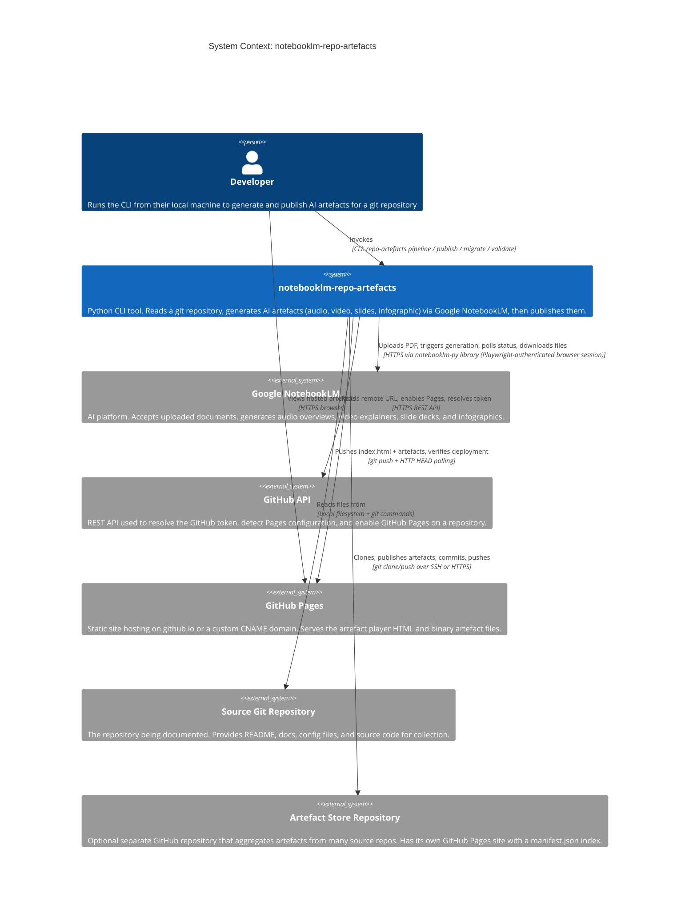

### External System Notes

| External System | Protocol | Auth |
|---|---|---|
| Google NotebookLM | Browser session via `notebooklm-py[browser]` (Playwright) | Google account cookie/CSRF stored by `NotebookLMClient.from_storage()` |
| GitHub API | HTTPS REST | `GITHUB_TOKEN` resolved from: env var, age-encrypted file, macOS Keychain, or 1Password CLI |
| GitHub Pages | HTTP (polling) | Public — no auth needed for verification |
| Source git repo | Local filesystem | None — the developer's working directory |
| Artefact store | git over SSH or HTTPS | Same `GITHUB_TOKEN` as above; SSH key or token-in-URL |

---

## Level 2 — Container Diagram

A container is a separately deployable or runnable unit. For this CLI tool everything runs in
one Python process, so containers correspond to the major source modules — each with a distinct
technical responsibility.

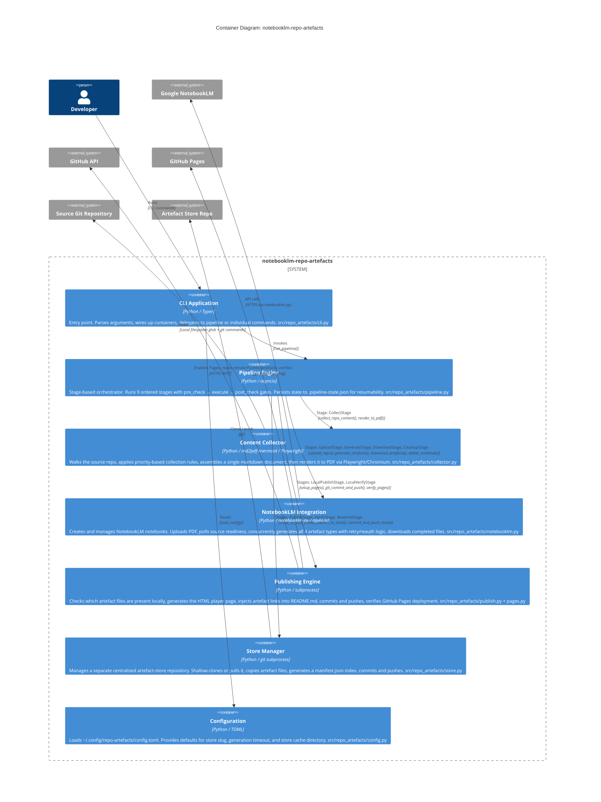

### Container Responsibilities

| Container | Source File(s) | Key Dependency |
|---|---|---|
| CLI Application | `cli.py` | `typer`, `rich` |
| Pipeline Engine | `pipeline.py` | All other containers |
| Content Collector | `collector.py` | `md2pdf-mermaid`, Playwright |
| NotebookLM Integration | `notebooklm.py` | `notebooklm-py[browser]` |
| Publishing Engine | `publish.py`, `pages.py` | `subprocess` (git), `urllib` |
| Store Manager | `store.py` | `subprocess` (git) |
| Configuration | `config.py` | `tomllib` (stdlib) |

---

## Level 3 — Component Diagrams

Level 3 zooms into the two most complex containers: the Pipeline Engine and the NotebookLM
Integration. These contain enough internal structure to warrant their own component view.

### Pipeline Engine Components

The pipeline is a linear sequence of 9 stages. Each stage is a class with three methods.
The runner (`run_pipeline`) drives state transitions and persists results after every stage
so a failed run can be resumed.

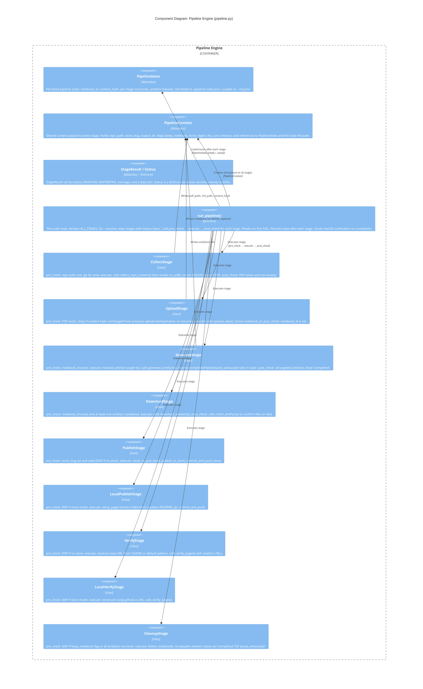

#### Stage Execution Protocol

Every stage class implements this implicit protocol. The runner enforces the sequence.

| Method | PASS means | SKIP means | FAIL means |
|---|---|---|---|
| `pre_check(ctx)` | Proceed to execute | Skip this stage entirely (not an error) | Abort pipeline |
| `execute(ctx)` | Stage work complete | N/A | Abort pipeline |
| `post_check(ctx)` | Stage verified | N/A | Abort pipeline |

#### Stage Ordering and Mutual Exclusivity

Stages 5–8 are mutually exclusive by design: `PublishStage` and `VerifyStage` activate
only when `store_slug` is set; `LocalPublishStage` and `LocalVerifyStage` activate only
when `store_slug` is absent. The runner runs all 9 stages unconditionally — the
`pre_check` SKIP mechanism handles the conditional logic.

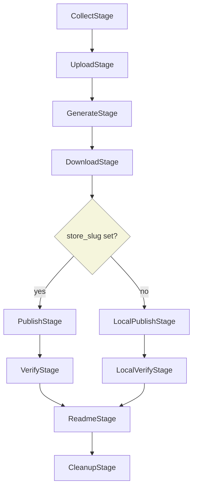

---

### NotebookLM Integration Components

This container encapsulates all communication with the NotebookLM API. It is the most
complex part of the codebase because the external API is asynchronous, requires browser-based
auth, has per-type quota limits, and returns inconsistent error codes.

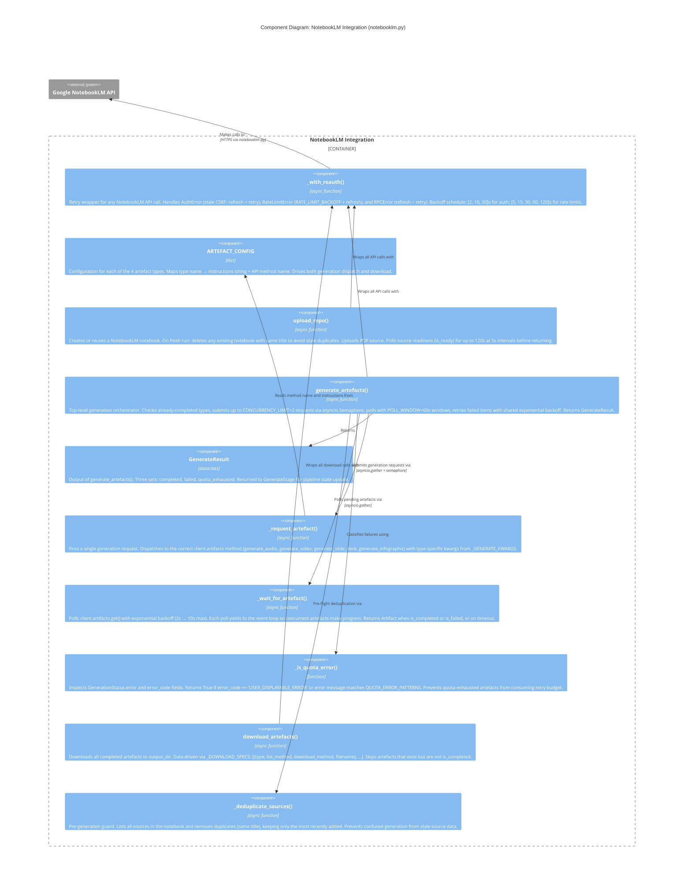

#### Concurrency Model

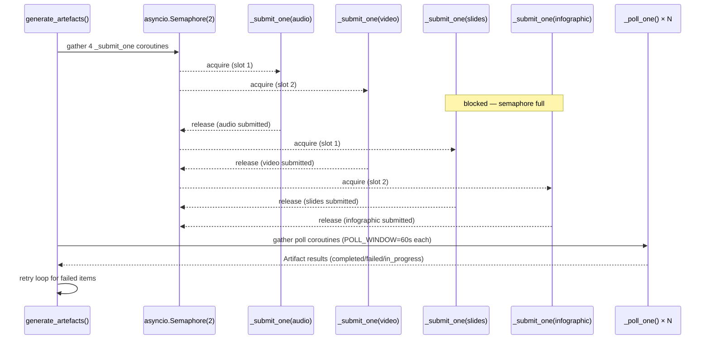

---

## Level 4 — Code Diagrams

Class-level detail for the key types in the system. These match the actual source
and are useful as a reference when reading or extending the code.

### Exception Hierarchy

`src/repo_artefacts/exceptions.py` and `src/repo_artefacts/store.py`

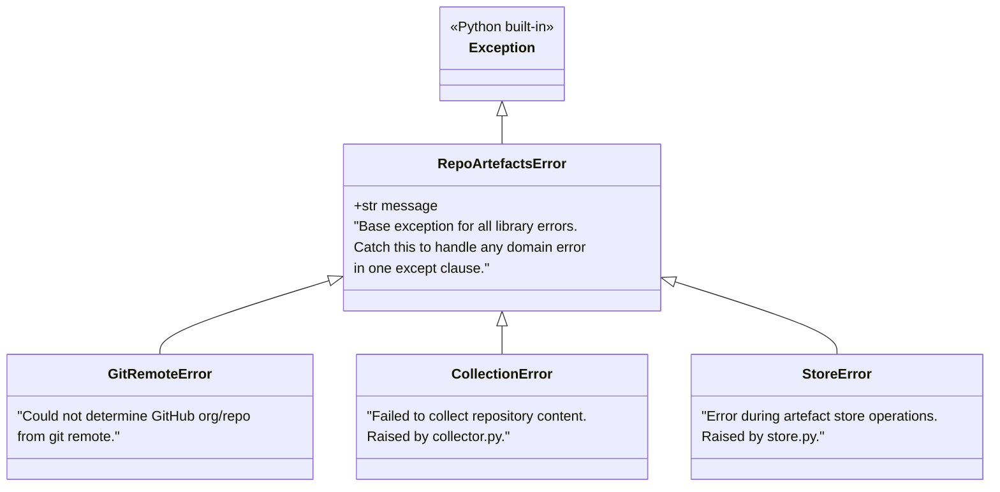

The CLI's `_handle_errors` decorator catches `RepoArtefactsError` and translates it to
`typer.Exit(code=1)`. Library callers can catch the base class for a single handler.

---

### Pipeline Data Model

`src/repo_artefacts/pipeline.py`

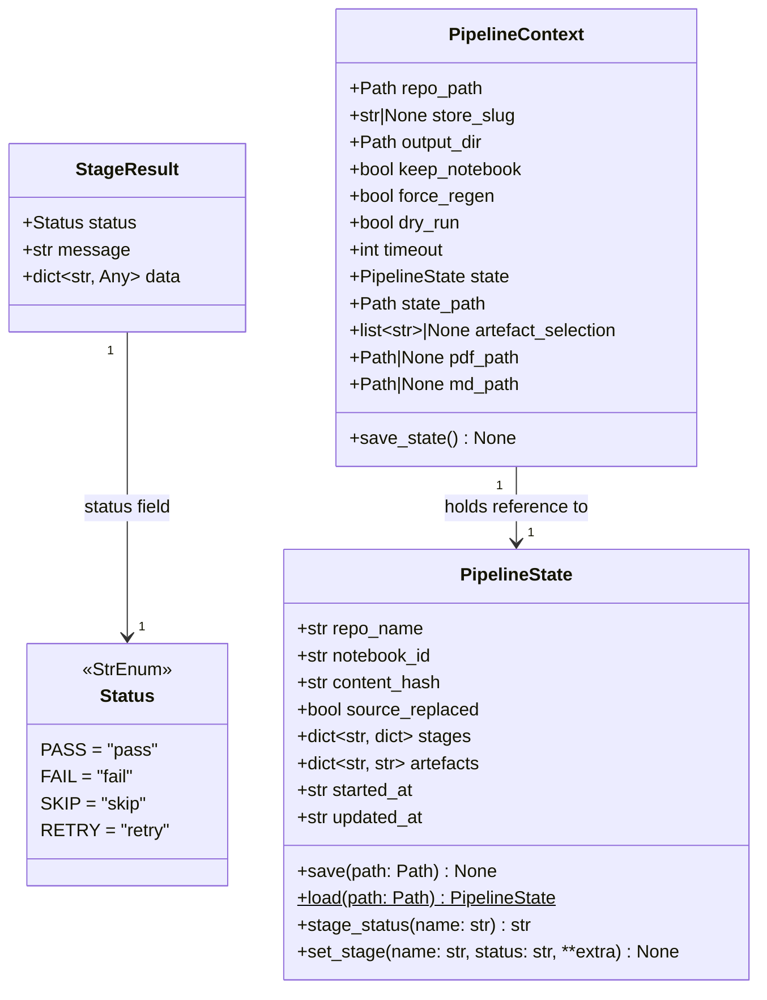

**State persistence**: `PipelineState.save()` writes JSON to `docs/artefacts/.pipeline-state.json`
after every stage. `PipelineState.load()` reads it on `--resume`. The `stages` dict records
the outcome of each stage by name, plus any extra data (e.g., `notebook_id`, `content_hash`,
`duration_s`) that may be useful for debugging.

**Artefact status values stored in `PipelineState.artefacts`**: `"completed"`, `"failed"`,
`"quota_exhausted"`. The `CleanupStage` treats both `"completed"` and `"quota_exhausted"`
as acceptable (the notebook is still deleted so credits are not wasted).

---

### Stage Protocol

All stage classes implement this implicit structural protocol. Python does not enforce it
with an ABC; the runner calls the methods by name.

```mermaid
classDiagram
    class StageProtocol {
        <<implicit interface>>
        +str name
        +pre_check(ctx: PipelineContext) StageResult
        +execute(ctx: PipelineContext) StageResult
        +post_check(ctx: PipelineContext) StageResult
    }

    class CollectStage {
        +name = "collect"
        +pre_check(ctx) StageResult
        +execute(ctx) StageResult
        +post_check(ctx) StageResult
    }

    class UploadStage {
        +name = "upload"
        +pre_check(ctx) StageResult
        +execute(ctx) StageResult
        +post_check(ctx) StageResult
    }

    class GenerateStage {
        +name = "generate"
        +pre_check(ctx) StageResult
        +execute(ctx) StageResult
        +post_check(ctx) StageResult
    }

    class DownloadStage {
        +name = "download"
        +pre_check(ctx) StageResult
        +execute(ctx) StageResult
        +post_check(ctx) StageResult
    }

    class PublishStage {
        +name = "publish"
        +pre_check(ctx) StageResult
        +execute(ctx) StageResult
        +post_check(ctx) StageResult
    }

    class LocalPublishStage {
        +name = "local_publish"
        +pre_check(ctx) StageResult
        +execute(ctx) StageResult
        +post_check(ctx) StageResult
    }

    class VerifyStage {
        +name = "verify"
        +pre_check(ctx) StageResult
        +execute(ctx) StageResult
        +post_check(ctx) StageResult
    }

    class LocalVerifyStage {
        +name = "local_verify"
        +pre_check(ctx) StageResult
        +execute(ctx) StageResult
        +post_check(ctx) StageResult
    }

    class ReadmeStage {
        +name = "readme"
        +pre_check(ctx) StageResult
        +execute(ctx) StageResult
        +post_check(ctx) StageResult
    }

    class CleanupStage {
        +name = "cleanup"
        +pre_check(ctx) StageResult
        +execute(ctx) StageResult
        +post_check(ctx) StageResult
    }

    StageProtocol <|.. CollectStage
    StageProtocol <|.. UploadStage
    StageProtocol <|.. GenerateStage
    StageProtocol <|.. DownloadStage
    StageProtocol <|.. PublishStage
    StageProtocol <|.. LocalPublishStage
    StageProtocol <|.. VerifyStage
    StageProtocol <|.. LocalVerifyStage
    StageProtocol <|.. ReadmeStage
    StageProtocol <|.. CleanupStage
```

`ALL_STAGES` in `pipeline.py` is the single ordered list of instantiated stage objects that
`run_pipeline()` iterates. Adding a new stage means appending to that list.

---

### Config Dataclass

`src/repo_artefacts/config.py` — loaded by `cli.py` and `store.py`

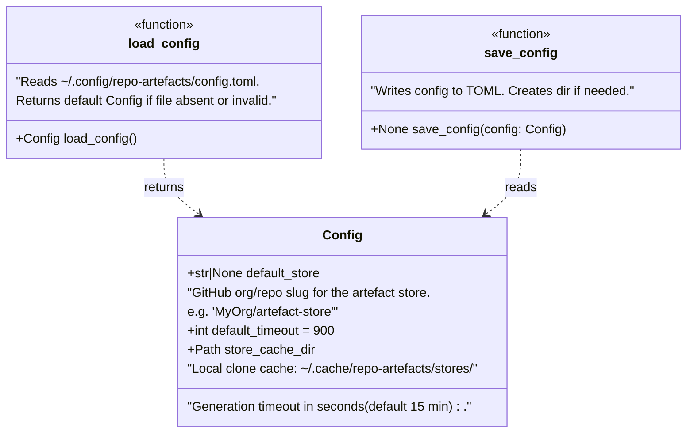

**Config file location**: `~/.config/repo-artefacts/config.toml`

Example:
```toml
default_store = "MyOrg/artefact-store"
default_timeout = 1200
```

---

## Sequence Diagrams

### Full Pipeline Run

This shows the happy-path flow for `repo-artefacts pipeline /path/to/repo --store org/store`.
Error handling and SKIP paths are omitted for readability.

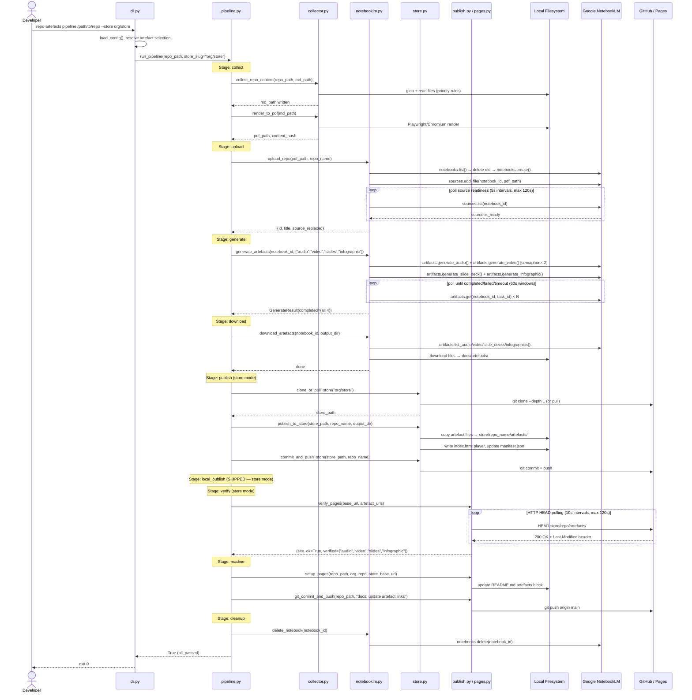

---

### Artefact Generation with Retries

This focuses on the retry and quota detection logic inside `generate_artefacts()`.

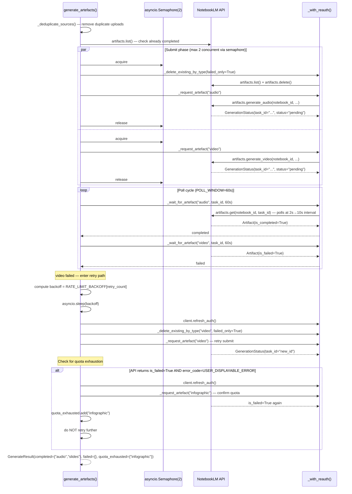

---

### Store Publishing Flow

The store mode separates artefact storage from source repos — binary files live in a dedicated
store repo with its own GitHub Pages site, not in every source repo's git history.

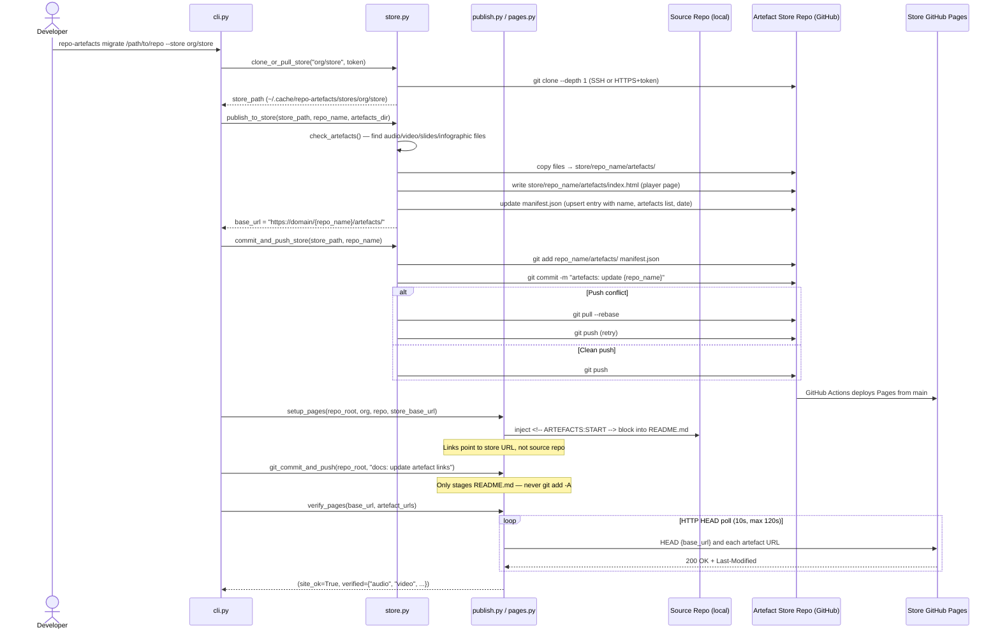

---

## Deployment Diagram

This shows how artefacts flow from the developer's machine through NotebookLM to their
final hosting destination. Two deployment paths exist: local mode and store mode.

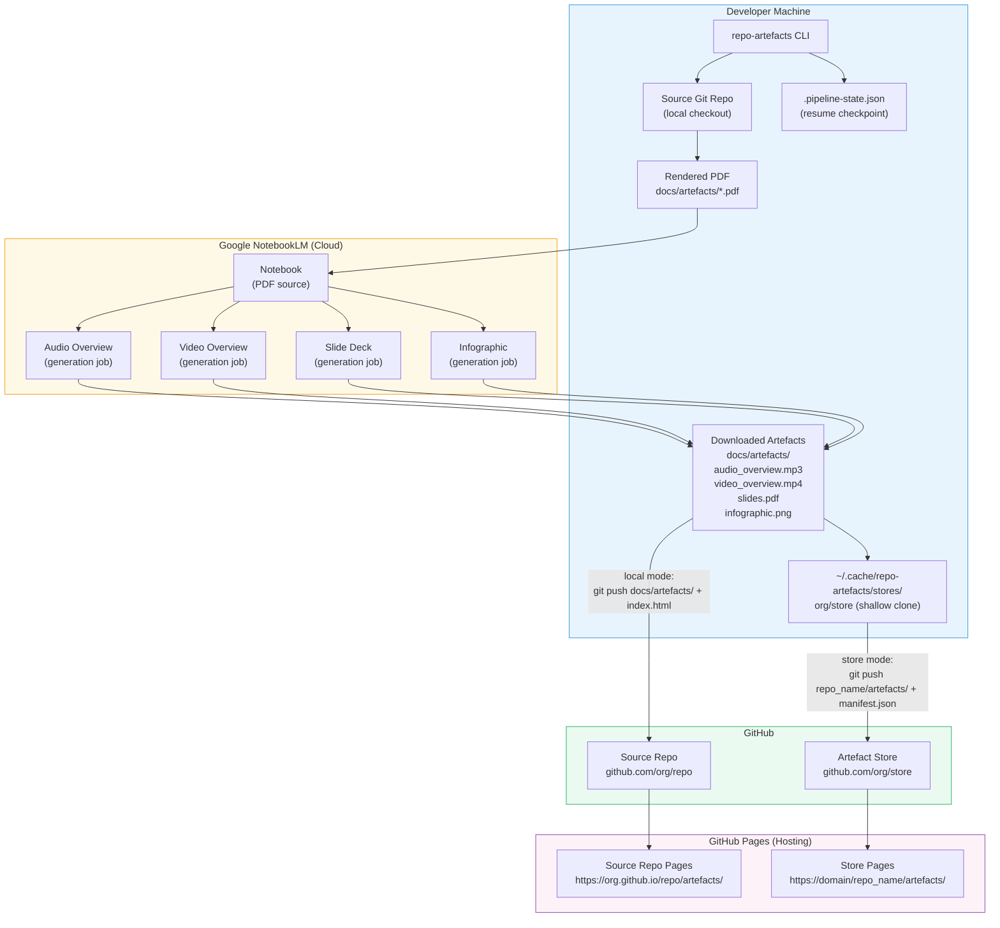

### Deployment Path Comparison

| Aspect | Local Mode | Store Mode |
|---|---|---|
| Artefact location | `docs/artefacts/` in source repo | `{repo_name}/artefacts/` in store repo |
| Player URL | `https://{org}.github.io/{repo}/artefacts/` | `https://{domain}/{repo_name}/artefacts/` |
| Binary files in source git history | Yes (increases repo size over time) | No (use `migrate` + `git filter-repo` to clean) |
| Multi-repo index | No | Yes (`manifest.json`) |
| Source repo README changes | `index.html` link | Store URL link |
| Custom domain support | Via source repo CNAME | Via store repo CNAME |

---

## Key Design Decisions

These explain the non-obvious architectural choices visible in the C4 diagrams above.

### 1. Stage-based pipeline with explicit pre/post checks

The three-method gate pattern (`pre_check → execute → post_check`) makes two things possible:
SKIP-based conditional branching (store vs. local mode uses the same stage list with different
pre_check returns), and fine-grained failure attribution (the pipeline log records which gate
failed, not just which stage). The alternative of `if store_slug:` conditionals inside a
monolithic function would make the execution path harder to test and resume.

Source: `pipeline.py` — `run_pipeline()` loop and each stage class.

### 2. State persisted to JSON after every stage

`PipelineState.save()` is called after every stage outcome, including failures.
This makes `--resume` safe: re-running with `--resume` skips `status == "pass"` stages
and re-executes from the first incomplete or failed stage. Without per-stage persistence,
a network failure during generation would require re-uploading and re-creating the notebook
from scratch. The state file also serves as a structured audit log for debugging.

Source: `pipeline.py` — `STATE_FILENAME = ".pipeline-state.json"`.

### 3. Mutual exclusivity via SKIP, not separate code paths

`PublishStage`/`VerifyStage` and `LocalPublishStage`/`LocalVerifyStage` are in the same
`ALL_STAGES` list. They self-deactivate via `pre_check` returning `Status.SKIP` based on
whether `ctx.store_slug` is set. This keeps the runner loop simple and ensures both paths
go through the same state persistence and logging infrastructure.

### 4. Content hash deduplication on upload

`UploadStage.pre_check` computes a SHA256 of the freshly rendered PDF and compares it
against the hash stored from the previous run's upload stage. If identical, upload is
skipped. This prevents NotebookLM from consuming API credits when the source repo has
not changed since the last run, which is common when iterating on publishing configuration.

### 5. Semaphore-limited concurrent generation with short poll windows

The NotebookLM API appears to reject or throttle more than 2 simultaneous generation
requests from the same account (`CONCURRENCY_LIMIT = 2`). Using `asyncio.Semaphore`
rather than sequential submission reduces total wall-clock time by roughly 2x.
Short `POLL_WINDOW = 60s` cycles allow failed artefacts to be detected and retried
without waiting for the slowest artefact (often video at 10–15 min) to finish.

Source: `notebooklm.py` — `generate_artefacts()`.

### 6. Auth retry wrapper separates retry policy from business logic

`_with_reauth()` is a generic retry wrapper that handles the three failure modes
(AuthError, RateLimitError, RPCError) independently of what operation is being retried.
Every API call is wrapped. This means business logic functions (`upload_repo`,
`generate_artefacts`, `download_artefacts`) do not contain any auth-recovery code,
and the retry policy is in one place.

### 7. Store mode separates binary artefacts from source history

Large binary files (MP3, MP4, PDF) committed directly to a source repo inflate git
clone times permanently. The store mode publishes to a separate dedicated repo, so
source repos only carry README links. The `migrate` command adds a `git filter-repo`
path to clean history for repos that previously used local mode.

### 8. Token resolution fallback chain

`get_github_token()` in `pages.py` tries four sources in order: `GITHUB_TOKEN` env var,
age-encrypted token file, macOS Keychain, 1Password CLI. This supports CI/CD (env var),
developer machines with different secret managers, and local development without env vars.
Each source is silently skipped on failure, so no single secret manager is required.
