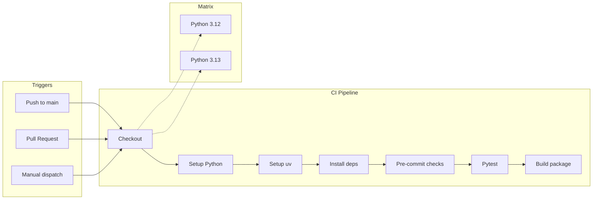
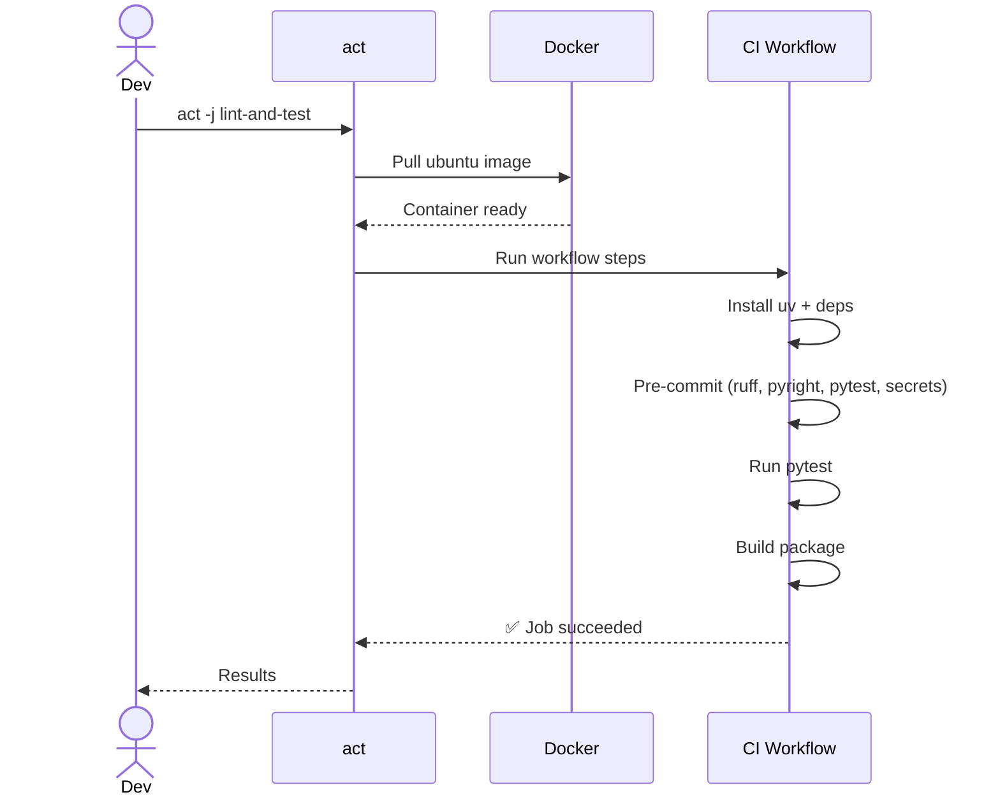

# CI & Local Testing

## GitHub Actions

Both repos use the same CI workflow (`.github/workflows/ci.yml`) that runs on every push and PR to `main`.



### What pre-commit checks

| Hook | What it does |
|------|-------------|
| `check-added-large-files` | Blocks files > 1MB |
| `end-of-file-fixer` | Ensures newline at EOF |
| `trailing-whitespace` | Strips trailing spaces |
| `mixed-line-ending` | Enforces LF line endings |
| `ruff` | Python linting + auto-fix |
| `ruff-format` | Code formatting |
| `detect-secrets` | Scans for leaked credentials |
| `pyright` | Static type checking |
| `pytest` | Unit tests |

## Running Locally with `act`

[`act`](https://github.com/nektos/act) runs GitHub Actions workflows locally in Docker containers — same environment as CI.

### Setup

```bash
brew install act
```

### Run the CI workflow

```bash
# Load GitHub token (needed for act to clone actions)
source ~/tmp/.env
# Or: export GITHUB_TOKEN=$(security find-generic-password -a GITHUB_TOKEN -s api-keys -w)

# Run the full CI
cd ~/code/personal/tools/notebooklm_repo_artefacts
act -j lint-and-test \
  --matrix python-version:3.12 \
  -P ubuntu-latest=catthehacker/ubuntu:act-latest \
  --container-architecture linux/amd64 \
  -s GITHUB_TOKEN=$GITHUB_TOKEN
```



### Quick options

```bash
# Run specific Python version
act -j lint-and-test --matrix python-version:3.13 ...

# Dry run (show what would execute)
act -j lint-and-test -n

# List available jobs
act -l
```

### Troubleshooting act

| Issue | Fix |
|-------|-----|
| `authentication required` | Pass `-s GITHUB_TOKEN=$GITHUB_TOKEN` |
| ARM/M-series issues | Add `--container-architecture linux/amd64` |
| Slow first run | Docker image download (~2GB), cached after |
| Pre-commit cache miss | Normal on first run, faster on subsequent |

## Running pre-commit directly

For quick checks without Docker:

```bash
# All files
uv run pre-commit run --all-files

# Specific hooks
uv run pre-commit run ruff --all-files
uv run pre-commit run pyright --all-files
uv run pre-commit run pytest --all-files

# Just staged files (default git hook behaviour)
uv run pre-commit run
```
