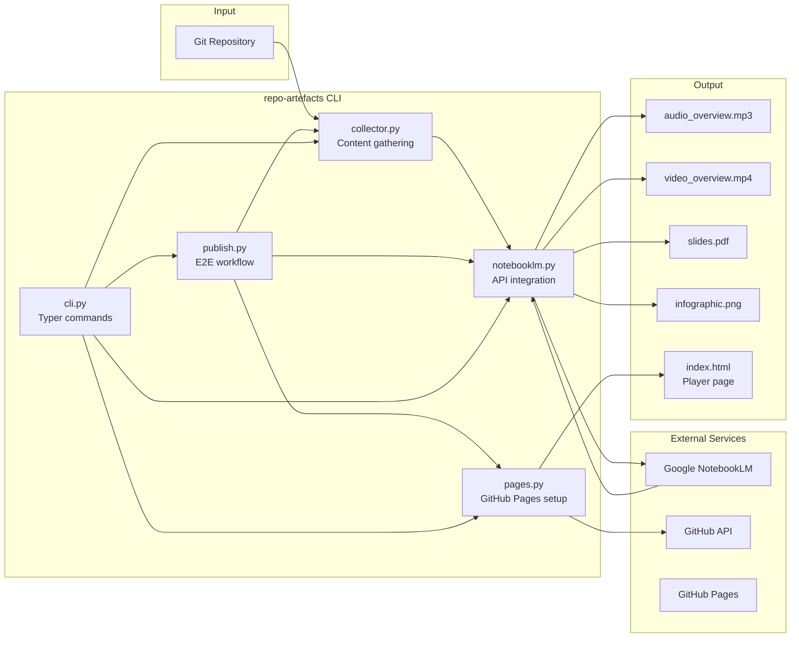
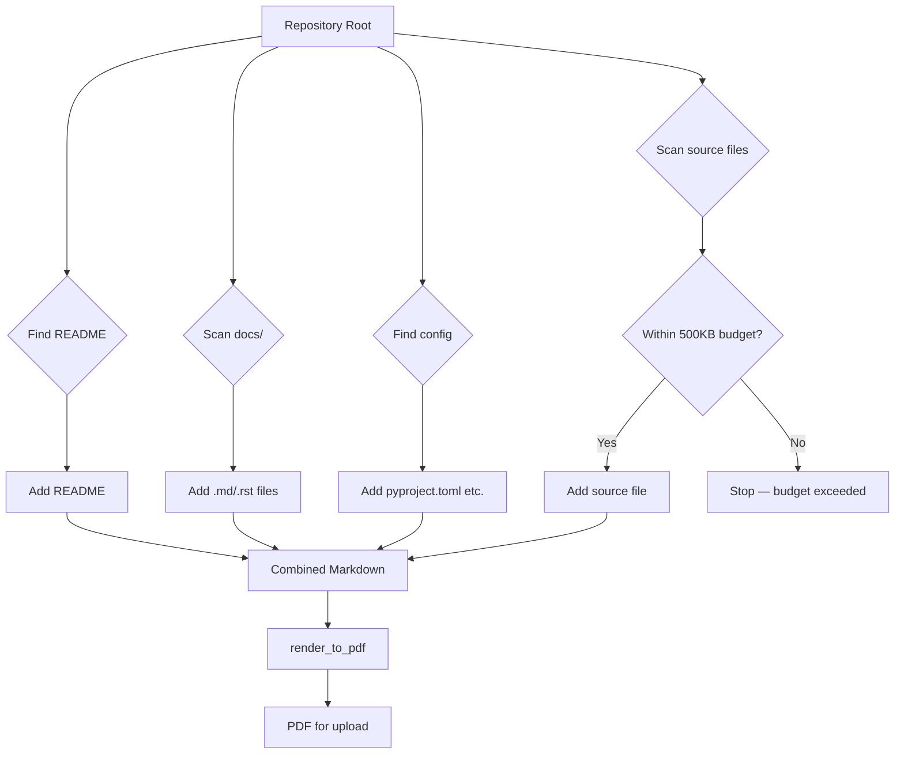
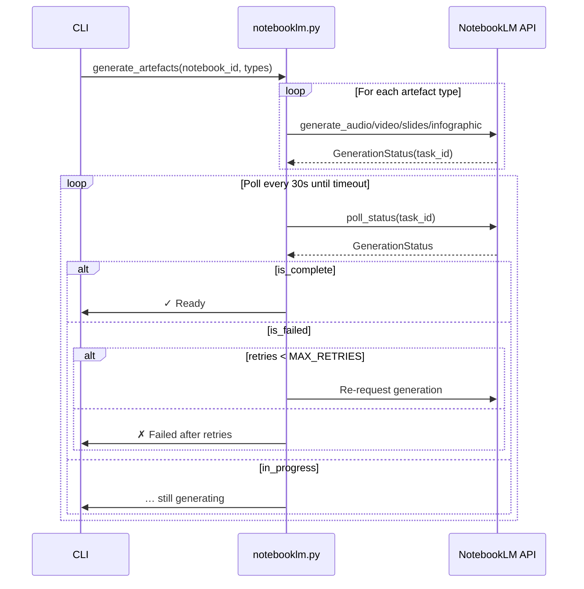
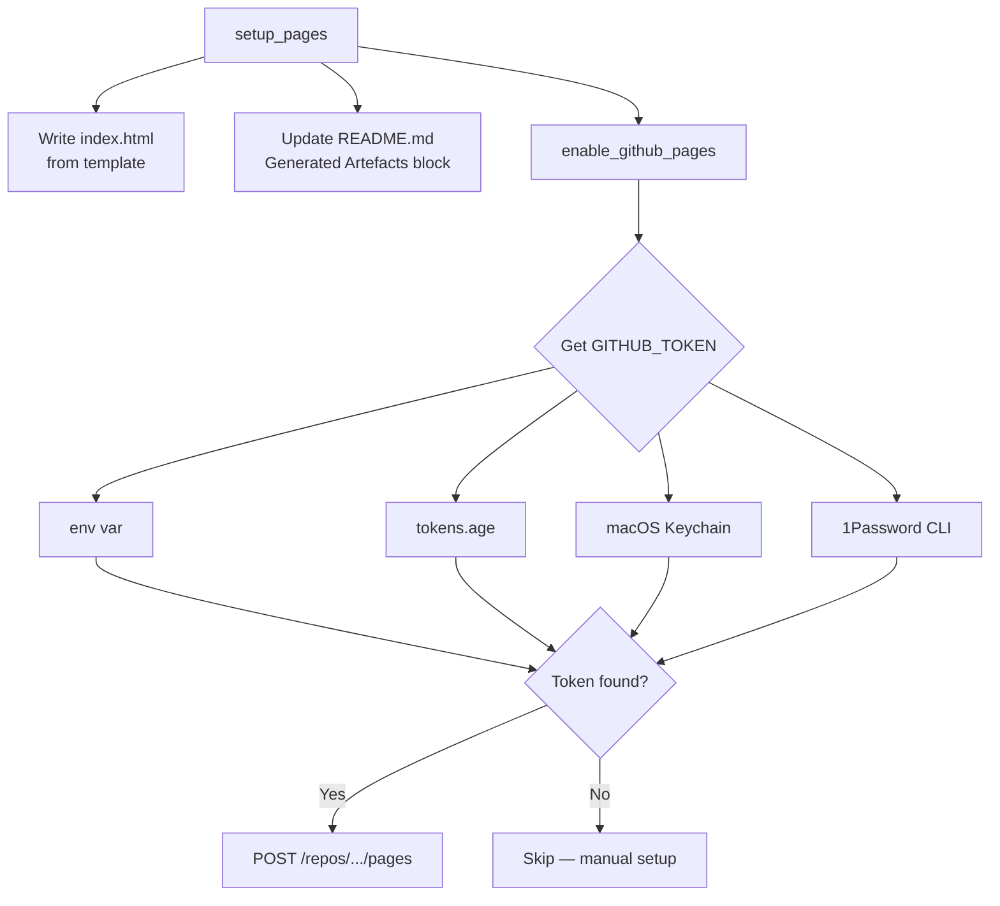
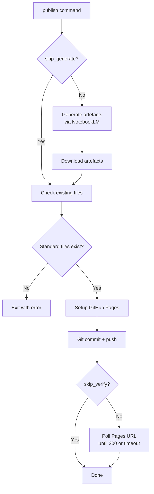
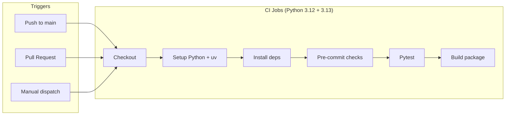
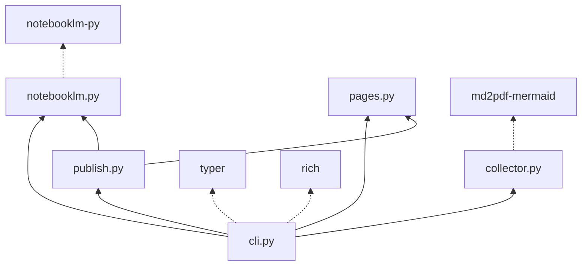

# Code Map — notebooklm-repo-artefacts

> Architecture, module relationships, and data flows for the `repo-artefacts` CLI tool.

## Overview

`notebooklm-repo-artefacts` collects content from a git repository, uploads it to Google NotebookLM, generates AI-powered artefacts (audio, video, slides, infographic), and publishes them via GitHub Pages.

## Module Breakdown

### cli.py — Command Router

Entry point for all CLI commands. Uses [Typer](https://typer.tiangolo.com/) for argument parsing and [Rich](https://rich.readthedocs.io/) for terminal output.

| Command | Description | Calls |
|---------|-------------|-------|
| `process` | Collect repo content → upload to NotebookLM | `collector` → `notebooklm` |
| `generate` | Generate artefacts from a notebook | `notebooklm` |
| `download` | Download artefacts to local disk | `notebooklm` |
| `list` | List notebooks or sources | `notebooklm` |
| `delete` | Delete a notebook | `notebooklm` |
| `pages` | Set up GitHub Pages player | `pages` |
| `publish` | Generate → pages → push → verify | `notebooklm` → `pages` → `publish` |
| `pipeline` | Full E2E: upload → generate → download → pages → push → verify → cleanup | `collector` → `notebooklm` → `pages` → `publish` |

### collector.py — Repository Content Gathering

Walks a git repository and assembles key files into a single markdown document for NotebookLM upload.

**Key constraints:**
- Total output capped at 500KB (`MAX_TOTAL_BYTES`)
- Source files capped at 500 lines each (`MAX_SOURCE_LINES`)
- Skips `.git`, `node_modules`, `__pycache__`, `.venv`, etc.
- Priority order: README → docs → config → source

### notebooklm.py — NotebookLM API Integration

Manages the full lifecycle: upload content, generate artefacts, poll for completion, download results.

**Retry logic:** Up to 3 retries per artefact. Handles both immediate failures (empty `task_id` from API) and failures detected during polling.

### pages.py — GitHub Pages Setup

Creates the player page, updates README links, and enables GitHub Pages via API.

**Token resolution chain** (first match wins):
1. `GITHUB_TOKEN` environment variable
2. `~/.config/secrets/tokens.age` (age-encrypted, decrypted with `~/.config/age/keys.txt`)
3. macOS Keychain (`api-keys` service)
4. 1Password CLI (`op` — API_KEYS vault)

### publish.py — End-to-End Workflow

Orchestrates the full pipeline: generate → check → pages → push → verify.

## CI Pipeline

GitHub Actions runs on every push/PR to `main`. Can be run locally with [`act`](https://github.com/nektos/act).

Pre-commit hooks: `ruff` (lint + format), `pyright` (type check), `pytest` (tests), `detect-secrets`, standard file checks.

See [CI & Testing](ci-and-testing.md) for `act` setup and local testing.

## Interfaces

| Module | Exports | Used By |
|--------|---------|---------:|
| `collector` | `collect_repo_content()`, `render_to_pdf()` | `cli.process`, `cli.pipeline` |
| `notebooklm` | `upload_repo()`, `generate_artefacts()`, `download_artefacts()`, `list_*()`, `delete_notebook()` | `cli.*`, `publish`, `pipeline` |
| `pages` | `get_github_info()`, `get_github_token()`, `setup_pages()`, `enable_github_pages()` | `cli.pages`, `cli.publish`, `cli.pipeline` |
| `publish` | `check_artefacts()`, `verify_pages()`, `git_commit_and_push()` | `cli.publish`, `cli.pipeline` |

## Dependencies

Solid lines = internal imports. Dotted lines = external packages.
