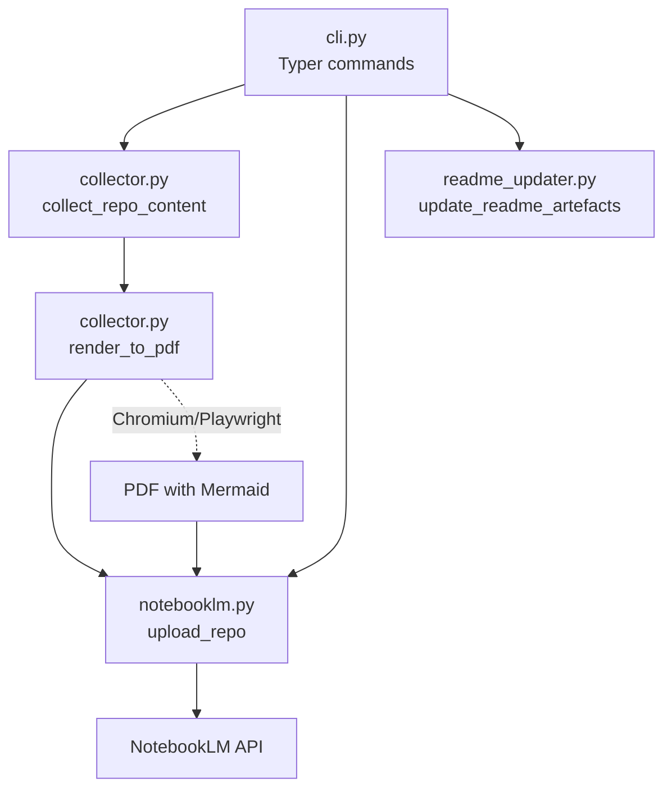
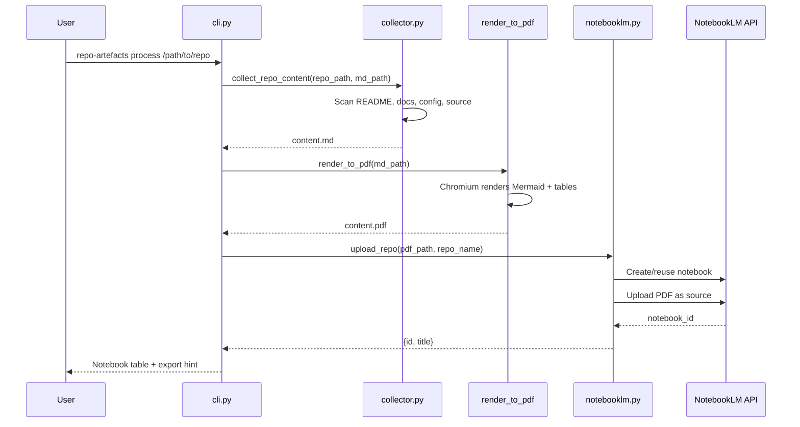
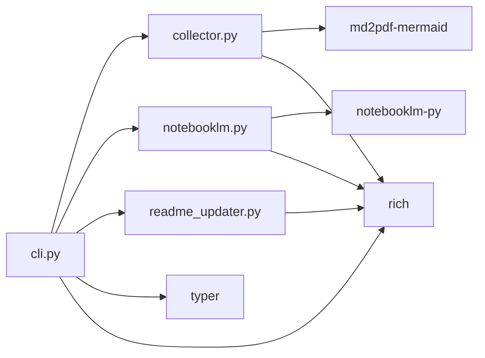

# Code Map — notebooklm-repo-artefacts

## Project Structure

```
notebooklm-repo-artefacts/
├── pyproject.toml
├── LICENSE
├── README.md
├── docs/
│   └── codemap.md
└── src/
    └── repo_artefacts/
        ├── __init__.py
        ├── cli.py              # Typer CLI entry point (6 commands)
        ├── collector.py        # Repo scanning + markdown assembly + PDF rendering
        ├── notebooklm.py       # NotebookLM API integration
        └── readme_updater.py   # README artefacts section updater
```

## Module Overview

| Module | Purpose | Key Dependencies |
|---|---|---|
| `cli.py` | CLI entry point — 6 commands via Typer | typer, rich |
| `collector.py` | Scans repos, assembles markdown, renders PDF | md2pdf-mermaid, rich |
| `notebooklm.py` | Upload, generate, download, list, delete via NotebookLM API | notebooklm-py, rich |
| `readme_updater.py` | Inserts/updates artefact listings in README files | rich |

## Architecture



## Module Deep-Dives

### cli.py

Entry point for all 6 commands. Uses lazy imports to keep startup fast — `notebooklm-py` and `md2pdf-mermaid` are only imported when their commands run.

| Command | Function | Description |
|---|---|---|
| `process` | `process()` | Collect → render → upload pipeline |
| `generate` | `generate()` | Request artefact generation |
| `download` | `download()` | Fetch artefacts + auto-update README |
| `list` | `list_cmd()` | List notebooks or sources |
| `delete` | `delete_cmd()` | Delete a notebook (with confirmation) |
| `update-readme` | `update_readme()` | Manual README artefacts update |

Helper functions:
- `_get_repo_name()` — resolves repo name from git remote origin, falls back to directory name
- `_get_notebook_id()` — resolves notebook ID from `-n` flag or `NOTEBOOK_ID` env var

### collector.py

Two main functions:

- `collect_repo_content(repo_path, output_path)` — Scans a repo with a priority system (README → docs → config → source) and writes a combined markdown file. Budget-aware: caps total at 500KB, source files limited to 500 lines each.
- `render_to_pdf(md_path)` — Converts markdown to PDF via `md2pdf-mermaid`, which uses Chromium/Playwright to render Mermaid diagrams as images.

Constants control collection behaviour: `MAX_TOTAL_BYTES`, `MAX_SOURCE_LINES`, `SOURCE_EXTENSIONS`, `SKIP_DIRS`, `README_NAMES`, `CONFIG_FILES`.

### notebooklm.py

Async functions wrapping `notebooklm-py`:

- `upload_repo()` — Creates or reuses a notebook, uploads the PDF as a source
- `generate_artefacts()` — Fires off generation requests concurrently, polls every 30s until complete or timeout
- `download_artefacts()` — Downloads all available artefact types (audio, video, slides, infographic)
- `list_notebooks()` / `list_sources()` — Display notebooks and sources as Rich tables
- `delete_notebook()` — Deletes a notebook by ID

Generation config (`ARTEFACT_CONFIG`) defines per-type instructions and timeouts. `DOWNLOAD_MAP` maps artefact types to their list/download API methods and filenames.

### readme_updater.py

- `update_readme_artefacts(readme_path, artefacts_dir)` — Scans the artefacts directory, builds a markdown listing, and inserts it between `<!-- ARTEFACTS:START -->` / `<!-- ARTEFACTS:END -->` markers. Appends if markers don't exist.

Uses `ARTEFACT_NAMES` dict to map filename prefixes to display labels with emoji.

## Data Flow — `process` Command



## Dependency Graph



## Key Design Decisions

| Decision | Rationale |
|---|---|
| Lazy imports in CLI | Fast startup — heavy deps only loaded when needed |
| PDF via Chromium/Playwright | Accurate rendering of Mermaid diagrams and tables |
| Budget-aware collection | 500KB cap prevents oversized uploads to NotebookLM |
| Async NotebookLM operations | Concurrent artefact generation with polling |
| Marker-based README updates | Non-destructive — only touches content between markers |
| CLI command stays `repo-artefacts` | Shorter to type; package name adds `notebooklm-` prefix for discoverability |
| `NOTEBOOK_ID` env var | Avoids repeating `-n` across commands in a workflow |
