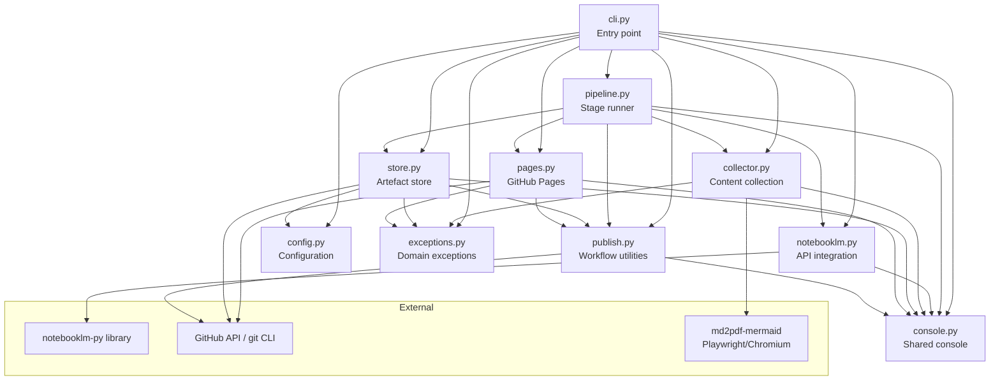
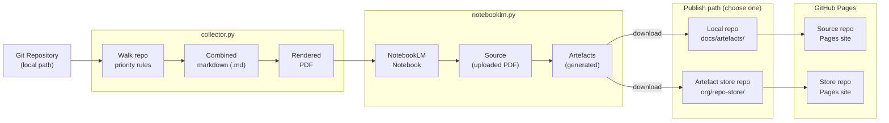
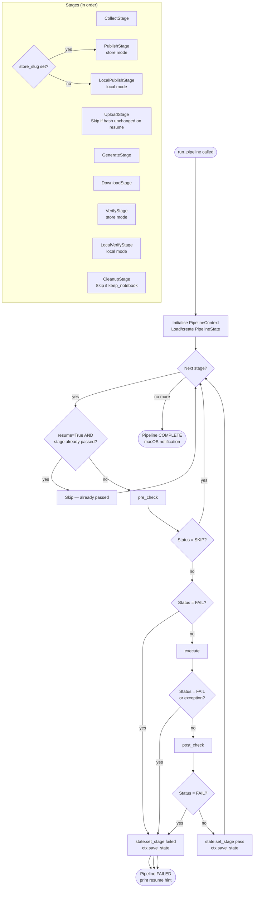
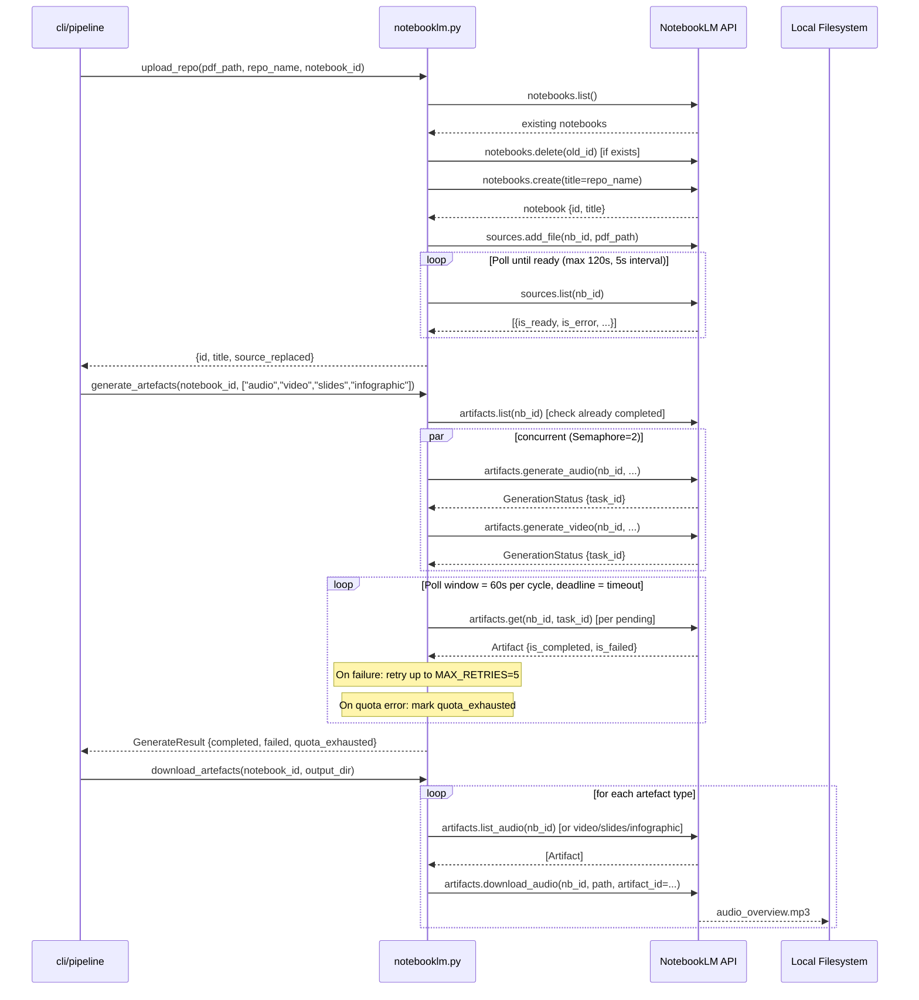
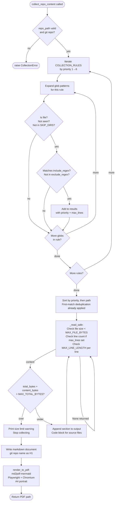
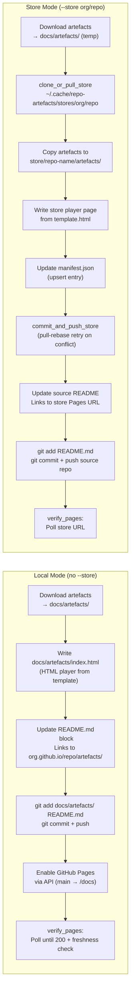
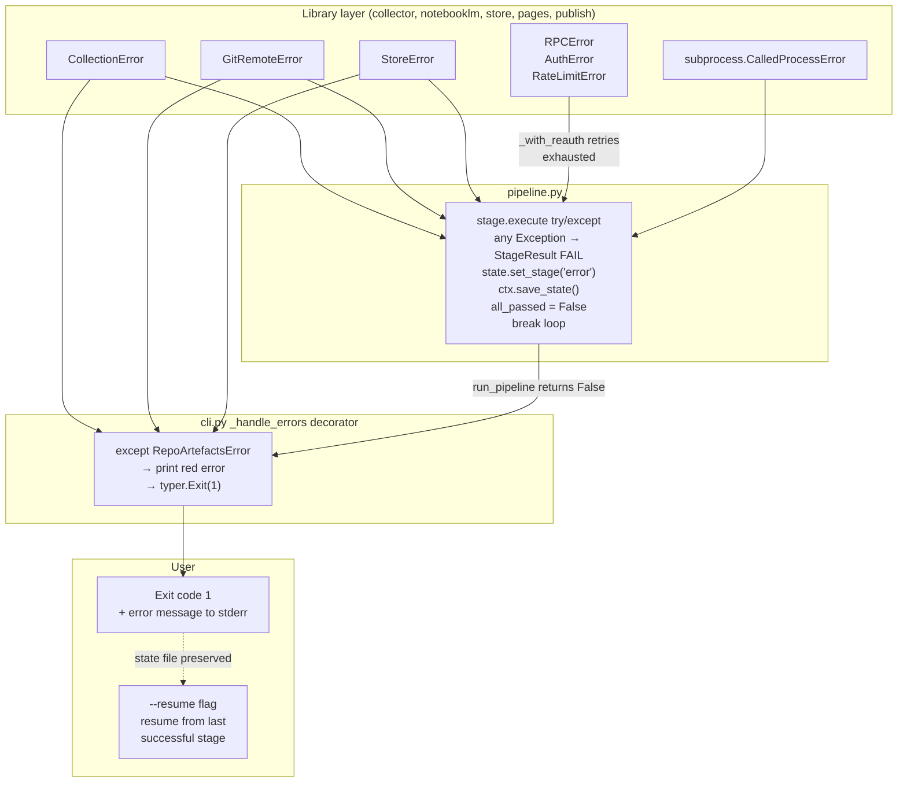
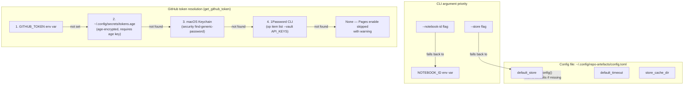
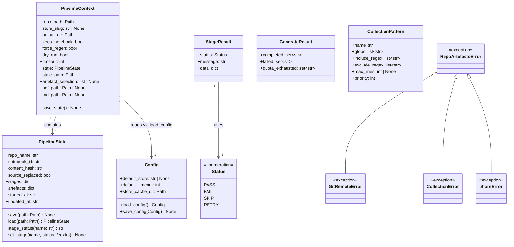

# Code Map — notebooklm-repo-artefacts v0.1.0

> Architecture, module relationships, data flows, and interface reference for the `repo-artefacts` CLI tool.

---

## Table of Contents

1. [System Overview](#1-system-overview)
2. [Module Dependency Graph](#2-module-dependency-graph)
3. [End-to-End Data Flow](#3-end-to-end-data-flow)
4. [Module Reference](#4-module-reference)
   - [cli.py — Command Interface](#41-clipy--command-interface)
   - [pipeline.py — Stage Runner](#42-pipelinepy--stage-runner)
   - [notebooklm.py — API Integration](#43-notebookklmpy--api-integration)
   - [collector.py — Content Collection](#44-collectorpy--content-collection)
   - [store.py — Artefact Store](#45-storepy--artefact-store)
   - [pages.py — GitHub Pages](#46-pagespy--github-pages)
   - [publish.py — Workflow Utilities](#47-publishpy--workflow-utilities)
   - [config.py — Configuration](#48-configpy--configuration)
   - [console.py — Shared Output](#49-consolepy--shared-output)
   - [exceptions.py — Error Types](#410-exceptionspy--error-types)
5. [Pipeline Stage Flow](#5-pipeline-stage-flow)
6. [NotebookLM Integration Sequence](#6-notebooklm-integration-sequence)
7. [Content Collection Flowchart](#7-content-collection-flowchart)
8. [Publishing Modes](#8-publishing-modes)
9. [Error Propagation](#9-error-propagation)
10. [Configuration and Secrets Resolution](#10-configuration-and-secrets-resolution)
11. [Key Dataclass Relationships](#11-key-dataclass-relationships)
12. [Interface Reference](#12-interface-reference)

---

## 1. System Overview

`notebooklm-repo-artefacts` is a Python CLI tool (`uv tool install`) that automates turning any git repository into AI-generated learning materials hosted on GitHub Pages.

**Core workflow:**

1. **Collect** — Scan the repo, assemble priority-ordered content into a markdown document, render to PDF
2. **Upload** — Create a NotebookLM notebook and upload the PDF as a source
3. **Generate** — Request audio overview, video explainer, slide deck, and/or infographic concurrently
4. **Download** — Pull the completed artefact files to disk
5. **Publish** — Push artefacts to GitHub Pages (local mode) or a centralised artefact store (store mode)
6. **Verify** — Poll the published URL to confirm the site is live and artefacts are reachable

Two orchestration paths exist:

| Path | Command | Description |
|---|---|---|
| **Pipeline** (recommended) | `pipeline` | Stage-based with state persistence, resumability, and structured logging |
| **Legacy** | `publish` | Linear workflow, no state, no resume |

---

## 2. Module Dependency Graph


```mermaid
graph TD
    CLI[cli.py<br/>Entry point]

    PL[pipeline.py<br/>Stage runner]
    NLM[notebooklm.py<br/>API integration]
    COL[collector.py<br/>Content collection]
    ST[store.py<br/>Artefact store]
    PG[pages.py<br/>GitHub Pages]
    PUB[publish.py<br/>Workflow utilities]
    CFG[config.py<br/>Configuration]
    CNS[console.py<br/>Shared console]
    EXC[exceptions.py<br/>Domain exceptions]

    CLI --> PL
    CLI --> NLM
    CLI --> COL
    CLI --> ST
    CLI --> PG
    CLI --> PUB
    CLI --> CFG
    CLI --> CNS
    CLI --> EXC

    PL --> NLM
    PL --> COL
    PL --> ST
    PL --> PG
    PL --> PUB
    PL --> CNS

    NLM --> CNS
    COL --> CNS
    COL --> EXC
    ST --> CFG
    ST --> CNS
    ST --> EXC
    ST --> PUB
    PG --> CNS
    PG --> EXC
    PG --> PUB
    PUB --> CNS

    subgraph "External"
        NLMLIB[notebooklm-py library]
        GHAPI[GitHub API / git CLI]
        MD2PDF[md2pdf-mermaid<br/>Playwright/Chromium]
    end

    NLM --> NLMLIB
    PG --> GHAPI
    ST --> GHAPI
    PUB --> GHAPI
    COL --> MD2PDF
```

**Key dependency rules:**

- `console.py` and `exceptions.py` are leaf modules — they depend on nothing in the package
- `config.py` is a near-leaf — only imported by `store.py` and `cli.py`
- `publish.py` is a utility layer — imported by `store.py`, `pages.py`, and `pipeline.py`
- `pipeline.py` is the heaviest orchestrator — imports from all domain modules
- `cli.py` imports lazily (inside function bodies) to keep startup fast

---

## 3. End-to-End Data Flow


```mermaid
flowchart LR
    REPO["Git Repository\n(local path)"]

    subgraph collect["collector.py"]
        WALK["Walk repo\npriority rules"]
        MD["Combined\nmarkdown (.md)"]
        PDF["Rendered\nPDF"]
    end

    subgraph notebooklm["notebooklm.py"]
        NB["NotebookLM\nNotebook"]
        SRC["Source\n(uploaded PDF)"]
        ART["Artefacts\n(generated)"]
    end

    subgraph publish_paths["Publish path (choose one)"]
        LOCAL["Local repo\ndocs/artefacts/"]
        STORE["Artefact store repo\norg/repo-store/"]
    end

    subgraph pages["GitHub Pages"]
        LPAGES["Source repo\nPages site"]
        SPAGES["Store repo\nPages site"]
    end

    REPO --> WALK
    WALK --> MD
    MD --> PDF
    PDF --> NB
    NB --> SRC
    SRC --> ART
    ART -->|"download"| LOCAL
    ART -->|"download"| STORE
    LOCAL --> LPAGES
    STORE --> SPAGES
```

The pipeline passes data through two mechanisms:

- **Files on disk** — PDF, downloaded artefacts, generated HTML player pages
- **`PipelineState`** — notebook_id, content_hash, artefact statuses, stage results, persisted to `.pipeline-state.json`

---

## 4. Module Reference

### 4.1 `cli.py` — Command Interface

**Role:** Typer application entry point. Translates user intent into calls to domain modules. Handles all argument parsing, resolution of defaults (env vars, config file), and error display.

**Key patterns:**

```python
# Error boundary: wraps every command, catches domain exceptions → typer.Exit(1)
def _handle_errors(func):
    @functools.wraps(func)
    def wrapper(*args, **kwargs):
        try:
            return func(*args, **kwargs)
        except RepoArtefactsError as exc:
            get_console().print(f"[red]Error:[/red] {exc}")
            raise typer.Exit(code=1) from exc
    return wrapper

# Notebook ID resolution: argument → env var → error
def _get_notebook_id(notebook_id: str | None) -> str:
    nb_id = notebook_id or os.environ.get("NOTEBOOK_ID")
    ...
```

**Commands:**

| Command | Key Arguments | What it does |
|---|---|---|
| `process` | `repo_path`, `--notebook-id`, `--output-dir` | Collect → PDF → upload. Prints notebook ID for use in subsequent commands |
| `generate` | `--notebook-id`, `--audio/--video/--slides/--infographic`, `--all`, `--timeout` | Fire generation requests for selected artefact types |
| `download` | `--notebook-id`, `--output-dir` | Download completed artefacts to local disk |
| `list` | `--notebook-id` | With ID: list sources. Without: list all notebooks |
| `delete` | `--notebook-id` | Delete notebook with confirmation prompt |
| `pages` | `repo_path`, `--org`, `--repo` | Create player page, update README, enable GitHub Pages |
| `publish` | `repo_path`, `--notebook-id`, `--store`, `--skip-generate`, `--remote` | Legacy E2E: generate → pages → push → verify |
| `pipeline` | `repo_path`, `--notebook-id`, `--store`, `--resume`, `--force-regen`, `--clean`, `--exclude` | Stage-based E2E with persistence and resumability |
| `migrate` | `repo_path`, `--store`, `--description` | Move artefacts from source repo to store; updates README; prints history-rewrite instructions |
| `validate` | `repo_path`, `--all`, `--store` | HEAD-check artefact URLs in README (single) or all repos in store manifest |
| `clean` | `--store`, `--delete` | Find orphaned artefact dirs in store; optionally remove and push |

**Helper functions:**

| Function | Signature | Purpose |
|---|---|---|
| `_get_git_root` | `(repo_path: Path) -> Path` | `git rev-parse --show-toplevel`, falls back to resolved path |
| `_get_repo_name` | `(repo_path: Path) -> str` | Remote URL → trailing segment, falls back to directory name |
| `_get_notebook_id` | `(notebook_id: str \| None) -> str` | Arg → `NOTEBOOK_ID` env var → error |

---

### 4.2 `pipeline.py` — Stage Runner

**Role:** Implements the recommended orchestration path. Decomposes the E2E workflow into 9 discrete stages, each with pre-check/execute/post-check gates. State is persisted to disk after every stage for resumability.

#### Result Types

```python
class Status(StrEnum):
    PASS = "pass"
    FAIL = "fail"
    SKIP = "skip"
    RETRY = "retry"

@dataclass
class StageResult:
    status: Status
    message: str = ""
    data: dict[str, Any] = field(default_factory=dict)
```

#### State and Context

```python
@dataclass
class PipelineState:
    """Persisted to .pipeline-state.json after each stage."""
    repo_name: str
    notebook_id: str
    content_hash: str          # SHA256 of the uploaded PDF
    source_replaced: bool      # True if a new source replaced an old one
    stages: dict[str, dict]    # stage_name → {status, at, ...data}
    artefacts: dict[str, str]  # artefact_name → "completed"|"failed"|"quota_exhausted"
    started_at: str
    updated_at: str

@dataclass
class PipelineContext:
    """Shared mutable context passed to every stage."""
    repo_path: Path
    store_slug: str | None
    output_dir: Path
    keep_notebook: bool
    force_regen: bool
    dry_run: bool
    timeout: int
    state: PipelineState
    state_path: Path
    artefact_selection: list[str] | None   # None = all four types
    pdf_path: Path | None                  # set during CollectStage.execute
    md_path: Path | None                   # set during CollectStage.execute
```

#### Stage Registry

```
ALL_STAGES = [
    CollectStage,       # 1. Scan repo, render PDF
    UploadStage,        # 2. Create/reuse notebook, upload source
    GenerateStage,      # 3. Concurrent generation with retry
    DownloadStage,      # 4. Download completed artefacts
    PublishStage,       # 5. Push to store (SKIP if no store)
    LocalPublishStage,  # 6. GitHub Pages setup (SKIP if store)
    VerifyStage,        # 7. Verify store deployment (SKIP if no store)
    LocalVerifyStage,   # 8. Verify local Pages (SKIP if store)
    CleanupStage,       # 9. Delete notebook (SKIP if keep_notebook or artefacts incomplete)
]
```

Stages 5/6 and 7/8 are mutually exclusive pairs — exactly one of each pair runs depending on whether `store_slug` is set.

#### Runner Loop Logic

```python
for stage in ALL_STAGES:
    if resume and state.stage_status(stage.name) == "pass":
        continue        # already passed — skip entirely

    pre = stage.pre_check(ctx)
    if pre.status == SKIP: continue
    if pre.status == FAIL: break (all_passed = False)

    result = stage.execute(ctx)   # raises → break
    if result.status == FAIL: break

    post = stage.post_check(ctx)
    if post.status == FAIL: break

    state.set_stage(stage.name, "pass", ...)
    ctx.save_state()              # atomic write after each pass
```

**Helper functions:**

| Function | Signature | Purpose |
|---|---|---|
| `run_pipeline` | `(repo_path, *, store_slug, keep_notebook, force_regen, dry_run, resume, timeout, artefact_selection, notebook_id) -> bool` | Main entry — initialises context, iterates stages, returns `True` on success |
| `_hash_file` | `(path: Path) -> str` | SHA256 of a file for content-hash skip detection |
| `_resolve_repo_name` | `(repo_path: Path) -> str` | git remote URL → repo name (lowercase) |
| `_notify` | `(title, message) -> None` | macOS `osascript` notification; silent no-op on Linux |

---

### 4.3 `notebooklm.py` — API Integration

**Role:** All interaction with the `notebooklm-py` library. Wraps every API call with `_with_reauth()` for auth resilience. Handles concurrent artefact generation with polling, retry, and quota detection.

#### Configuration Constants

```python
ARTEFACT_CONFIG = {
    "audio":       {"instructions": "...", "method": "generate_audio"},
    "video":       {"instructions": "...", "method": "generate_video"},
    "slides":      {"instructions": "...", "method": "generate_slide_deck"},
    "infographic": {"instructions": None,  "method": "generate_infographic"},
}

_GENERATE_KWARGS = {
    "audio":       {"audio_format": AudioFormat.DEEP_DIVE},
    "video":       {"video_style": VideoStyle.WHITEBOARD},
    "infographic": {"orientation": ..., "detail_level": ...},
}

NAME_TO_ARTIFACT_TYPE = {
    "audio": ArtifactType.AUDIO,
    "video": ArtifactType.VIDEO,
    "slides": ArtifactType.SLIDE_DECK,
    "infographic": ArtifactType.INFOGRAPHIC,
}
```

#### Auth Retry Wrapper

```python
async def _with_reauth(
    client: NotebookLMClient,
    fn: Callable[[], Awaitable[T]],
    label: str = "",
) -> T
```

Handles three failure modes with progressive backoff:

| Exception | Action | Backoff sequence |
|---|---|---|
| `AuthError` | `refresh_auth()` + retry | 2s, 10s, 30s |
| `RateLimitError` | sleep + `refresh_auth()` + retry | 5s, 15s, 30s, 60s, 120s |
| `RPCError` | sleep + `refresh_auth()` + retry | same as RateLimitError |

After all retries exhausted, makes one final attempt before raising.

#### Generation State Machine

```python
@dataclass
class GenerateResult:
    completed: set[str]       # successfully generated artefact names
    failed: set[str]          # permanently failed (exhausted MAX_RETRIES=5)
    quota_exhausted: set[str] # hit NotebookLM daily cap — retry after 24h
```

**Public functions:**

| Function | Signature | Called by |
|---|---|---|
| `upload_repo` | `(content_path, repo_name, notebook_id=None) -> dict` | `cli.process`, `UploadStage.execute` |
| `generate_artefacts` | `(notebook_id, artefacts, timeout, *, force_regen) -> GenerateResult` | `cli.generate`, `cli.publish`, `GenerateStage.execute` |
| `download_artefacts` | `(notebook_id, output_dir) -> None` | `cli.download`, `cli.publish`, `DownloadStage.execute` |
| `get_completed_artefacts` | `(notebook_id) -> set[str]` | `generate_artefacts` (internal) |
| `list_notebooks` | `() -> None` | `cli.list_cmd` |
| `list_sources` | `(notebook_id) -> None` | `cli.list_cmd` |
| `delete_notebook` | `(notebook_id) -> None` | `cli.delete_cmd`, `CleanupStage.execute` |

**Private functions:**

| Function | Purpose |
|---|---|
| `_with_reauth` | Retry wrapper for all API calls |
| `_request_artefact` | Fire one generation request with re-auth |
| `_delete_existing_by_type` | Delete failed or all artefacts before (re)generation |
| `_wait_for_artefact` | Manual polling loop with exponential backoff (2s → 10s, max 10s cap) |
| `_deduplicate_sources` | Remove duplicate sources before generation |
| `_is_quota_error` | Detect daily cap exhaustion from error message or `USER_DISPLAYABLE_ERROR` code |

---

### 4.4 `collector.py` — Content Collection

**Role:** Walk a git repository, apply priority-based collection rules, assemble a single markdown document, and render it to PDF using md2pdf-mermaid via Playwright/Chromium.

#### Size Budget Constants

| Constant | Value | Purpose |
|---|---|---|
| `MAX_TOTAL_BYTES` | 700 KB | Total output document ceiling |
| `MAX_FILE_BYTES` | 512 KB | Per-file size guard before reading |
| `MAX_SOURCE_LINES` | 500 | Line limit for source code files |
| `MAX_LINE_LENGTH` | 10,000 | Rejects minified/generated files |

#### Collection Rules (by priority)

```python
COLLECTION_RULES = [
    CollectionPattern(name="README",            globs=["README.md", ...],     priority=1),
    CollectionPattern(name="Agent instructions",globs=["AGENTS.md", ...],     priority=2),
    CollectionPattern(name="Root docs",         globs=["*.md"],               priority=3),
    CollectionPattern(name="Documentation",     globs=["docs/**/*.md", ...],  priority=4),
    CollectionPattern(name="Configuration",     globs=["pyproject.toml",...], priority=5),
    CollectionPattern(name="Source code",       globs=["src/**/*", ...],      priority=6,
                      max_lines=500),
]
```

Each rule has `include_regex` and `exclude_regex` lists for fine-grained filtering. First-match wins (a file matched by priority-1 is not collected again by priority-6).

**Public functions:**

| Function | Signature | Called by |
|---|---|---|
| `collect_repo_content` | `(repo_path, output_path) -> Path` | `cli.process`, `CollectStage.execute` |
| `render_to_pdf` | `(md_path) -> Path` | `cli.process`, `CollectStage.execute` |

**Private functions:**

| Function | Purpose |
|---|---|
| `_collect_files` | Walk repo, apply all rules, deduplicate, sort by priority → returns `[(rule_name, path, max_lines)]` |
| `_read_safe` | Read file with size/line/line-length guards; returns `None` on any failure |
| `_matches_patterns` | Test a relative path against include/exclude regex lists |
| `_is_git_repo` | Accept `.git/` directory, file (worktrees), or bare repo `HEAD`+`objects/` |

---

### 4.5 `store.py` — Artefact Store

**Role:** Manage a separate GitHub repository used as a centralised artefact host. Artefacts are published there instead of living in the source repo, keeping the source repo free of large binary files.

**Store layout on disk:**
```
store-repo/
  manifest.json            # index of all hosted repos
  CNAME                    # custom domain (optional)
  {repo-name}/
    artefacts/
      index.html           # rendered from template.html
      audio_overview.mp3
      video_overview.mp4
      slides.pdf
      infographic.png
```

**Cache location:** `~/.cache/repo-artefacts/stores/{org}/{repo}/`

**Public functions:**

| Function | Signature | Called by |
|---|---|---|
| `clone_or_pull_store` | `(store_slug, token=None) -> Path` | `cli.publish`, `cli.migrate`, `cli.validate`, `cli.clean`, stage classes |
| `publish_to_store` | `(store_path, repo_name, artefacts_dir, description="") -> str` | `cli.publish`, `cli.migrate`, `PublishStage.execute` |
| `update_manifest` | `(store_path, repo_name, title, description, artefacts) -> None` | `publish_to_store` (internal call chain) |
| `commit_and_push_store` | `(store_path, repo_name) -> bool` | `cli.publish`, `cli.migrate`, `PublishStage.execute` |
| `list_store_repos` | `(store_path) -> list[str]` | `cli.clean` |
| `remove_store_repo` | `(store_path, repo_name) -> None` | `cli.clean` |

**Private functions:**

| Function | Purpose |
|---|---|
| `_validate_store_slug` | Enforce `org/repo` format; reject path-like or traversal strings |
| `_safe_rmtree` | Delete only paths inside `store_cache_dir` — prevents accidental deletion of arbitrary paths |
| `_store_cache_dir` | Construct cache path from config |

---

### 4.6 `pages.py` — GitHub Pages

**Role:** Create the HTML player page, inject the artefacts block into README.md, and enable GitHub Pages via the API. Also owns GitHub token resolution across multiple credential stores.

**Player page creation:** Reads `template.html` from the package using `importlib.resources`, substitutes `{REPO_NAME}`, and writes to `docs/artefacts/index.html`.

**README update:** Uses `<!-- ARTEFACTS:START -->` / `<!-- ARTEFACTS:END -->` sentinel comments. Updates in-place if present; appends if absent.

**Public functions:**

| Function | Signature | Called by |
|---|---|---|
| `setup_pages` | `(repo_root, org, repo, store_base_url=None, available_artefacts=None) -> str` | `cli.pages`, `cli.publish`, `cli.migrate`, stage classes |
| `get_github_info` | `(repo_root) -> tuple[str, str]` | CLI commands, stage classes |
| `get_github_token` | `() -> str \| None` | `cli.publish`, `cli.migrate`, `cli.validate`, `cli.clean`, `enable_github_pages` |
| `enable_github_pages` | `(org, repo) -> bool` | `setup_pages` (local mode only) |

`setup_pages` behaves differently based on `store_base_url`:

| Mode | `store_base_url` | Writes `index.html` | Calls `enable_github_pages` | Updates README |
|---|---|---|---|---|
| Local | `None` | Yes | Yes | Yes |
| Store | Provided | No | No | Yes |

---

### 4.7 `publish.py` — Workflow Utilities

**Role:** Utility functions for the final publish/verify/commit steps, shared across both the `publish` command and the pipeline's stage classes.

**Public functions:**

| Function | Signature | Called by |
|---|---|---|
| `check_artefacts` | `(artefacts_dir) -> dict[str, Path]` | `cli.publish`, `DownloadStage.post_check`, `store.publish_to_store`, stage classes |
| `verify_pages` | `(url, max_wait=120, artefact_urls=None) -> tuple[bool, set[str]]` | `cli.publish`, `cli.migrate`, `VerifyStage.execute`, `LocalVerifyStage.execute` |
| `git_commit_and_push` | `(repo_root, message, remote="origin", branch=None, outputs=None) -> bool` | `cli.publish`, `LocalPublishStage.execute`, `ReadmeStage.execute` |

**Constants:**

```python
STANDARD_FILES = {
    "audio_overview.m4a": "audio",
    "audio_overview.mp3": "audio",
    "video_overview.mp4": "video",
    "video_overview.webm": "video",
    "infographic.png": "infographic",
    "infographic.jpg": "infographic",
    "infographic.webp": "infographic",
    "slides.pdf": "slides",
}

TOOL_OUTPUTS = ["docs/artefacts/", "README.md"]  # only these paths are ever staged
```

`git_commit_and_push` safety guarantees:
- Only stages paths in `TOOL_OUTPUTS` (never `git add -A`)
- Respects pre-commit hooks (no `--no-verify`)
- Auto-detects current branch; refuses on detached HEAD
- Skips commit if the staging area is empty

---

### 4.8 `config.py` — Configuration

**Role:** User-level settings persisted at `~/.config/repo-artefacts/config.toml`.

```python
@dataclass
class Config:
    default_store: str | None = None           # e.g. "MyOrg/artefact-store"
    default_timeout: int = 900                 # seconds per artefact generation
    store_cache_dir: Path = ~/.cache/repo-artefacts/stores
```

**Public functions:**

| Function | Signature | Called by |
|---|---|---|
| `load_config` | `() -> Config` | `cli.publish`, `cli.pipeline`, `cli.migrate`, `cli.validate`, `cli.clean`, `store.py` |
| `save_config` | `(config: Config) -> None` | Not currently called from CLI; available for future `config set` command |

Returns a default `Config()` instance if the file is missing or malformed — never raises.

---

### 4.9 `console.py` — Shared Output

**Role:** Single shared `rich.Console(stderr=True)` instance across all modules. Centralised so `--quiet` can be implemented in one place without threading a flag through every function.

```python
def get_console() -> Console      # returns the shared instance
def configure_console(*, quiet: bool = False) -> None  # swap for quiet mode
```

All modules call `get_console()` rather than caching the instance, so a `configure_console()` call takes effect globally.

---

### 4.10 `exceptions.py` — Error Types

**Role:** Domain exception hierarchy. Library code raises these; `cli.py` catches them at the `_handle_errors` boundary and converts to `typer.Exit(1)`.

```python
RepoArtefactsError(Exception)     # base — catch-all for library consumers
  GitRemoteError                  # no GitHub remote found in git config
  CollectionError                 # repo_path invalid or not a git repo

# Defined in store.py (not exceptions.py):
StoreError(RepoArtefactsError)    # store slug validation, clone failure, path safety
```

---

## 5. Pipeline Stage Flow


```mermaid
flowchart TD
    START([run_pipeline called])
    INIT[Initialise PipelineContext\nLoad/create PipelineState]
    LOOP{Next stage?}
    RESUME{resume=True AND\nstage already passed?}
    SKIP_R[Skip — already passed]
    PRE[pre_check]
    PRE_SKIP{Status = SKIP?}
    PRE_FAIL{Status = FAIL?}
    EXEC[execute]
    EXEC_FAIL{Status = FAIL\nor exception?}
    POST[post_check]
    POST_FAIL{Status = FAIL?}
    SAVE[state.set_stage pass\nctx.save_state]
    FAIL_SAVE[state.set_stage failed\nctx.save_state]
    BREAK([Pipeline FAILED\nprint resume hint])
    DONE([Pipeline COMPLETE\nmacOS notification])

    START --> INIT --> LOOP
    LOOP -->|yes| RESUME
    LOOP -->|no more| DONE
    RESUME -->|yes| SKIP_R --> LOOP
    RESUME -->|no| PRE
    PRE --> PRE_SKIP
    PRE_SKIP -->|yes| LOOP
    PRE_SKIP -->|no| PRE_FAIL
    PRE_FAIL -->|yes| FAIL_SAVE --> BREAK
    PRE_FAIL -->|no| EXEC
    EXEC --> EXEC_FAIL
    EXEC_FAIL -->|yes| FAIL_SAVE --> BREAK
    EXEC_FAIL -->|no| POST
    POST --> POST_FAIL
    POST_FAIL -->|yes| FAIL_SAVE --> BREAK
    POST_FAIL -->|no| SAVE --> LOOP

    subgraph "Stages (in order)"
        S1[CollectStage]
        S2[UploadStage\nSkip if hash unchanged on resume]
        S3[GenerateStage]
        S4[DownloadStage]
        S5{store_slug set?}
        S6A[PublishStage\nstore mode]
        S6B[LocalPublishStage\nlocal mode]
        S7A[VerifyStage\nstore mode]
        S7B[LocalVerifyStage\nlocal mode]
        S8[CleanupStage\nSkip if keep_notebook]
    end
    S5 -->|yes| S6A
    S5 -->|no| S6B
```

---

## 6. NotebookLM Integration Sequence


```mermaid
sequenceDiagram
    participant CLI as cli/pipeline
    participant NLM as notebooklm.py
    participant API as NotebookLM API
    participant FS as Local Filesystem

    CLI->>NLM: upload_repo(pdf_path, repo_name, notebook_id)
    NLM->>API: notebooks.list()
    API-->>NLM: existing notebooks
    NLM->>API: notebooks.delete(old_id) [if exists]
    NLM->>API: notebooks.create(title=repo_name)
    API-->>NLM: notebook {id, title}
    NLM->>API: sources.add_file(nb_id, pdf_path)
    loop Poll until ready (max 120s, 5s interval)
        NLM->>API: sources.list(nb_id)
        API-->>NLM: [{is_ready, is_error, ...}]
    end
    NLM-->>CLI: {id, title, source_replaced}

    CLI->>NLM: generate_artefacts(notebook_id, ["audio","video","slides","infographic"])
    NLM->>API: artifacts.list(nb_id) [check already completed]
    par concurrent (Semaphore=2)
        NLM->>API: artifacts.generate_audio(nb_id, ...)
        API-->>NLM: GenerationStatus {task_id}
        NLM->>API: artifacts.generate_video(nb_id, ...)
        API-->>NLM: GenerationStatus {task_id}
    end
    loop Poll window = 60s per cycle, deadline = timeout
        NLM->>API: artifacts.get(nb_id, task_id) [per pending]
        API-->>NLM: Artifact {is_completed, is_failed}
        Note over NLM: On failure: retry up to MAX_RETRIES=5
        Note over NLM: On quota error: mark quota_exhausted
    end
    NLM-->>CLI: GenerateResult {completed, failed, quota_exhausted}

    CLI->>NLM: download_artefacts(notebook_id, output_dir)
    loop for each artefact type
        NLM->>API: artifacts.list_audio(nb_id) [or video/slides/infographic]
        API-->>NLM: [Artifact]
        NLM->>API: artifacts.download_audio(nb_id, path, artifact_id=...)
        API-->>FS: audio_overview.mp3
    end
```

---

## 7. Content Collection Flowchart


```mermaid
flowchart TD
    START([collect_repo_content called])
    VALID{repo_path valid\nand git repo?}
    ERROR([raise CollectionError])
    RULES[Iterate COLLECTION_RULES\nby priority 1→6]
    GLOB[Expand glob patterns\nfor this rule]
    FILE{Is file?\nNot seen?\nNot in SKIP_DIRS?}
    REGEX{Matches include_regex?\nNot in exclude_regex?}
    ADD[Add to results\nwith priority + max_lines]
    NEXT_GLOB{More globs\nin rule?}
    NEXT_RULE{More rules?}
    SORT[Sort by priority, then path\nFirst-match deduplication already applied]
    READ[_read_safe:\nCheck file size < MAX_FILE_BYTES\nCheck line count if max_lines set\nCheck MAX_LINE_LENGTH per line]
    BUDGET{total_bytes +\ncontent_bytes\n> MAX_TOTAL_BYTES?}
    WARN[Print size limit warning\nStop collecting]
    SECTION[Append section to output\nCode block for source files]
    WRITE[Write markdown document\ngit repo name as H1]
    PDF[render_to_pdf:\nmd2pdf-mermaid\nPlaywright + Chromium\nA4 portrait]
    DONE([Return PDF path])

    START --> VALID
    VALID -->|no| ERROR
    VALID -->|yes| RULES
    RULES --> GLOB
    GLOB --> FILE
    FILE -->|no| NEXT_GLOB
    FILE -->|yes| REGEX
    REGEX -->|no| NEXT_GLOB
    REGEX -->|yes| ADD --> NEXT_GLOB
    NEXT_GLOB -->|more| GLOB
    NEXT_GLOB -->|done| NEXT_RULE
    NEXT_RULE -->|more| RULES
    NEXT_RULE -->|done| SORT
    SORT --> READ
    READ -->|None returned| READ
    READ -->|content| BUDGET
    BUDGET -->|over| WARN --> WRITE
    BUDGET -->|under| SECTION --> READ
    WRITE --> PDF --> DONE
```

---

## 8. Publishing Modes


```mermaid
flowchart LR
    subgraph local_mode["Local Mode (no --store)"]
        direction TB
        L1["Download artefacts\n→ docs/artefacts/"]
        L2["Write docs/artefacts/index.html\n(HTML player from template)"]
        L3["Update README.md\n<!-- ARTEFACTS:START --> block\nLinks to org.github.io/repo/artefacts/"]
        L4["git add docs/artefacts/ README.md\ngit commit + push"]
        L5["Enable GitHub Pages\nvia API (main → /docs)"]
        L6["verify_pages:\nPoll until 200 + freshness check"]
        L1 --> L2 --> L3 --> L4 --> L5 --> L6
    end

    subgraph store_mode["Store Mode (--store org/repo)"]
        direction TB
        S1["Download artefacts\n→ docs/artefacts/ (temp)"]
        S2["clone_or_pull_store\n~/.cache/repo-artefacts/stores/org/repo"]
        S3["Copy artefacts to\nstore/repo-name/artefacts/"]
        S4["Write store player page\nfrom template.html"]
        S5["Update manifest.json\n(upsert entry)"]
        S6["commit_and_push_store\n(pull-rebase retry on conflict)"]
        S7["Update source README\nLinks to store Pages URL"]
        S8["git add README.md\ngit commit + push source repo"]
        S9["verify_pages:\nPoll store URL"]
        S1 --> S2 --> S3 --> S4 --> S5 --> S6 --> S7 --> S8 --> S9
    end
```

**Key differences:**

| Aspect | Local mode | Store mode |
|---|---|---|
| Binary files location | `docs/artefacts/` in source repo | Separate store repo |
| Source repo git history | Contains binary blobs | Contains only README and code |
| Player page | `docs/artefacts/index.html` in source repo | `{repo-name}/artefacts/index.html` in store |
| Pages URL | `org.github.io/source-repo/artefacts/` | `org.github.io/store-repo/repo-name/artefacts/` |
| Migration path | Use `migrate` command | Already there |

---

## 9. Error Propagation


```mermaid
flowchart TD
    subgraph library["Library layer (collector, notebooklm, store, pages, publish)"]
        CE[CollectionError]
        GRE[GitRemoteError]
        SE[StoreError]
        RPCE[RPCError\nAuthError\nRateLimitError]
        SUBP[subprocess.CalledProcessError]
    end

    subgraph pipeline_layer["pipeline.py"]
        PL_CATCH["stage.execute try/except\nany Exception → StageResult FAIL\nstate.set_stage('error')\nctx.save_state()\nall_passed = False\nbreak loop"]
    end

    subgraph cli_layer["cli.py _handle_errors decorator"]
        CLI_CATCH["except RepoArtefactsError\n→ print red error\n→ typer.Exit(1)"]
    end

    subgraph user["User"]
        EXIT1["Exit code 1\n+ error message to stderr"]
        RESUME["--resume flag\nresume from last\nsuccessful stage"]
    end

    CE --> CLI_CATCH
    GRE --> CLI_CATCH
    SE --> CLI_CATCH
    CE --> PL_CATCH
    GRE --> PL_CATCH
    SE --> PL_CATCH
    RPCE -->|"_with_reauth retries\nexhausted"| PL_CATCH
    SUBP --> PL_CATCH
    PL_CATCH -->|"run_pipeline returns False"| CLI_CATCH
    CLI_CATCH --> EXIT1
    EXIT1 -.->|"state file preserved"| RESUME
```

**Error boundary summary:**

- `notebooklm.py` — `_with_reauth` handles transient auth/rate-limit errors transparently. Quota exhaustion is surfaced as `GenerateResult.quota_exhausted` (not an exception).
- `pipeline.py` — catches all exceptions in the execute step, records them in state, and breaks the loop. State file is always saved so `--resume` can skip already-passed stages.
- `cli.py` — `_handle_errors` decorator is the outermost boundary. Catches `RepoArtefactsError` (and subclasses including `StoreError`) and converts to `typer.Exit(1)`. Uncaught exceptions propagate to Typer's default handler.

---

## 10. Configuration and Secrets Resolution


```mermaid
flowchart TD
    subgraph config_file["Config file: ~/.config/repo-artefacts/config.toml"]
        CF_DS[default_store]
        CF_TO[default_timeout]
        CF_CD[store_cache_dir]
    end

    subgraph cli_args["CLI argument priority"]
        ARG_STORE["--store flag"]
        ARG_NB["--notebook-id flag"]
        ARG_NB2["NOTEBOOK_ID env var"]
    end

    subgraph token_chain["GitHub token resolution (get_github_token)"]
        T1["1. GITHUB_TOKEN env var"]
        T2["2. ~/.config/secrets/tokens.age\n(age-encrypted, requires age key)"]
        T3["3. macOS Keychain\n(security find-generic-password)"]
        T4["4. 1Password CLI\n(op item list --vault API_KEYS)"]
        T5["None — Pages enable skipped\nwith warning"]
        T1 -->|not set| T2
        T2 -->|not found| T3
        T3 -->|not found| T4
        T4 -->|not found| T5
    end

    ARG_STORE -->|"falls back to"| CF_DS
    ARG_NB -->|"falls back to"| ARG_NB2
    config_file -->|"load_config()\nreturns defaults if missing"| CF_DS
```

**Store slug resolution priority:** `--store` CLI flag → `config.default_store` → error (if store operation required)

**Notebook ID resolution priority:** `--notebook-id` CLI flag → `NOTEBOOK_ID` env var → error printed + `typer.Exit(1)`

---

## 11. Key Dataclass Relationships


```mermaid
classDiagram
    class Config {
        +default_store: str | None
        +default_timeout: int
        +store_cache_dir: Path
        +load_config() Config
        +save_config(Config) None
    }

    class PipelineState {
        +repo_name: str
        +notebook_id: str
        +content_hash: str
        +source_replaced: bool
        +stages: dict
        +artefacts: dict
        +started_at: str
        +updated_at: str
        +save(path: Path) None
        +load(path: Path) PipelineState
        +stage_status(name: str) str
        +set_stage(name, status, **extra) None
    }

    class PipelineContext {
        +repo_path: Path
        +store_slug: str | None
        +output_dir: Path
        +keep_notebook: bool
        +force_regen: bool
        +dry_run: bool
        +timeout: int
        +state: PipelineState
        +state_path: Path
        +artefact_selection: list | None
        +pdf_path: Path | None
        +md_path: Path | None
        +save_state() None
    }

    class StageResult {
        +status: Status
        +message: str
        +data: dict
    }

    class Status {
        <<enumeration>>
        PASS
        FAIL
        SKIP
        RETRY
    }

    class GenerateResult {
        +completed: set~str~
        +failed: set~str~
        +quota_exhausted: set~str~
    }

    class CollectionPattern {
        +name: str
        +globs: list~str~
        +include_regex: list~str~
        +exclude_regex: list~str~
        +max_lines: int | None
        +priority: int
    }

    class RepoArtefactsError {
        <<exception>>
    }
    class GitRemoteError {
        <<exception>>
    }
    class CollectionError {
        <<exception>>
    }
    class StoreError {
        <<exception>>
    }

    PipelineContext "1" --> "1" PipelineState : contains
    PipelineContext "1" --> "1" Config : reads via load_config
    StageResult "1" --> "1" Status : uses
    RepoArtefactsError <|-- GitRemoteError
    RepoArtefactsError <|-- CollectionError
    RepoArtefactsError <|-- StoreError
```

---

## 12. Interface Reference

### `cli.py`

| Symbol | Type | Signature | Notes |
|---|---|---|---|
| `app` | `typer.Typer` | — | Root application |
| `_handle_errors` | decorator | `(func) -> func` | Wraps commands; catches `RepoArtefactsError` → `Exit(1)` |
| `_get_git_root` | function | `(repo_path: Path) -> Path` | Falls back to `repo_path.resolve()` |
| `_get_repo_name` | function | `(repo_path: Path) -> str` | Falls back to directory name |
| `_get_notebook_id` | function | `(notebook_id: str \| None) -> str` | Checks `NOTEBOOK_ID` env var |
| `ALL_ARTEFACTS` | constant | `list[str]` | `["audio", "video", "slides", "infographic"]` |

### `pipeline.py`

| Symbol | Type | Signature | Notes |
|---|---|---|---|
| `run_pipeline` | function | `(repo_path, *, store_slug, keep_notebook, force_regen, dry_run, resume, timeout, artefact_selection, notebook_id) -> bool` | Main entry point |
| `PipelineState` | dataclass | — | Persisted to `.pipeline-state.json` |
| `PipelineContext` | dataclass | — | Shared mutable context |
| `StageResult` | dataclass | `(status, message, data)` | Returned by all stage methods |
| `Status` | StrEnum | `PASS\|FAIL\|SKIP\|RETRY` | — |
| `ALL_STAGES` | constant | `list[Stage]` | Ordered stage instances |
| `STATE_FILENAME` | constant | `".pipeline-state.json"` | Written inside `output_dir` |

### `notebooklm.py`

| Symbol | Type | Signature | Notes |
|---|---|---|---|
| `upload_repo` | async function | `(content_path, repo_name, notebook_id=None) -> dict` | Returns `{id, title, source_replaced}` |
| `generate_artefacts` | async function | `(notebook_id, artefacts, timeout=900, *, force_regen=False) -> GenerateResult` | Concurrent generation with retry |
| `download_artefacts` | async function | `(notebook_id, output_dir) -> None` | Downloads all completed types |
| `get_completed_artefacts` | async function | `(notebook_id) -> set[str]` | Returns artefact names already done |
| `list_notebooks` | async function | `() -> None` | Prints rich table |
| `list_sources` | async function | `(notebook_id) -> None` | Prints rich table |
| `delete_notebook` | async function | `(notebook_id) -> None` | — |
| `GenerateResult` | dataclass | `(completed, failed, quota_exhausted)` | All fields are `set[str]` |
| `ARTEFACT_CONFIG` | constant | `dict[str, dict]` | 4 types with instructions + method name |
| `MAX_RETRIES` | constant | `int = 5` | Per-artefact retry ceiling |
| `CONCURRENCY_LIMIT` | constant | `int = 2` | Max simultaneous generation requests |

### `collector.py`

| Symbol | Type | Signature | Notes |
|---|---|---|---|
| `collect_repo_content` | function | `(repo_path, output_path) -> Path` | Raises `CollectionError` on invalid path |
| `render_to_pdf` | function | `(md_path) -> Path` | Requires `md2pdf-mermaid` + Playwright |
| `CollectionPattern` | dataclass | `(name, globs, include_regex, exclude_regex, max_lines, priority)` | Rule definition |
| `COLLECTION_RULES` | constant | `list[CollectionPattern]` | 6 rules ordered priority 1→6 |
| `MAX_TOTAL_BYTES` | constant | `int = 716800` | 700 KB |
| `SKIP_DIRS` | constant | `frozenset[str]` | 19 directories skipped during walk |

### `store.py`

| Symbol | Type | Signature | Notes |
|---|---|---|---|
| `clone_or_pull_store` | function | `(store_slug, token=None) -> Path` | SSH without token; HTTPS with token |
| `publish_to_store` | function | `(store_path, repo_name, artefacts_dir, description="") -> str` | Returns base URL |
| `update_manifest` | function | `(store_path, repo_name, title, description, artefacts) -> None` | Upsert by name |
| `commit_and_push_store` | function | `(store_path, repo_name) -> bool` | Pull-rebase retry on push conflict |
| `list_store_repos` | function | `(store_path) -> list[str]` | Sorted directory names with `artefacts/` subdirs |
| `remove_store_repo` | function | `(store_path, repo_name) -> None` | Removes dir + manifest entry |
| `StoreError` | exception | — | Subclass of `RepoArtefactsError` |

### `pages.py`

| Symbol | Type | Signature | Notes |
|---|---|---|---|
| `setup_pages` | function | `(repo_root, org, repo, store_base_url=None, available_artefacts=None) -> str` | Returns player URL |
| `get_github_info` | function | `(repo_root) -> tuple[str, str]` | Raises `GitRemoteError` if no GitHub remote |
| `get_github_token` | function | `() -> str \| None` | 4-source resolution chain |
| `enable_github_pages` | function | `(org, repo) -> bool` | Preserves existing config if Pages already enabled |

### `publish.py`

| Symbol | Type | Signature | Notes |
|---|---|---|---|
| `check_artefacts` | function | `(artefacts_dir) -> dict[str, Path]` | `{type: path}` for found standard files |
| `verify_pages` | function | `(url, max_wait=120, artefact_urls=None) -> tuple[bool, set[str]]` | Returns `(site_ok, verified_types)` |
| `git_commit_and_push` | function | `(repo_root, message, remote="origin", branch=None, outputs=None) -> bool` | Safe stage + commit + push |
| `STANDARD_FILES` | constant | `dict[str, str]` | 8 filename → artefact type mappings |
| `TOOL_OUTPUTS` | constant | `list[str]` | `["docs/artefacts/", "README.md"]` |

### `config.py`

| Symbol | Type | Signature | Notes |
|---|---|---|---|
| `Config` | dataclass | `(default_store, default_timeout, store_cache_dir)` | — |
| `load_config` | function | `() -> Config` | Never raises; returns defaults on error |
| `save_config` | function | `(config: Config) -> None` | Creates `~/.config/repo-artefacts/` if needed |

### `console.py`

| Symbol | Type | Signature | Notes |
|---|---|---|---|
| `get_console` | function | `() -> Console` | Always call this; never cache the result |
| `configure_console` | function | `(*, quiet=False) -> None` | Swaps global instance |

### `exceptions.py`

| Symbol | Type | Hierarchy |
|---|---|---|
| `RepoArtefactsError` | Exception base | — |
| `GitRemoteError` | Exception | `RepoArtefactsError` |
| `CollectionError` | Exception | `RepoArtefactsError` |
| `StoreError` | Exception (in `store.py`) | `RepoArtefactsError` |
