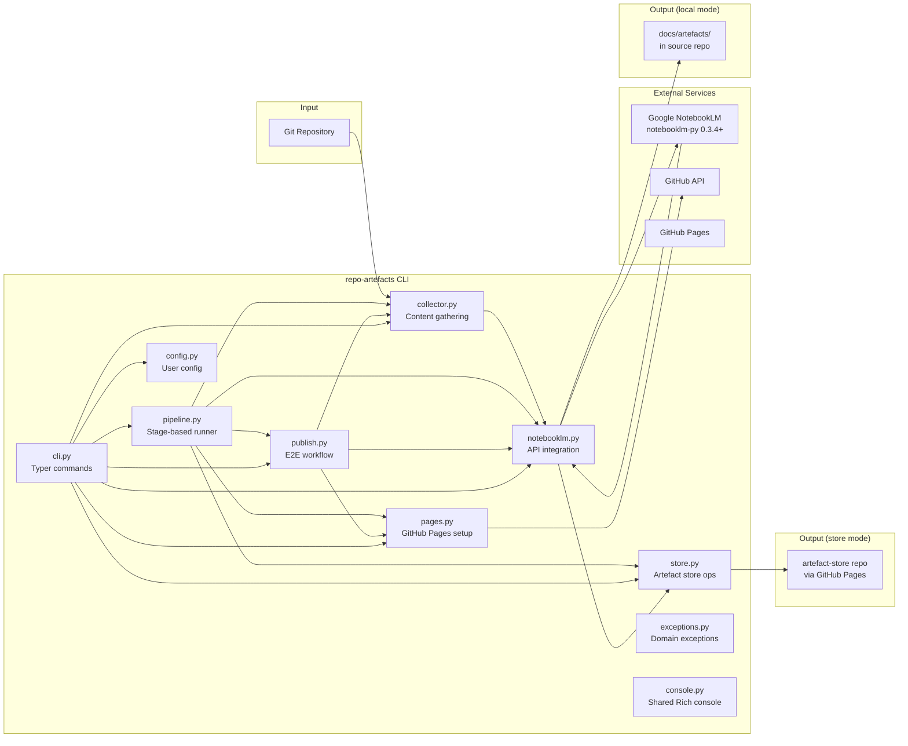
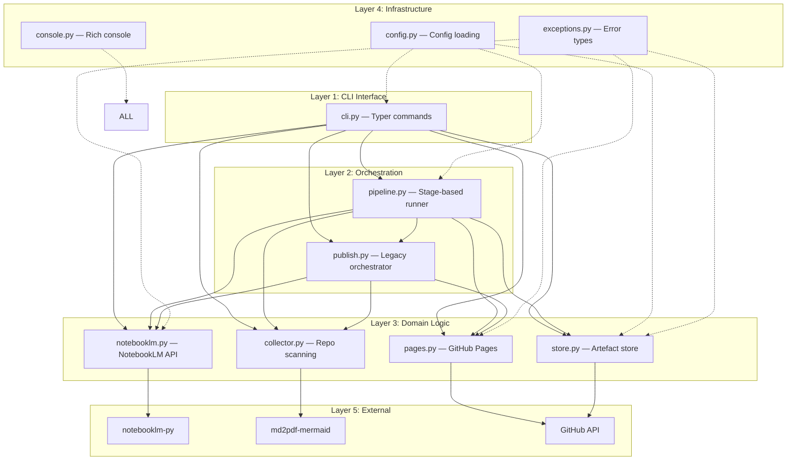
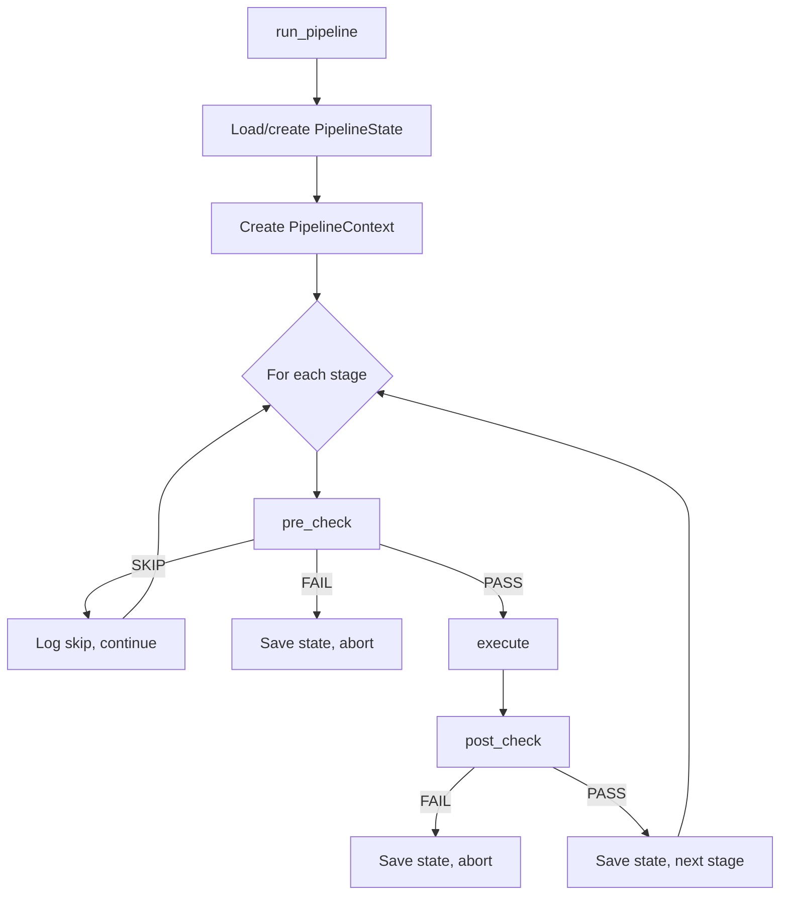
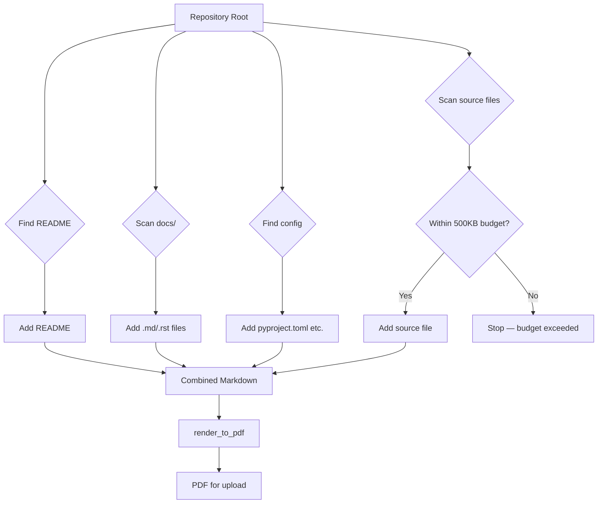
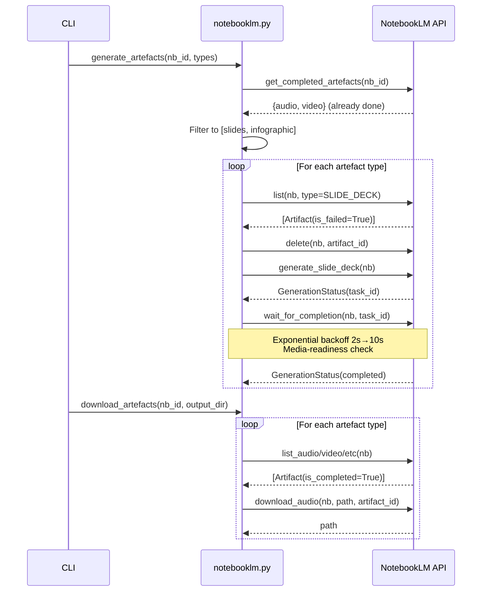
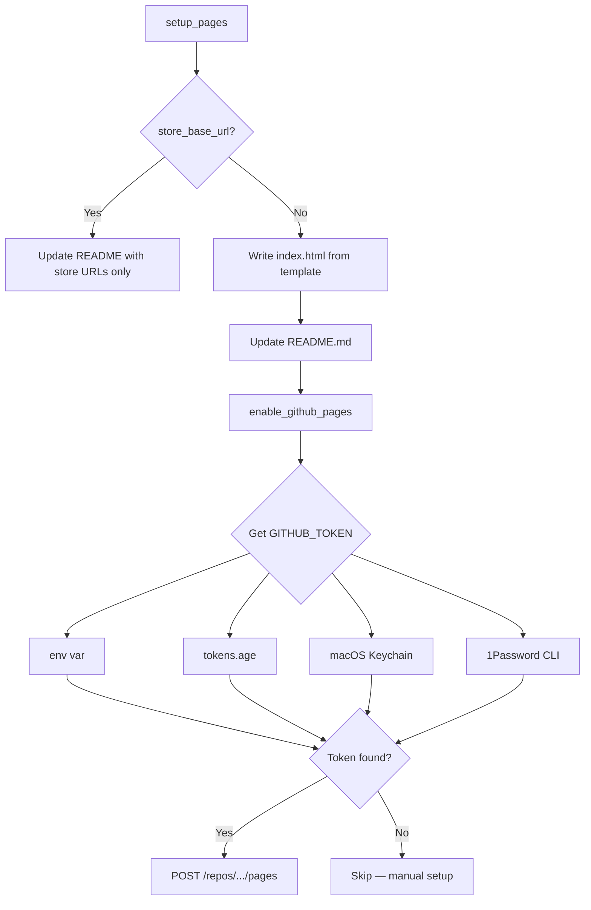
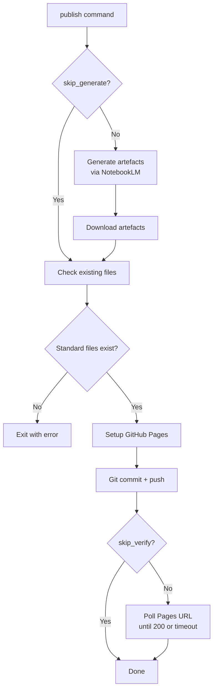
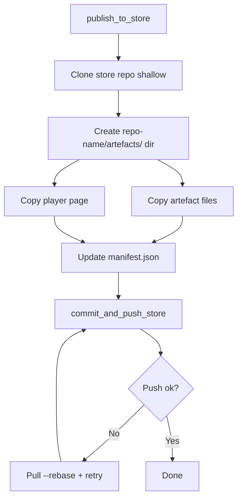
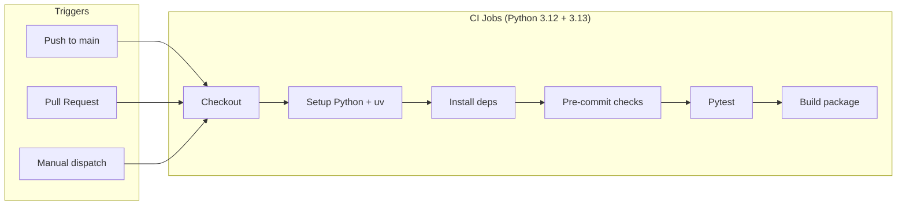
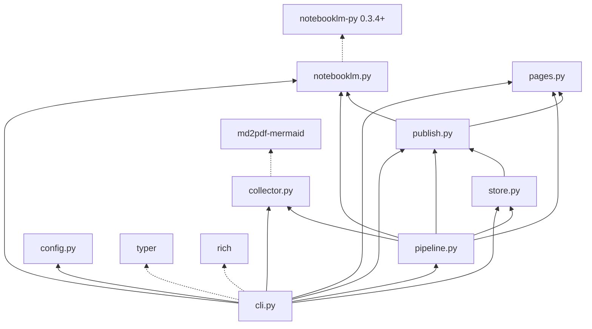

# Code Map — notebooklm-repo-artefacts

> Architecture, module relationships, and data flows for the `repo-artefacts` CLI tool.

## Overview

`notebooklm-repo-artefacts` collects content from a git repository, uploads it to Google NotebookLM, generates AI-powered artefacts (audio, video, slides, infographic), and publishes them via GitHub Pages.


```mermaid
graph LR
    subgraph "Input"
        REPO[Git Repository]
    end

    subgraph "repo-artefacts CLI"
        CLI[cli.py<br/>Typer commands]
        COL[collector.py<br/>Content gathering]
        NLM[notebooklm.py<br/>API integration]
        PL[pipeline.py<br/>Stage-based runner]
        PG[pages.py<br/>GitHub Pages setup]
        PUB[publish.py<br/>E2E workflow]
        ST[store.py<br/>Artefact store ops]
        CFG[config.py<br/>User config]
        EXC[exceptions.py<br/>Domain exceptions]
        CNS[console.py<br/>Shared Rich console]
    end

    subgraph "External Services"
        NLMAPI[Google NotebookLM<br/>notebooklm-py 0.3.4+]
        GHAPI[GitHub API]
        GHPAGES[GitHub Pages]
    end

    subgraph "Output (local mode)"
        LOCAL[docs/artefacts/<br/>in source repo]
    end

    subgraph "Output (store mode)"
        STORE[artefact-store repo<br/>via GitHub Pages]
    end

    REPO --> COL
    COL --> NLM
    NLM --> NLMAPI
    NLMAPI --> NLM
    PG --> GHAPI
    PL --> COL & NLM & PG & PUB & ST
    PUB --> COL & NLM & PG
    ST --> STORE
    CLI --> COL & NLM & PG & PUB & ST & CFG & PL
    NLM --> LOCAL
    NLM --> ST
```

## Architecture Layers


```mermaid
graph TD
    subgraph "Layer 1: CLI Interface"
        CLI[cli.py — Typer commands]
    end

    subgraph "Layer 2: Orchestration"
        PL[pipeline.py — Stage-based runner]
        PUB[publish.py — Legacy orchestrator]
    end

    subgraph "Layer 3: Domain Logic"
        COL[collector.py — Repo scanning]
        NLM[notebooklm.py — NotebookLM API]
        PG[pages.py — GitHub Pages]
        ST[store.py — Artefact store]
    end

    subgraph "Layer 4: Infrastructure"
        CFG[config.py — Config loading]
        EXC[exceptions.py — Error types]
        CNS[console.py — Rich console]
    end

    subgraph "Layer 5: External"
        NLMPY[notebooklm-py]
        MD2PDF[md2pdf-mermaid]
        GITHUB[GitHub API]
    end

    CLI --> PL
    CLI --> PUB
    CLI --> COL & NLM & PG & ST
    PL --> COL & NLM & PG & ST & PUB
    PUB --> COL & NLM & PG
    COL --> MD2PDF
    NLM --> NLMPY
    PG --> GITHUB
    ST --> GITHUB
    CFG -.-> CLI & PL & ST
    EXC -.-> NLM & PG & ST
    CNS -.-> ALL
```

## Module Breakdown

### cli.py — Command Router

Entry point for all CLI commands. Uses [Typer](https://typer.tiangolo.com/) for argument parsing and [Rich](https://rich.readthedocs.io/) for terminal output.

| Command | Description | Calls |
|---------|-------------|-------|
| `process` | Collect repo content → upload to NotebookLM | `collector` → `notebooklm` |
| `generate` | Generate artefacts from a notebook | `notebooklm` |
| `download` | Download artefacts to local disk | `notebooklm` |
| `list` | List notebooks or sources | `notebooklm` |
| `delete` | Delete a notebook | `notebooklm` |
| `pages` | Set up GitHub Pages player | `pages` |
| `publish` | Generate → pages → push → verify | `notebooklm` → `pages` → `publish` (+ `store` with `--store`) |
| `pipeline` | Full E2E via stage-based runner | `pipeline.run_pipeline()` |
| `migrate` | Migrate from old format | `pipeline` |

**Key design pattern**: The `pipeline` command delegates to `pipeline.run_pipeline()` which uses a stage-based architecture with pre-check → execute → post-check gates and JSON state persistence for resumability.

### pipeline.py — Stage-Based Pipeline Runner

The modern pipeline implementation. Chains 8 stages with state persistence, resumability, and per-stage error handling.


```mermaid
graph TD
    A[run_pipeline] --> B[Load/create PipelineState]
    B --> C[Create PipelineContext]
    C --> D{For each stage}
    D --> E[pre_check]
    E -->|SKIP| F[Log skip, continue]
    E -->|FAIL| G[Save state, abort]
    E -->|PASS| H[execute]
    H --> I[post_check]
    I -->|FAIL| J[Save state, abort]
    I -->|PASS| K[Save state, next stage]
    F --> D
    K --> D
```

**Stages (in order):**

| Stage | Purpose | Pre-check | Post-check |
|-------|---------|-----------|------------|
| `collect` | Scan repo, render PDF | Is git repo? | PDF exists and non-empty? |
| `upload` | Upload PDF to NotebookLM | PDF available? | Got notebook_id? |
| `generate` | Generate artefacts | Has notebook_id? | All artefacts completed? |
| `download` | Download to local disk | Has notebook_id + completed? | Files on disk? |
| `publish` | Push to store or local Pages | Valid store slug? | — |
| `verify` | Poll Pages URL until 200 | Store mode only | All artefacts verified? |
| `readme` | Update source README | Has README + store? | — |
| `cleanup` | Delete notebook | All done + not keep? | Notebook deleted? |

**State persistence**: `.pipeline-state.json` in `docs/artefacts/` enables `--resume` to continue from the last successful stage.

### collector.py — Repository Content Gathering

Walks a git repository and assembles key files into a single markdown document for NotebookLM upload.


```mermaid
graph TD
    A[Repository Root] --> B{Find README}
    B --> C[Add README]
    A --> D{Scan docs/}
    D --> E[Add .md/.rst files]
    A --> F{Find config}
    F --> G[Add pyproject.toml etc.]
    A --> H{Scan source files}
    H --> I{Within 500KB budget?}
    I -->|Yes| J[Add source file]
    I -->|No| K[Stop — budget exceeded]
    C & E & G & J --> L[Combined Markdown]
    L --> M[render_to_pdf]
    M --> N[PDF for upload]
```

**Key constraints:**
- Total output capped at 500KB (`MAX_TOTAL_BYTES`)
- Source files capped at 500 lines each (`MAX_SOURCE_LINES`)
- Skips `.git`, `node_modules`, `__pycache__`, `.venv`, etc.
- Priority order: README → docs → config → source

### notebooklm.py — NotebookLM API Integration

Manages the full lifecycle using **upstream notebooklm-py public APIs**. Uses `client.artifacts.list()` with type filtering, `wait_for_completion()` with exponential backoff and media-readiness checks.


```mermaid
sequenceDiagram
    participant CLI
    participant NLM as notebooklm.py
    participant API as NotebookLM API

    CLI->>NLM: generate_artefacts(nb_id, types)
    NLM->>API: get_completed_artefacts(nb_id)
    API-->>NLM: {audio, video} (already done)
    NLM->>NLM: Filter to [slides, infographic]

    loop For each artefact type
        NLM->>API: list(nb, type=SLIDE_DECK)
        API-->>NLM: [Artifact(is_failed=True)]
        NLM->>API: delete(nb, artifact_id)
        NLM->>API: generate_slide_deck(nb)
        API-->>NLM: GenerationStatus(task_id)
        NLM->>API: wait_for_completion(nb, task_id)
        Note over NLM,API: Exponential backoff 2s→10s<br/>Media-readiness check
        API-->>NLM: GenerationStatus(completed)
    end

    CLI->>NLM: download_artefacts(nb_id, output_dir)
    loop For each artefact type
        NLM->>API: list_audio/video/etc(nb)
        API-->>NLM: [Artifact(is_completed=True)]
        NLM->>API: download_audio(nb, path, artifact_id)
        API-->>NLM: path
    end
```

**Upstream public APIs used:**

| Wrapper Function | Upstream API | Notes |
|-----------------|--------------|-------|
| `_delete_existing_by_type()` | `client.artifacts.list(nb, artifact_type=...)` | Type-filtered listing, iterate `Artifact.is_failed` |
| `get_completed_artefacts()` | `client.artifacts.list(nb)` | Iterate `Artifact.is_completed`, use `Artifact.kind.value` |
| `_wait_for_artefact()` | `client.artifacts.wait_for_completion()` | Exponential backoff + media-readiness built in |
| `download_artefacts()` | `client.artifacts.list_audio()` etc. | Already used public APIs — no change needed |

**Eliminated (replaced by upstream):**
- `RawArtefact` dataclass + `_parse_raw_artefacts()` → `Artifact` objects from `list()`
- `ArtefactType` IntEnum → `ArtifactType` str enum from `notebooklm.types`
- `_poll_by_type()` → `wait_for_completion()` with media-readiness
- `_snapshot_artefact_ids()` → no longer needed; `wait_for_completion()` tracks by task_id

### pages.py — GitHub Pages Setup

Creates the player page, updates README links, and enables GitHub Pages via API.


```mermaid
graph TD
    A[setup_pages] --> B{store_base_url?}
    B -->|Yes| C[Update README with store URLs only]
    B -->|No| D[Write index.html from template]
    D --> E[Update README.md]
    E --> F[enable_github_pages]
    F --> G{Get GITHUB_TOKEN}
    G --> H[env var]
    G --> I[tokens.age]
    G --> J[macOS Keychain]
    G --> K[1Password CLI]
    H & I & J & K --> L{Token found?}
    L -->|Yes| M[POST /repos/.../pages]
    L -->|No| N[Skip — manual setup]
```

**Token resolution chain** (first match wins):
1. `GITHUB_TOKEN` environment variable
2. `~/.config/secrets/tokens.age` (age-encrypted, decrypted with `~/.config/age/keys.txt`)
3. macOS Keychain (`api-keys` service)
4. 1Password CLI (`op` — API_KEYS vault)

### publish.py — End-to-End Workflow

Legacy orchestrator (still used by `publish` command). Generates → checks → pages → pushes → verifies.


```mermaid
graph TD
    A[publish command] --> B{skip_generate?}
    B -->|No| C[Generate artefacts<br/>via NotebookLM]
    C --> D[Download artefacts]
    B -->|Yes| E[Check existing files]
    D --> E
    E --> F{Standard files exist?}
    F -->|No| G[Exit with error]
    F -->|Yes| H[Setup GitHub Pages]
    H --> I[Git commit + push]
    I --> J{skip_verify?}
    J -->|No| K[Poll Pages URL<br/>until 200 or timeout]
    J -->|Yes| L[Done]
    K --> L
```

### store.py — Artefact Store Operations

Publishes artefacts to a separate GitHub repo (keeps source repos lean).


```mermaid
graph TD
    A[publish_to_store] --> B[Clone store repo shallow]
    B --> C[Create repo-name/artefacts/ dir]
    C --> D[Copy artefact files]
    C --> E[Copy player page]
    D --> F[Update manifest.json]
    E --> F
    F --> G[commit_and_push_store]
    G --> H{Push ok?}
    H -->|No| I[Pull --rebase + retry]
    H -->|Yes| J[Done]
    I --> G
```

### config.py — User Configuration

Loads/saves `~/.config/repo-artefacts/config.toml`.

```toml
default_store = "NetDevAutomate/artefact-store"
```

### console.py — Shared Rich Console

Single shared `Console(stderr=True)` instance for consistent output control. Enables future `--quiet`/`--verbose` support.

### exceptions.py — Domain Exceptions

```python
RepoArtefactsError          # Base for all errors
├── GitRemoteError          # Could not determine org/repo from git remote
└── CollectionError         # Failed to collect repository content
```

The CLI layer catches these and translates to `typer.Exit()`.

## CI Pipeline

GitHub Actions runs on every push/PR to `main`. Can be run locally with [`act`](https://github.com/nektos/act).


```mermaid
graph LR
    subgraph "Triggers"
        A[Push to main]
        B[Pull Request]
        C[Manual dispatch]
    end

    subgraph "CI Jobs (Python 3.12 + 3.13)"
        D[Checkout] --> E[Setup Python + uv]
        E --> F[Install deps]
        F --> G[Pre-commit checks]
        G --> H[Pytest]
        H --> I[Build package]
    end

    A & B & C --> D
```

Pre-commit hooks: `ruff` (lint + format), `pyright` (type check), `pytest` (tests), `detect-secrets`, standard file checks.

See [CI & Testing](ci-and-testing.md) for `act` setup and local testing.

## Interfaces

| Module | Exports | Used By |
|--------|---------|---------:|
| `collector` | `collect_repo_content()`, `render_to_pdf()` | `cli.process`, `pipeline.CollectStage` |
| `notebooklm` | `upload_repo()`, `generate_artefacts()`, `download_artefacts()`, `list_*()`, `delete_notebook()` | `cli.*`, `publish`, `pipeline.*Stage` |
| `pipeline` | `run_pipeline()`, `PipelineContext`, `PipelineState`, stage classes | `cli.pipeline` |
| `pages` | `get_github_info()`, `get_github_token()`, `setup_pages()`, `enable_github_pages()` | `cli.pages`, `cli.publish`, `cli.pipeline` |
| `publish` | `check_artefacts()`, `verify_pages()`, `git_commit_and_push()` | `cli.publish`, `cli.pipeline` |
| `store` | `clone_or_pull_store()`, `publish_to_store()`, `commit_and_push_store()`, `update_manifest()` | `cli.pipeline`, `cli.publish` |
| `config` | `load_config()`, `save_config()`, `Config` | `cli.pipeline`, `cli.publish`, `store` |

## Dependencies


```mermaid
graph BT
    CLI[cli.py] --> PL[pipeline.py]
    CLI --> COL[collector.py]
    CLI --> NLM[notebooklm.py]
    CLI --> PG[pages.py]
    CLI --> PUB[publish.py]
    CLI --> ST[store.py]
    CLI --> CFG[config.py]
    PL --> COL & NLM & PG & ST & PUB
    PUB --> NLM
    PUB --> PG
    ST --> PUB

    NLM -.-> NLMPY[notebooklm-py 0.3.4+]
    COL -.-> MD2PDF[md2pdf-mermaid]
    CLI -.-> TYPER[typer]
    CLI -.-> RICH[rich]
```

Solid lines = internal imports. Dotted lines = external packages.

## Key Design Patterns

### Stage Pattern (pipeline.py)

Each stage implements a three-phase gate:

```python
class StageProtocol:
    name: str

    def pre_check(self, ctx: PipelineContext) -> StageResult:
        """Validate prerequisites. Return SKIP/FAIL/PASS."""

    def execute(self, ctx: PipelineContext) -> StageResult:
        """Do the work. Only called if pre_check passed."""

    def post_check(self, ctx: PipelineContext) -> StageResult:
        """Validate results. Only called if execute succeeded."""
```

**Why this pattern?**
- **Pre-checks** fail fast before expensive operations
- **Post-checks** catch silent failures (e.g., generation returned but artefacts not actually completed)
- **State persistence** enables `--resume` to continue from last successful stage
- **SKIP status** handles conditional stages (e.g., cleanup only if all artefacts done)

### Auth Retry Wrapper (notebooklm.py)

```python
async def _with_reauth(client, fn, label=""):
    """Run fn(), refreshing auth on RPC errors."""
    for attempt, wait in enumerate(REAUTH_BACKOFF, 1):
        try:
            return await fn()
        except RateLimitError:
            await asyncio.sleep(RATE_LIMIT_BACKOFF[attempt-1])
            await client.refresh_auth()
        except (AuthError, RPCError):
            await asyncio.sleep(wait)
            await client.refresh_auth()
    return await fn()  # Final attempt
```

**Why this pattern?**
- NotebookLM auth tokens expire (~15 min)
- Rate limits are common during generation
- Wrapping every API call manually would be error-prone
- Centralised retry logic handles all three failure modes

### Artefact Selection Modes

```
Default:     generate all 4 types, skip already completed
Explicit:    --audio --video → only these
Exclude:     --exclude infographic → all except named
Resume:      --resume → only types not yet completed
```

The `generate_artefacts()` function checks `get_completed_artefacts()` first and only requests generation for missing types. This avoids wasting quota on artefacts that already exist.

## Upstream Dependency: notebooklm-py

This tool wraps [notebooklm-py](https://github.com/teng-lin/notebooklm-py) (v0.3.4+), an unofficial Python client for Google NotebookLM's undocumented RPC API.

**What upstream provides:**
- `NotebookLMClient.from_storage()` — auth from browser cookies
- `client.notebooks.*` — CRUD operations
- `client.sources.*` — source management
- `client.artifacts.*` — generation, listing, downloading, polling
- `Artifact` dataclass with `.is_completed`, `.is_failed`, `.kind` properties
- `wait_for_completion()` with exponential backoff and media-readiness checks

**What the wrapper adds:**
- Repository content collection and PDF rendering
- Generation orchestration with retry, quota detection, and auth refresh
- Artefact selection modes (default, explicit, exclude, resume)
- GitHub Pages setup and README link injection
- Artefact store publishing (separate repo for binary files)
- Stage-based pipeline with state persistence and resumability
- CLI with Typer + Rich output
