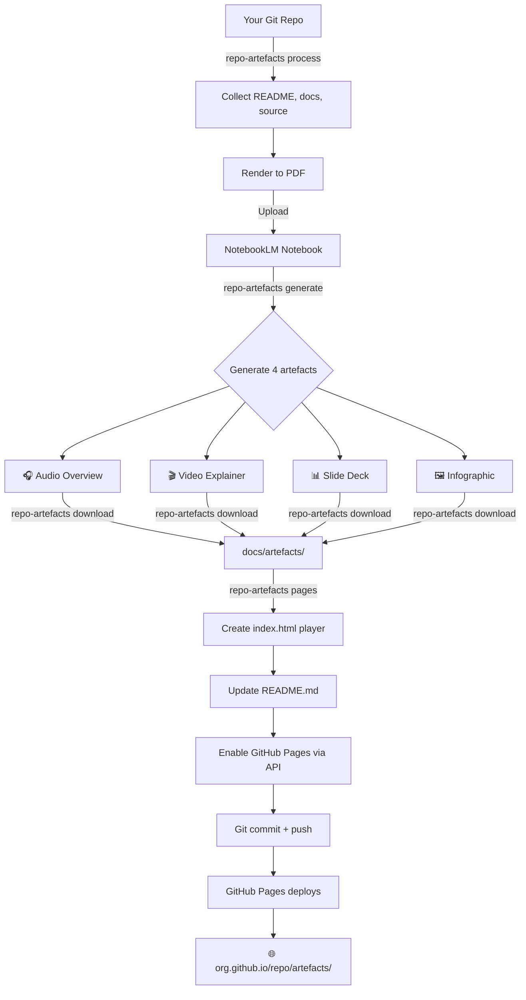
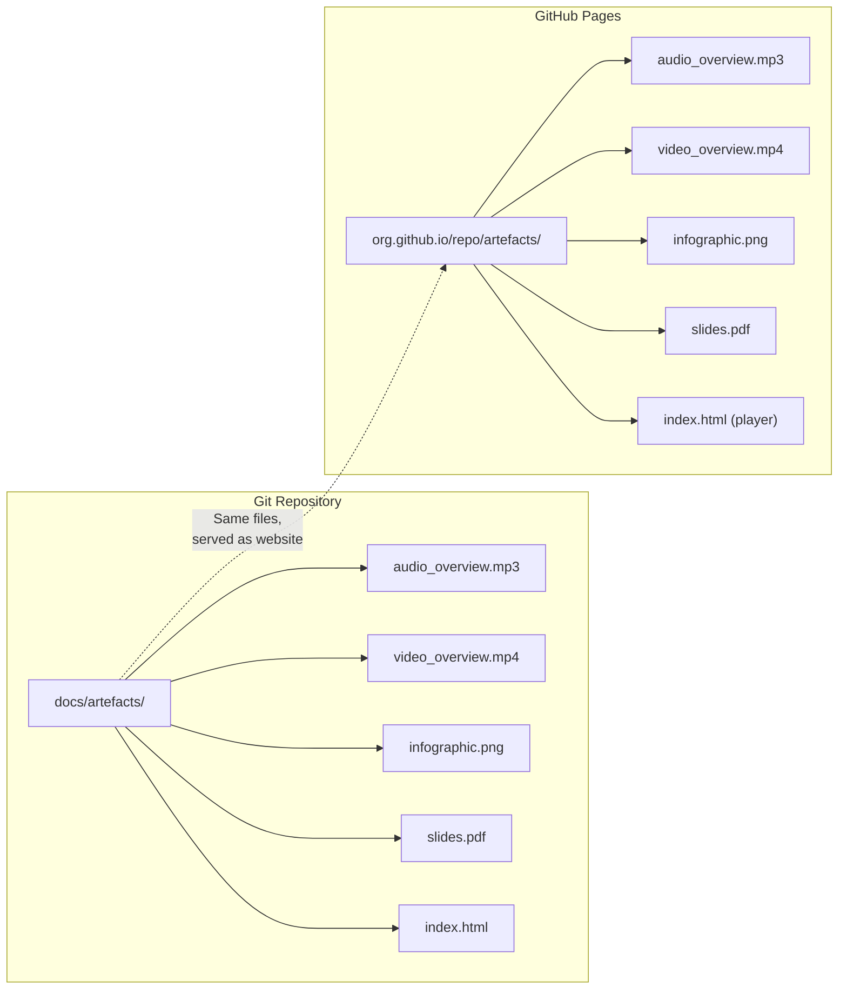
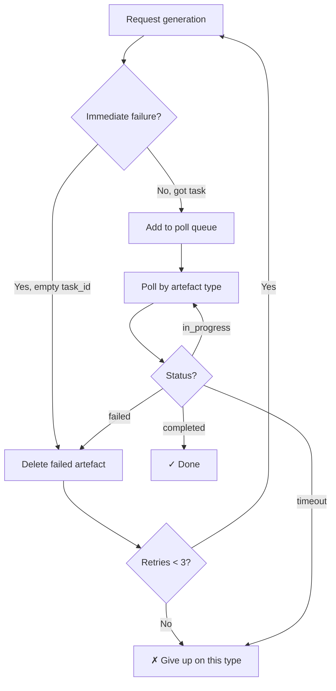
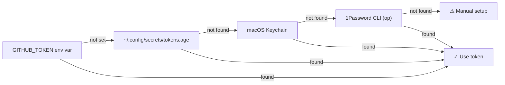

# How It Works — Publishing Artefacts

> From git repo to hosted player page in one command.

## The Big Picture



## Where Do Files Live?

The artefacts are committed directly to the repo. GitHub Pages serves the same files as a website — no separate hosting needed.



## The `publish` Pipeline

`repo-artefacts publish` chains everything into one command:

```mermaid
sequenceDiagram
    actor User
    participant CLI as repo-artefacts
    participant NLM as NotebookLM
    participant GH as GitHub

    User->>CLI: publish /path/to/repo -n NOTEBOOK_ID

    rect rgb(30, 40, 60)
    Note over CLI,NLM: Step 1 — Generate
    CLI->>NLM: Request audio, video, slides, infographic
    loop Poll every 30s by artefact type
        CLI->>NLM: Check status
        alt Completed
            NLM-->>CLI: ✓ Ready
        else Failed
            CLI->>NLM: Delete failed artefact
            CLI->>NLM: Retry (max 3 times)
        end
    end
    CLI->>NLM: Download all completed artefacts
    end

    rect rgb(30, 50, 40)
    Note over CLI,GH: Step 2 — Publish
    CLI->>CLI: Create player page (index.html)
    CLI->>CLI: Update README with Generated Artefacts table
    CLI->>GH: Enable GitHub Pages (API)
    CLI->>GH: Git commit + push
    end

    rect rgb(50, 40, 30)
    Note over CLI,GH: Step 3 — Verify
    loop Poll until 200 or timeout
        CLI->>GH: HEAD request to Pages URL
    end
    GH-->>CLI: 200 OK
    end

    CLI-->>User: ✅ Published! URL
```



## Retry & Failure Handling



Key detail: NotebookLM won't generate a new artefact if a failed one of the same type exists. The tool deletes failed artefacts before every retry.

## Token Resolution

The GitHub API token is resolved automatically:



## Quick Reference

```bash
# Full pipeline
repo-artefacts publish /path/to/repo -n $NOTEBOOK_ID

# Skip generation (artefacts already exist)
repo-artefacts publish /path/to/repo --skip-generate

# Individual steps
repo-artefacts process /path/to/repo          # Collect + upload
repo-artefacts generate -n $NOTEBOOK_ID       # Generate artefacts
repo-artefacts download -n $NOTEBOOK_ID       # Download artefacts
repo-artefacts pages /path/to/repo            # Player + Pages setup
```
