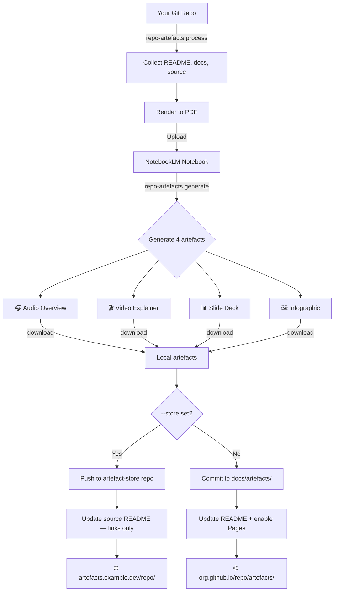
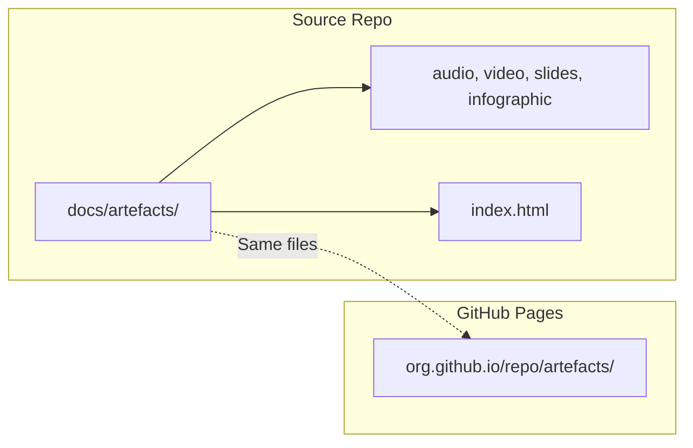
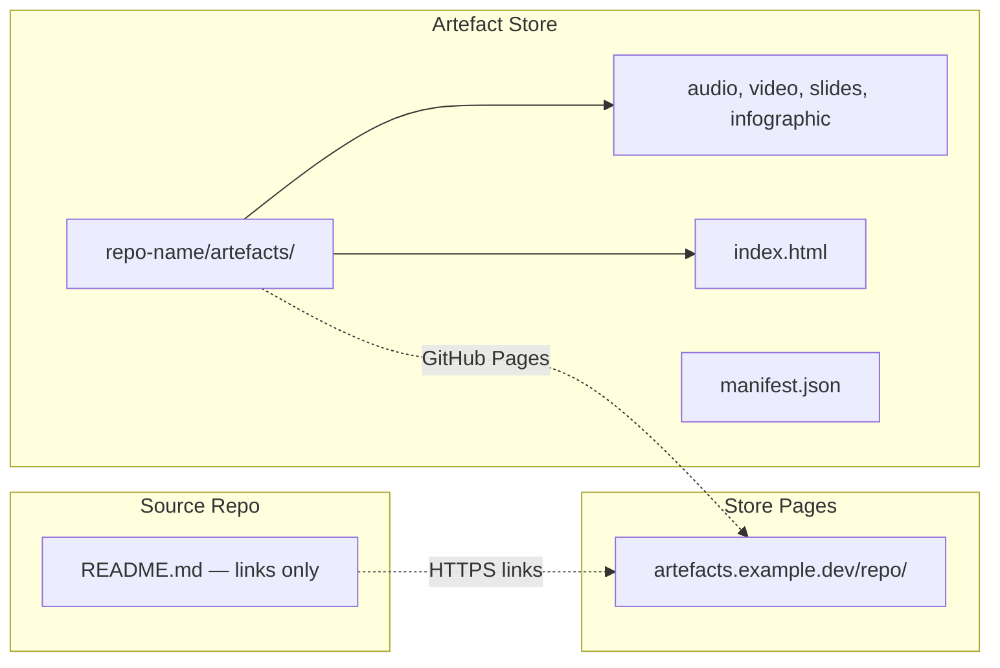
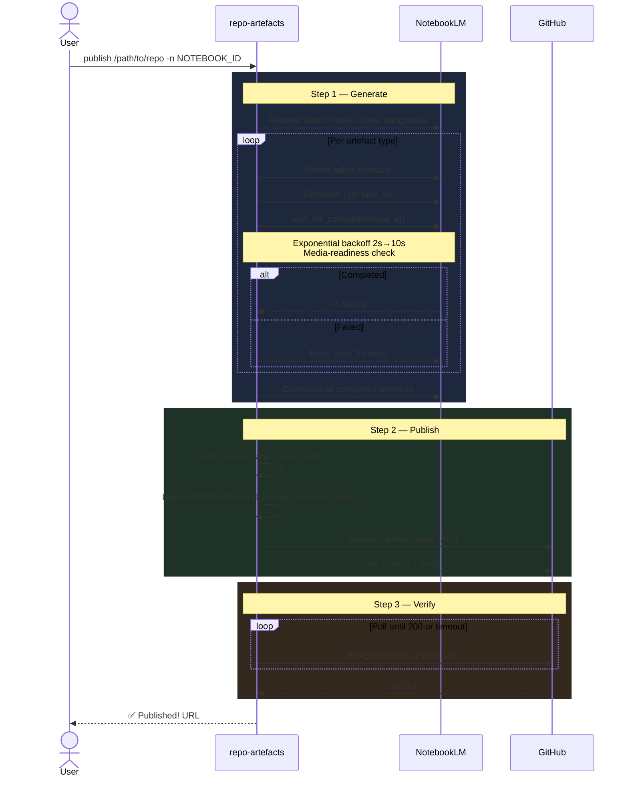
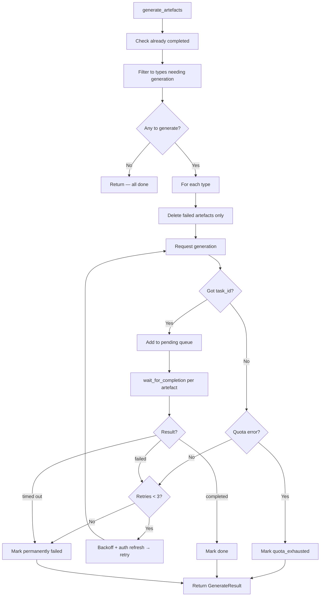
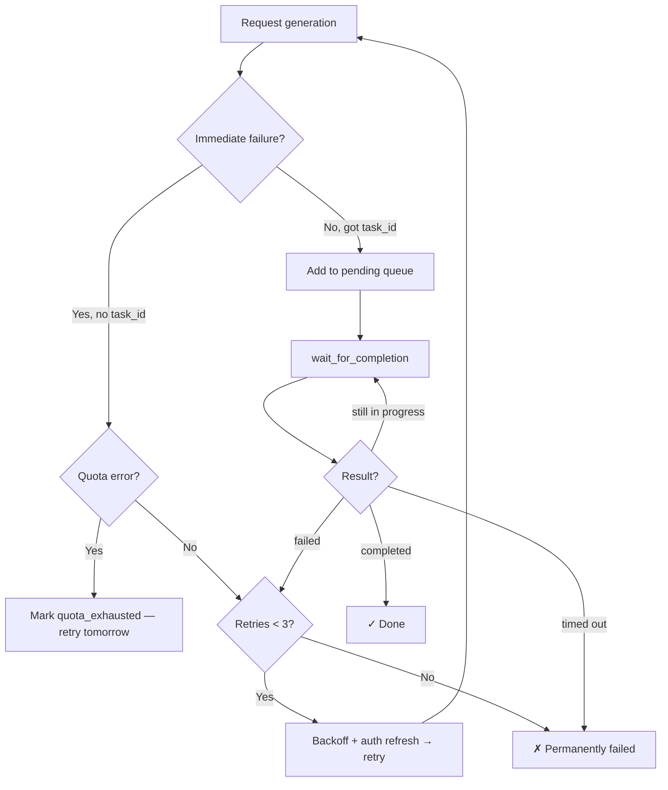
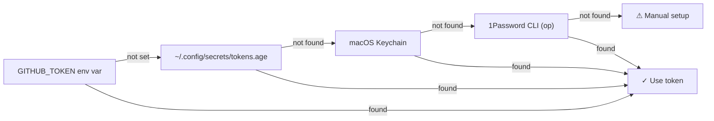

# How It Works — Publishing Artefacts

> From git repo to hosted player page in one command.

## The Big Picture


```mermaid
graph TD
    A[Your Git Repo] -->|repo-artefacts process| B[Collect README, docs, source]
    B --> C[Render to PDF]
    C -->|Upload| D[NotebookLM Notebook]
    D -->|repo-artefacts generate| E{Generate 4 artefacts}
    E --> F[🎧 Audio Overview]
    E --> G[🎬 Video Explainer]
    E --> H[📊 Slide Deck]
    E --> I[🖼️ Infographic]
    F & G & H & I -->|download| J[Local artefacts]
    J --> K{--store set?}
    K -->|Yes| L[Push to artefact-store repo]
    K -->|No| M[Commit to docs/artefacts/]
    L --> N[Update source README — links only]
    M --> O[Update README + enable Pages]
    N --> P["🌐 artefacts.example.dev/repo/"]
    O --> Q["🌐 org.github.io/repo/artefacts/"]
```

## Where Do Files Live?

There are two modes — choose based on whether you want to keep binary files out of source repos.

### Local mode (default)

Artefacts are committed directly to the source repo. GitHub Pages serves the same files.


```mermaid
graph LR
    subgraph "Source Repo"
        R[docs/artefacts/]
        R --> A1[audio, video, slides, infographic]
        R --> A5[index.html]
    end
    subgraph "GitHub Pages"
        P["org.github.io/repo/artefacts/"]
    end
    R -.->|"Same files"| P
```

### Store mode (`--store`)

Artefacts are published to a separate store repo. Source repo gets links only — zero binary files.


```mermaid
graph LR
    subgraph "Source Repo"
        RM[README.md — links only]
    end
    subgraph "Artefact Store"
        ST[repo-name/artefacts/]
        ST --> B1[audio, video, slides, infographic]
        ST --> B5[index.html]
        ST2[manifest.json]
    end
    subgraph "Store Pages"
        SP["artefacts.example.dev/repo/"]
    end
    RM -.->|HTTPS links| SP
    ST -.->|GitHub Pages| SP
```

## The `publish` Pipeline

`repo-artefacts publish` chains everything into one command:


```mermaid
sequenceDiagram
    actor User
    participant CLI as repo-artefacts
    participant NLM as NotebookLM
    participant GH as GitHub

    User->>CLI: publish /path/to/repo -n NOTEBOOK_ID

    rect rgb(30, 40, 60)
    Note over CLI,NLM: Step 1 — Generate
    CLI->>NLM: Request audio, video, slides, infographic
    loop Per artefact type
        CLI->>NLM: Delete failed artefacts
        CLI->>NLM: Generate (get task_id)
        CLI->>NLM: wait_for_completion(task_id)
        Note over CLI,NLM: Exponential backoff 2s→10s<br/>Media-readiness check
        alt Completed
            NLM-->>CLI: ✓ Ready
        else Failed
            CLI->>NLM: Retry (max 3 times)
        end
    end
    CLI->>NLM: Download all completed artefacts
    end

    rect rgb(30, 50, 40)
    Note over CLI,GH: Step 2 — Publish
    CLI->>CLI: Create player page (index.html)
    CLI->>CLI: Update README with Generated Artefacts table
    CLI->>GH: Enable GitHub Pages (API)
    CLI->>GH: Git commit + push
    end

    rect rgb(50, 40, 30)
    Note over CLI,GH: Step 3 — Verify
    loop Poll until 200 or timeout
        CLI->>GH: HEAD request to Pages URL
    end
    GH-->>CLI: 200 OK
    end

    CLI-->>User: ✅ Published! URL
```

## Generation Flow (Detailed)

The `generate_artefacts()` function in `notebooklm.py` handles the complex part:


```mermaid
graph TD
    A[generate_artefacts] --> B[Check already completed]
    B --> C[Filter to types needing generation]
    C --> D{Any to generate?}
    D -->|No| E[Return — all done]
    D -->|Yes| F[For each type]
    F --> G[Delete failed artefacts only]
    G --> H[Request generation]
    H --> I{Got task_id?}
    I -->|Yes| J[Add to pending queue]
    I -->|No| K{Quota error?}
    K -->|Yes| L[Mark quota_exhausted]
    K -->|No| M{Retries < 3?}
    M -->|Yes| N[Backoff + auth refresh → retry]
    M -->|No| O[Mark permanently failed]
    N --> H

    J --> P[wait_for_completion per artefact]
    P --> Q{Result?}
    Q -->|completed| R[Mark done]
    Q -->|failed| M
    Q -->|timed out| O
    L --> S[Return GenerateResult]
    R --> S
    O --> S
```

### Key Improvements (v0.1.0+)

| Before | After |
|--------|-------|
| Custom polling with 30s fixed interval | Upstream `wait_for_completion()` with 2s→10s exponential backoff |
| Raw array parsing (`_list_raw`) | Public `client.artifacts.list()` with type filtering |
| No media-readiness check | URL availability verified before reporting COMPLETED |
| Deleted ALL artefacts before regenerating | Only deletes FAILED artefacts (preserves completed) |
| Integer type codes (fragile) | `ArtifactType` str enum (stable) |

### Media-Readiness Check

This was a major source of flakiness. The NotebookLM API can report `status=COMPLETED` before the actual media URLs are populated in the response. The upstream library now checks URL availability at type-specific array positions:

- **Audio**: `art[6][5]` — non-empty media list
- **Video**: `art[8]` — any valid URL
- **Infographic**: forward iteration through metadata
- **Slide deck**: `art[16][3]` — PDF URL present

If URLs aren't ready, the status is downgraded to `PROCESSING` and polling continues.

## Retry & Failure Handling


```mermaid
graph TD
    A[Request generation] --> B{Immediate failure?}
    B -->|No, got task_id| C[Add to pending queue]
    B -->|Yes, no task_id| D{Quota error?}
    D -->|Yes| E[Mark quota_exhausted — retry tomorrow]
    D -->|No| F{Retries < 3?}
    F -->|Yes| G[Backoff + auth refresh → retry]
    F -->|No| H["✗ Permanently failed"]
    G --> A

    C --> I[wait_for_completion]
    I --> J{Result?}
    J -->|completed| K["✓ Done"]
    J -->|failed| F
    J -->|timed out| H
    J -->|still in progress| I
```

Key detail: NotebookLM won't generate a new artefact if a failed one of the same type exists. The tool deletes failed artefacts before every retry.

## Token Resolution

The GitHub API token is resolved automatically:


```mermaid
graph LR
    A["GITHUB_TOKEN env var"] -->|not set| B["~/.config/secrets/tokens.age"]
    B -->|not found| C["macOS Keychain"]
    C -->|not found| D["1Password CLI (op)"]
    D -->|not found| E["⚠ Manual setup"]
    A -->|found| F["✓ Use token"]
    B -->|found| F
    C -->|found| F
    D -->|found| F
```

## Quick Reference

```bash
# Full pipeline (stage-based with resumability)
repo-artefacts pipeline /path/to/repo

# With existing notebook
repo-artefacts publish /path/to/repo -n NOTEBOOK_ID

# Skip generation (artefacts already exist)
repo-artefacts publish /path/to/repo --skip-generate

# Individual steps
repo-artefacts process /path/to/repo          # Collect + upload
repo-artefacts generate -n NOTEBOOK_ID        # Generate artefacts
repo-artefacts download -n NOTEBOOK_ID        # Download artefacts
repo-artefacts pages /path/to/repo            # Player + Pages setup
```
