# Pipeline Architecture

> The `pipeline` command: from git repo to hosted artefacts in one shot, with stage validation gates and idempotent behaviour.

## Overview

`repo-artefacts pipeline` is the stage-based pipeline that chains every step — collect, upload, generate, download, publish, verify, readme update, and cleanup — into a single invocation. Each stage has pre-check and post-check validation gates. State is persisted to JSON after each stage for resumability.

```bash
repo-artefacts pipeline /path/to/repo --store Org/artefact-store
```

## Stage Flow with Validation Gates

```mermaid
flowchart TD
    START([pipeline /path/to/repo]) --> C

    subgraph COLLECT["Stage 1: Collect"]
        C_PRE{{"PRE: repo exists?\nis git repo?"}}
        C["Scan files → render PDF\nSHA256 content hash"]
        C_POST{{"POST: PDF exists?\nsize > 0?"}}
        C_PRE -->|PASS| C
        C_PRE -->|FAIL| ABORT
        C --> C_POST
    end

    C_POST -->|PASS| U_PRE

    subgraph UPLOAD["Stage 2: Upload"]
        U_PRE{{"PRE: PDF exists?"}}
        U["Upload to NotebookLM\nwait=True for ingestion"]
        U_POST{{"POST: notebook_id\nreturned?"}}
        U_PRE -->|PASS| U
        U_PRE -->|FAIL| ABORT
        U --> U_POST
    end

    U_POST -->|PASS| G_PRE

    subgraph GENERATE["Stage 3: Generate"]
        G_PRE{{"PRE: notebook_id set?\ncheck completed artefacts"}}
        G_PRE -->|"source replaced"| G_REGEN
        G_PRE -->|"all completed"| G_SKIP
        G_REGEN["Regenerate all 4 types\nsequential, 30s gap"]
        G_SKIP(["SKIP: all artefacts exist"])
        G_LOOP["For each type:\n1. Delete FAILED only\n2. Request generation\n3. Poll until complete"]
        G_POST{{"POST: all 4 types\ncompleted?"}}
        G_REGEN --> G_LOOP
        G_LOOP --> G_POST
    end

    G_POST -->|PASS| D_PRE
    G_SKIP --> D_PRE

    subgraph DOWNLOAD["Stage 4: Download"]
        D_PRE{{"PRE: notebook_id set?\ncompleted artefacts > 0?"}}
        D["Download audio, video,\nslides, infographic"]
        D_POST{{"POST: all files exist?\nsize > 0?"}}
        D_PRE -->|PASS| D
        D_PRE -->|FAIL| ABORT
        D --> D_POST
    end

    D_POST -->|PASS| P_PRE

    subgraph PUBLISH["Stage 5: Publish"]
        P_PRE{{"PRE: store slug valid?\n(org/repo format)"}}
        P["Clone store → copy files\nupdate manifest → push"]
        P_POST{{"POST: push succeeded?"}}
        P_PRE -->|PASS| P
        P_PRE -->|SKIP| V_PRE
        P --> P_POST
    end

    P_POST -->|PASS| V_PRE

    subgraph VERIFY["Stage 6: Verify"]
        V_PRE{{"PRE: store configured?"}}
        V["HEAD request each\nartefact URL"]
        V_POST{{"POST: all URLs\nreturn 200?"}}
        V_PRE -->|PASS| V
        V_PRE -->|SKIP| R_PRE
        V --> V_POST
    end

    V_POST -->|PASS| R_PRE

    subgraph README["Stage 7: README"]
        R_PRE{{"PRE: README.md exists?\nstore configured?"}}
        R["Update artefacts block\ncommit + push"]
        R_POST{{"POST: links updated?"}}
        R_PRE -->|PASS| R
        R_PRE -->|SKIP| CL_PRE
        R --> R_POST
    end

    R_POST -->|PASS| CL_PRE

    subgraph CLEANUP["Stage 8: Cleanup"]
        CL_PRE{{"PRE: all artefacts done?\nnot --keep-notebook?"}}
        CL["Delete NotebookLM\nnotebook"]
        CL_POST{{"POST: deleted OK?"}}
        CL_PRE -->|PASS| CL
        CL_PRE -->|SKIP| DONE
        CL --> CL_POST
    end

    CL_POST -->|PASS| DONE
    G_POST -->|FAIL| ABORT

    DONE([Pipeline complete!])
    ABORT([Pipeline failed\nstate saved to JSON])

    style ABORT fill:#c0392b,color:#fff
    style DONE fill:#27ae60,color:#fff
    style G_SKIP fill:#3498db,color:#fff
```



## Sequence Diagram

```mermaid
sequenceDiagram
    actor User
    participant CLI as pipeline
    participant Col as collector
    participant NLM as NotebookLM API
    participant Store as Artefact Store
    participant GH as GitHub

    User->>CLI: pipeline /path/to/repo --store Org/store

    rect rgb(30, 40, 60)
    Note over CLI,Col: Stage 1: Collect
    CLI->>CLI: PRE: repo exists? is git repo?
    CLI->>Col: collect_repo_content()
    Col-->>CLI: markdown
    CLI->>Col: render_to_pdf()
    Col-->>CLI: PDF (+ SHA256 hash)
    CLI->>CLI: POST: PDF exists, size > 0
    CLI->>CLI: Save state → JSON
    end

    rect rgb(40, 30, 60)
    Note over CLI,NLM: Stage 2: Upload (with ingestion wait)
    CLI->>CLI: PRE: PDF exists
    CLI->>NLM: Find or create notebook
    CLI->>NLM: Replace source PDF
    CLI->>NLM: add_file(wait=True) ← blocks until ingested
    NLM-->>CLI: source status = READY
    CLI->>CLI: POST: notebook_id set
    CLI->>CLI: Save state → JSON
    end

    rect rgb(50, 30, 40)
    Note over CLI,NLM: Stage 3: Generate (sequential, 30s gap)
    CLI->>CLI: PRE: check existing artefacts
    alt Source replaced or --force-regen
        CLI->>NLM: Regenerate all types
    else All completed
        CLI->>CLI: SKIP generation
    end
    loop For each type (audio → video → slides → infographic)
        CLI->>NLM: Delete FAILED artefacts only
        CLI->>NLM: Request generation
        loop Poll every 30s
            CLI->>NLM: artifacts.list()
            NLM-->>CLI: status
        end
        Note over CLI: 30s gap before next type
    end
    CLI->>CLI: POST: all 4 types completed
    CLI->>CLI: Save state → JSON
    end

    rect rgb(30, 50, 40)
    Note over CLI,Store: Stages 4-7: Download → Publish → Verify → README
    CLI->>NLM: Download all artefacts
    CLI->>Store: Clone store (shallow)
    CLI->>Store: Copy files + player page + manifest
    CLI->>Store: git push
    CLI->>Store: Verify URLs return 200
    CLI->>GH: Update README + push
    end

    rect rgb(50, 40, 30)
    Note over CLI,NLM: Stage 8: Cleanup (conditional)
    alt All passed and not --keep-notebook
        CLI->>NLM: delete_notebook()
    else Keep notebook
        CLI->>CLI: Skip cleanup
    end
    end

    CLI-->>User: ✅ Pipeline complete!
```



## Idempotency Rules

The pipeline is safe to run multiple times:

| Stage | Behaviour on re-run |
|-------|-------------------|
| **Collect** | Always regenerates (fast, no side effects) |
| **Upload** | Replaces source if content hash differs, detects replacement via `source_replaced` flag |
| **Generate** | Checks existing artefacts via `artifacts.list()`. Skips completed types. Only deletes **failed** artefacts — never completed ones (unless `--force-regen`) |
| **Download** | Overwrites local files (idempotent) |
| **Publish** | Upserts to store (idempotent) |
| **Verify** | Safe read-only check |
| **README** | Updates links, skips commit if no changes |
| **Cleanup** | Only runs when all artefacts pass |

## State Persistence

After each stage, the pipeline saves state to `.pipeline-state.json` in the artefacts directory:

```json
{
  "repo_name": "Socratic-Study-Mentor",
  "notebook_id": "12f41d99-0d48-4ead-a550-acb71d5af77b",
  "content_hash": "a3f8c2...",
  "source_replaced": true,
  "stages": {
    "collect": {"status": "pass", "at": "2026-03-15T01:30:00Z"},
    "upload":  {"status": "pass", "at": "2026-03-15T01:31:00Z"},
    "generate": {"status": "pass", "at": "2026-03-15T01:35:00Z"}
  },
  "artefacts": {
    "audio": "completed",
    "video": "completed",
    "slides": "completed",
    "infographic": "completed"
  }
}
```

Resume a failed pipeline:

```bash
repo-artefacts pipeline /path/to/repo --store Org/store --resume
```

## Options

| Option | Description | Default |
|---|---|---|
| `repo_path` | Path to git repository (positional) | `.` |
| `-s, --store` | Publish to external artefact store (`org/repo`) | config default |
| `--resume` | Resume from previous pipeline state | `false` |
| `--keep-notebook` | Don't delete the notebook after publishing | `false` |
| `--force-regen` | Force regeneration of all artefacts | `false` |
| `-t, --timeout` | Generation timeout per artefact (seconds) | `900` |

## Safety Guarantees

1. **Store slug validation** — Rejects absolute paths, tilde paths, `..` traversals. Only accepts `org/repo` format. Prevents `shutil.rmtree` on real repos.
2. **Safe deletion** — `_safe_rmtree()` refuses to delete directories outside the cache tree.
3. **Upstream type safety** — Uses `notebooklm-py` public `ArtifactType` string enum (not integer type codes) to match artefact types. Eliminates type code mismatch bugs.
4. **Source ingestion wait** — `add_file(wait=True)` blocks until NotebookLM finishes ingesting the source PDF before generation starts.
5. **Never deletes completed artefacts** — Only failed artefacts are cleaned up before regeneration. Completed artefacts are preserved unless `--force-regen` is explicitly set.

## Artefact Store Mode

With `--store` (or a `default_store` in `~/.config/repo-artefacts/config.toml`), the pipeline publishes artefacts to a separate GitHub repo instead of committing binary files into the source repo:

- **Store repo** gets: artefact files, player page, manifest.json
- **Source repo** gets: README links only (zero binary files)
- **Store is served** via GitHub Pages (e.g., `artefacts.netdevautomate.dev`)

This keeps source repos lean. The store repo is cloned shallowly (`--depth 1`) and cached in `~/.cache/repo-artefacts/stores/` for fast subsequent runs.
