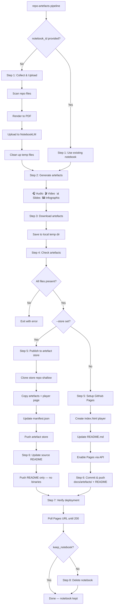

# Pipeline Architecture

> The `pipeline` command: from git repo to hosted artefacts in one shot.

## Overview

`repo-artefacts pipeline` is the all-in-one command that chains every step — collect, upload, generate, download, publish, verify, and cleanup — into a single invocation.

```bash
repo-artefacts pipeline /path/to/repo
```

## Pipeline Flow



## Sequence Diagram

```mermaid
sequenceDiagram
    actor User
    participant CLI as repo-artefacts pipeline
    participant Col as collector
    participant NLM as NotebookLM API
    participant Store as Artefact Store
    participant GH as GitHub

    User->>CLI: pipeline /path/to/repo

    rect rgb(30, 40, 60)
    Note over CLI,NLM: Collect & Upload
    CLI->>Col: collect_repo_content()
    Col-->>CLI: markdown
    CLI->>Col: render_to_pdf()
    Col-->>CLI: PDF
    CLI->>NLM: upload_repo(pdf)
    NLM-->>CLI: notebook_id
    end

    rect rgb(40, 30, 60)
    Note over CLI,NLM: Generate & Download
    CLI->>NLM: generate_artefacts(all)
    loop Poll per artefact type
        CLI->>NLM: Check status
        alt Failed
            CLI->>NLM: Delete + retry (max 3)
        end
    end
    NLM-->>CLI: All complete
    CLI->>NLM: download_artefacts()
    NLM-->>CLI: audio, video, slides, infographic
    end

    rect rgb(30, 50, 40)
    Note over CLI,Store: Publish (--store mode)
    CLI->>Store: Clone store (shallow)
    CLI->>Store: Copy artefacts + player page
    CLI->>Store: Update manifest.json
    CLI->>Store: git push
    CLI->>CLI: Update source README (links only)
    CLI->>GH: git push (README only)
    end

    rect rgb(50, 40, 30)
    Note over CLI,Store: Verify & Cleanup
    loop Poll until 200
        CLI->>Store: HEAD request to store Pages URL
    end
    Store-->>CLI: 200 OK
    CLI->>NLM: delete_notebook()
    end

    CLI-->>User: ✅ Published! URL
```



## Options

| Option | Description | Default |
|---|---|---|
| `repo_path` | Path to git repository (positional) | `.` |
| `-n, --notebook-id` | Existing notebook ID (skips upload) | — |
| `--audio` | Generate audio overview | — |
| `--video` | Generate video explainer | — |
| `--slides` | Generate slide deck | — |
| `--infographic` | Generate infographic | — |
| `--exclude` | Artefact types to skip (repeatable) | — |
| `--resume` | Only generate artefacts not yet completed | `false` |
| `-r, --remote` | Git remote to push to | `origin` |
| `-t, --timeout` | Generation timeout per artefact (seconds) | `900` |
| `--keep-notebook` | Don't delete the notebook after publishing | `false` |
| `-s, --store` | Publish to external artefact store (`org/repo`) | config default |

Selection modes (pick one):
- **Default**: generate all four types, skipping any already completed in the notebook
- **Explicit**: `--audio --video` — only generate the named types
- **Exclude**: `--exclude infographic` — generate all except the named types
- **Resume**: `--resume` — only generate types not yet completed (useful after quota hits)

## vs `publish`

`pipeline` and `publish` overlap but serve different use cases:

| | `pipeline` | `publish` |
|---|---|---|
| Collects & uploads repo | ✅ | ❌ (needs existing notebook) |
| Generates artefacts | ✅ | ✅ (skippable) |
| Downloads artefacts | ✅ | ✅ |
| Sets up GitHub Pages | ✅ | ✅ |
| Commits & pushes | ✅ | ✅ |
| Verifies deployment | ✅ | ✅ (skippable) |
| Deletes notebook after | ✅ (default) | ❌ |
| Cleans up temp files | ✅ | ❌ |

Use `pipeline` for a fresh repo you haven't touched. Use `publish` when you already have a notebook and want more control over individual steps.

## Artefact Store Mode

With `--store` (or a `default_store` in `~/.config/repo-artefacts/config.toml`), the pipeline publishes artefacts to a separate GitHub repo instead of committing binary files into the source repo:

- **Store repo** gets: artefact files, player page, manifest.json
- **Source repo** gets: README links only (zero binary files)
- **Store is served** via GitHub Pages (e.g., `artefacts.netdevautomate.dev`)

This keeps source repos lean. The store repo is cloned shallowly (`--depth 1`) and cached in `~/.cache/repo-artefacts/stores/` for fast subsequent runs.

## Git Safety

In local mode, only `docs/artefacts/` and `README.md` are staged. In store mode, only `README.md` is staged in the source repo. Other files in your working tree are never touched. Pre-commit hooks are respected in both modes. If the tool detects a detached HEAD state, it will refuse to push.

## CI Integration

The pipeline is designed to run locally. For CI, use the individual commands — see [CI & Testing](ci-and-testing.md) for the GitHub Actions workflow and `act` for local CI runs.
