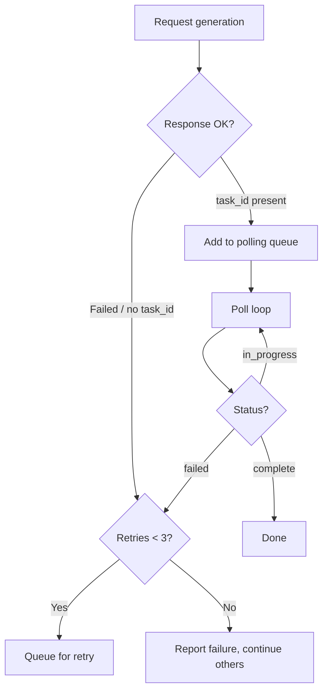
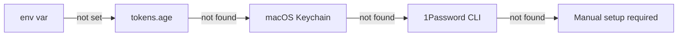

# Troubleshooting — notebooklm-repo-artefacts

## Generation Issues

### Infographic generation fails but polling continues

**Symptom:** "Infographic generation failed. Try..." message appears but the tool keeps polling.

**Cause:** NotebookLM returns a `GenerationStatus` with `status="failed"` and empty `task_id` on immediate failure. If the code doesn't check the initial response, it never enters the polling loop for that artefact — but other artefacts keep polling, making it look stuck.

**Fix (v0.1.0+):** The tool now checks the initial generation response for failures and queues retries immediately. Up to 3 retries per artefact.



**Workaround if still stuck:** Generate individually:
```bash
repo-artefacts generate -n $NOTEBOOK_ID --infographic
```

### Generation times out

**Symptom:** "✗ Audio timed out" after 15 minutes.

**Cause:** NotebookLM generation can take 5-20 minutes depending on content size and server load.

**Fix:** Increase timeout:
```bash
repo-artefacts generate -n $NOTEBOOK_ID --timeout 1800  # 30 minutes
```

### "No content collected" error

**Symptom:** `repo-artefacts process` says "No content collected. Is this a code repository?"

**Cause:** The collector found no README, docs, config, or source files.

**Check:**
- Is the path a git repository?
- Does it have a README.md?
- Are source files in standard locations (`src/`, or root)?
- File extensions must be in the supported set (`.py`, `.ts`, `.js`, `.rs`, `.go`, etc.)

## GitHub Pages Issues

### 404 on Pages URL

**Symptom:** `https://org.github.io/repo/artefacts/` returns 404.

**Causes and fixes:**

| Cause | Fix |
|-------|-----|
| Pages not enabled | Run `repo-artefacts pages .` with `GITHUB_TOKEN` set |
| Not yet deployed | Wait 1-2 minutes after push, Pages builds take time |
| Wrong branch/folder | Check Settings → Pages: should be `main` branch, `/docs` folder |
| No `index.html` | Run `repo-artefacts pages .` to regenerate |

### GITHUB_TOKEN not found

**Symptom:** "⚠ GITHUB_TOKEN not set — enable Pages manually"

**Resolution chain** (checked in order):



**Quick fix:**
```bash
export GITHUB_TOKEN=ghp_your_token_here
repo-artefacts pages .
```

**Persistent fix:** Add to `~/.config/secrets/tokens.age` via `api-key-sync`.

### Audio/video won't play in browser

**Symptom:** Clicking audio/video links downloads the file instead of playing.

**Cause:** GitHub raw URLs don't support streaming. The player page (`index.html`) uses `<audio>` and `<video>` tags that stream from the Pages-hosted files.

**Fix:** Use the GitHub Pages URL, not the raw GitHub URL. The README "Repo Deep Dive" links point to the Pages player which handles playback correctly.

## NotebookLM Auth Issues

### "NotebookLM authentication failed"

**Cause:** The `notebooklm-py` library needs Google auth cookies.

**Fix:**
```bash
# Re-authenticate
notebooklm auth
```

This opens a browser for Google sign-in and stores cookies locally.

## Common Errors

| Error | Cause | Fix |
|-------|-------|-----|
| `No GitHub remote found` | No `github.com` remote in git config | Use `--org` and `--repo` flags |
| `Failed to spawn: pyright` | Missing dev dependency | `uv add --dev pyright` |
| `age: no identity matched` | Wrong age key for tokens.age | Check `~/.config/age/keys.txt` |
| `op: not signed in` | 1Password CLI session expired | Run `op_token` then retry |
