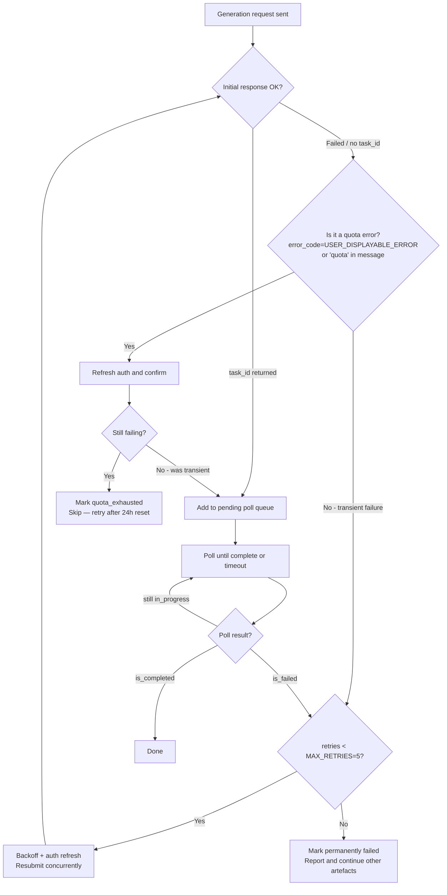
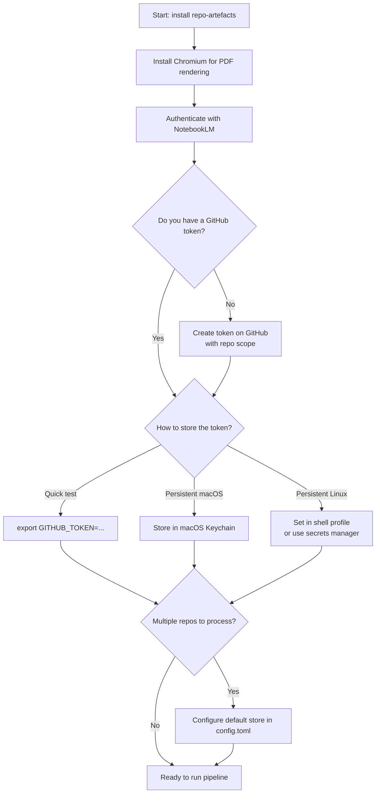
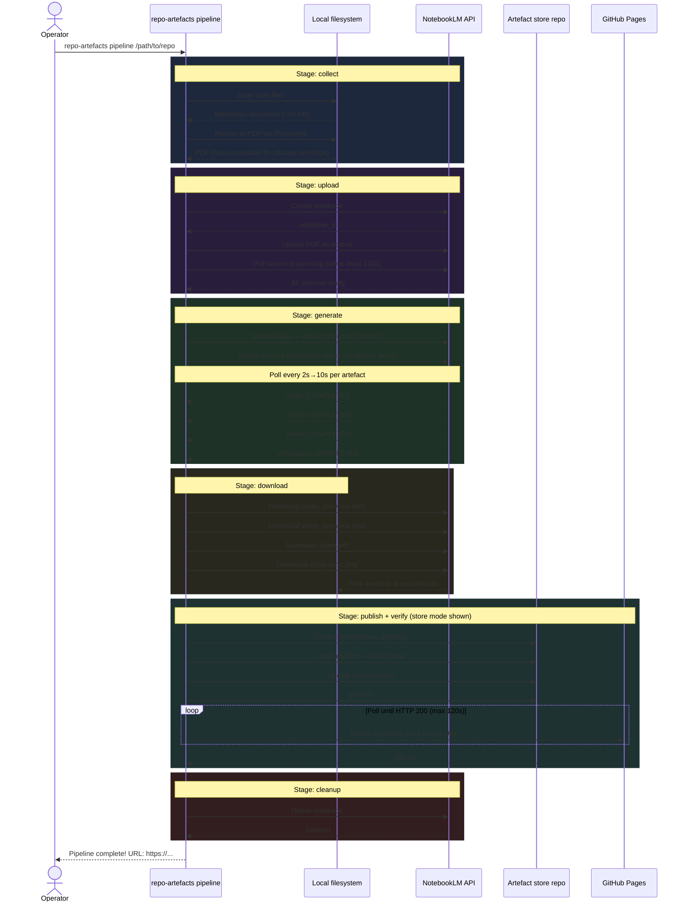
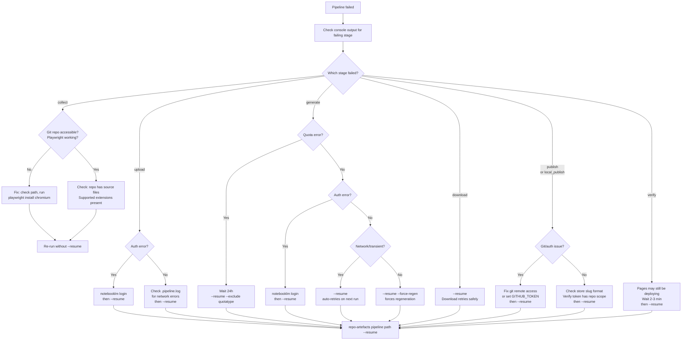

# Troubleshooting and Runbook — notebooklm-repo-artefacts v0.1.0

This document covers diagnosis and resolution for operators running `repo-artefacts` in production, plus step-by-step runbooks for common operational procedures.

---

## Part 1: Troubleshooting Guide

### Section 1: Generation Issues

#### 1.1 Artefact generation fails immediately

**Symptom:** Console shows `✗ [artefact] failed immediately` with no progress, or no `task_id` is returned after the submission step.

**Cause:** NotebookLM returns a `GenerationStatus` with `status="failed"` and an empty `task_id` on the initial request. This is distinct from a generation that starts and later fails during polling.

**Diagnosis:** Check `docs/artefacts/.pipeline.log` for `[submit]` entries. A failed immediate submission looks like:

```
10:30:05 repo_artefacts.notebooklm WARNING [submit] infographic: immediate failure — error='...', error_code='USER_DISPLAYABLE_ERROR', task_id='', status='failed', metadata=None
```

**Resolution:** The tool auto-retries up to `MAX_RETRIES=5`. If failures persist beyond that:

1. Check whether the error is a quota issue — see Section 1.3.
2. Re-authenticate: `notebooklm login`
3. Generate the failing artefact type individually to isolate:

```bash
repo-artefacts generate -n $NOTEBOOK_ID --infographic
```


```mermaid
flowchart TD
    A[Generation request sent] --> B{Initial response OK?}
    B -->|task_id returned| C[Add to pending poll queue]
    B -->|Failed / no task_id| D{Is it a quota error?\nerror_code=USER_DISPLAYABLE_ERROR\nor 'quota' in message}
    D -->|Yes| E[Refresh auth and confirm]
    E --> F{Still failing?}
    F -->|Yes| G[Mark quota_exhausted\nSkip — retry after 24h reset]
    F -->|No - was transient| C
    D -->|No - transient failure| H{retries < MAX_RETRIES=5?}
    H -->|Yes| I[Backoff + auth refresh\nResubmit concurrently]
    I --> B
    H -->|No| J[Mark permanently failed\nReport and continue other artefacts]
    C --> K[Poll until complete or timeout]
    K --> L{Poll result?}
    L -->|is_completed| M[Done]
    L -->|is_failed| H
    L -->|still in_progress| K
```

---

#### 1.2 Generation times out

**Symptom:** Console shows `✗ Audio timed out` (or similar) after the default 900 seconds.

**Cause:** NotebookLM generation is server-side and duration varies significantly with server load and content size. Audio and video typically take 5–20 minutes. Cinematic-style video can take 30–40 minutes. The default `--timeout 900` (15 minutes) is appropriate for most cases but will be too short for large repositories or heavy load periods.

**Resolution:**

```bash
repo-artefacts pipeline /path/to/repo --timeout 1800   # 30 minutes
repo-artefacts generate -n $NOTEBOOK_ID --timeout 2400  # 40 minutes for video
```

**Polling behaviour:** The poller uses `POLL_WINDOW=60s` per cycle. Within each cycle it polls with exponential backoff from 2s, capping at 10s intervals. The deadline is enforced at the outer loop level.

---

#### 1.3 Daily quota exhausted

**Symptom:** Console shows `daily quota exhausted`. The `quota_exhausted` set is populated in `generate_artefacts()` output, and the affected artefact types are logged at WARNING level.

**Cause:** NotebookLM enforces separate daily generation caps per account. Pro accounts can generate approximately 20–25 infographics and 20–25 slide decks per day. Audio and video have different (typically higher) caps. Caps reset 24 hours from the first use of the day (UTC), not at midnight UTC.

**Detection:** The tool identifies quota exhaustion by checking both the error message content and the `error_code` field of the `GenerationStatus` response:

- `error_code='USER_DISPLAYABLE_ERROR'` is reliably set on quota hits
- Error message text is checked for: `"rate limit"`, `"quota exceeded"`, `"quota"`

On detection, the tool performs one auth refresh and retries once to distinguish quota exhaustion from transient auth failures before marking the artefact as `quota_exhausted`.

**Resolution:**

```bash
# Wait 24h, then resume without the quota-exhausted type
repo-artefacts pipeline /path/to/repo --resume --exclude infographic

# Or resume specifically requesting only what was quota-limited
repo-artefacts generate -n $NOTEBOOK_ID --infographic
```

---

#### 1.4 "No content collected"

**Symptom:** `repo-artefacts process` exits with "No content collected. Is this a code repository?"

**Cause:** The collector scanned the repository and found no files matching its collection criteria.

**Diagnosis checklist:**

- Is the path a git repository (has `.git/` directory)?
- Does the repository have a `README.md`, `README.rst`, or `README.txt`?
- Are source files present in `src/` or the repository root?
- Do source files use supported extensions?

**Supported source extensions:**

```
.py .ts .js .rs .java .go .rb .kt .swift .c .cpp .h .hpp .cs .scala .ex .exs .clj .zig .lua .sh .bash
```

**Skipped directories** (never scanned):

```
.git  node_modules  __pycache__  .venv  venv  dist  build  .tox  .eggs  target  .next  .nuxt  vendor
```

**Total output cap:** 500 KB. README and docs are always included in full; source files are truncated first if the limit is reached.

---

#### 1.5 Concurrent generation failures

**Symptom:** Multiple artefact types fail in the same run, or generation seems to stall with many artefacts pending.

**Cause:** `CONCURRENCY_LIMIT=2` means at most two generation requests are submitted simultaneously. Certain artefact types (particularly infographic and slides) appear to conflict when submitted concurrently against the same notebook.

**Resolution:** The tool handles this automatically with a semaphore and retry logic. If failures persist:

```bash
# Reduce concurrent load by excluding low-priority types
repo-artefacts pipeline /path/to/repo --exclude infographic

# Or generate types sequentially in separate invocations
repo-artefacts generate -n $NOTEBOOK_ID --audio --video
repo-artefacts generate -n $NOTEBOOK_ID --slides --infographic
```

---

### Section 2: Authentication Issues

#### 2.1 NotebookLM authentication failed

**Symptom:** RPC errors on the first API call, or an `AuthError` exception immediately after tool startup.

**Cause:** The `notebooklm-py` library requires valid Google session cookies. These expire and must be refreshed by re-running the browser-based login flow.

**Resolution:**

```bash
notebooklm login
```

This opens a browser window for Google sign-in and stores fresh cookies in the local credential store.

---

#### 2.2 Auth token expires during long generation

**Symptom:** Auth-related warnings appear in the console mid-generation, typically after 10–15 minutes into a long pipeline run. The generation may or may not recover automatically.

**Cause:** Google session tokens expire approximately every 15 minutes. The `_with_reauth()` wrapper handles this automatically for all API calls, but very long polls between API calls may still surface token expiry on the next call.

**Automatic handling:** The `_with_reauth()` wrapper catches `AuthError`, `RateLimitError`, and `RPCError` and calls `client.refresh_auth()` with exponential backoff (using `REAUTH_BACKOFF = [2, 10, 30]` seconds) before retrying. This is transparent in most cases.

**Resolution if auth refresh loops are frequent:**

```bash
# Re-authenticate immediately before starting a long pipeline
notebooklm login
repo-artefacts pipeline /path/to/repo

# If the run still fails, resume after re-authenticating
notebooklm login
repo-artefacts pipeline /path/to/repo --resume
```

---

#### 2.3 GITHUB_TOKEN not found

**Symptom:** Console shows `⚠ GITHUB_TOKEN not set — enable Pages manually`. GitHub Pages setup is skipped.

**Cause:** The tool cannot locate a GitHub token through any of the supported resolution methods.

The tool attempts to resolve the token via the following chain, stopping at the first match:

```mermaid
flowchart LR
    A[Start token resolution] --> B{GITHUB_TOKEN\nenvironment variable?}
    B -->|Found| Z[Use token]
    B -->|Not set| C{"~/.config/secrets/tokens.age"\nexists?"}
    C -->|Found| D[Decrypt with\n~/.config/age/keys.txt]
    D --> Z
    C -->|Not found| E{macOS Keychain:\nsecurity find-generic-password\n-a GITHUB_TOKEN -s api-keys}
    E -->|Found| Z
    E -->|Not found| F{1Password CLI:\nop item get GITHUB_TOKEN\n--vault API_KEYS}
    F -->|Found| Z
    F -->|Not found| G[Warn: manual setup required]
```

**Resolution — quick (session only):**

```bash
export GITHUB_TOKEN=ghp_your_token_here
repo-artefacts pages /path/to/repo
```

**Resolution — persistent (macOS Keychain):**

```bash
security add-generic-password -a GITHUB_TOKEN -s api-keys -w ghp_your_token_here
```

**Resolution — persistent (age-encrypted):**

```bash
# Requires age and an existing key at ~/.config/age/keys.txt
echo "GITHUB_TOKEN=ghp_your_token_here" | age -r $(age-keygen -y ~/.config/age/keys.txt) > ~/.config/secrets/tokens.age
```

The token requires the `repo` scope to enable GitHub Pages and push to the repository.

---

### Section 3: GitHub Pages Issues

#### 3.1 404 on Pages URL

**Symptom:** `https://org.github.io/repo/artefacts/` returns HTTP 404.

**Diagnosis and resolution by cause:**

| Cause | How to confirm | Fix |
|-------|---------------|-----|
| Pages not enabled | Settings → Pages shows "Pages is not enabled" | Run `repo-artefacts pages /path/to/repo` with `GITHUB_TOKEN` set |
| Not yet deployed | Recent push, no completed Pages Action in Actions tab | Wait 1–2 minutes; GitHub Pages builds asynchronously |
| Wrong branch or folder | Settings → Pages shows different branch/folder | Set source to `main` branch, `/docs` folder |
| No `index.html` in `docs/artefacts/` | `ls docs/artefacts/` shows no `index.html` | Run `repo-artefacts pages /path/to/repo` to regenerate the player page |
| Custom domain misconfigured | CNAME record points elsewhere | Check DNS with `dig +short CNAME your.domain` |

---

#### 3.2 Audio or video won't play in browser

**Symptom:** Clicking the audio or video link downloads the file rather than playing it inline.

**Cause:** Raw GitHub URLs (`raw.githubusercontent.com` or `github.com/...blob/...`) serve files with `Content-Disposition: attachment` and do not support HTTP range requests required for browser media streaming.

**Resolution:** Use the GitHub Pages URL. The player page at `index.html` uses `<audio>` and `<video>` HTML elements that load files from the Pages-hosted URL, which supports range requests and inline playback. The README "Generated Artefacts" links always point to the Pages player — do not link directly to raw files.

---

#### 3.3 Stale artefacts after an update

**Symptom:** The Pages URL shows old artefact content after a fresh pipeline run and push.

**Cause:** GitHub Pages is served through a CDN that caches content. New pushes can take several minutes to propagate globally, and aggressive client-side or CDN caching may serve stale responses even after propagation.

**Freshness check:** The tool checks the `Last-Modified` header of published artefacts via `_check_freshness()` with a default `max_age_seconds=600` (10 minutes). Verification may pass before CDN edges fully propagate.

**Resolution:**

1. Wait 2–5 minutes for CDN propagation after a successful push.
2. Hard-refresh the browser (Cmd+Shift+R on macOS, Ctrl+Shift+R on Linux/Windows).
3. If content is still stale after 10 minutes, check GitHub Pages build status in the repository's Actions tab.
4. As a last resort, navigate to Settings → Pages and click "Save" to trigger a manual rebuild.

---

### Section 4: Artefact Store Issues

#### 4.1 "Failed to clone artefact-store"

**Symptom:** Pipeline fails at the `publish` stage with an error indicating the store repository could not be cloned.

**Cause:** The store repository does not exist, or the GitHub token lacks read access to it.

**Resolution:**

```bash
# Verify the store repo exists and is accessible
gh repo view Org/artefact-store

# Check the token has the repo scope
gh auth status

# Create the store repo if it doesn't exist
gh repo create Org/artefact-store --public --description "NotebookLM artefact store"
```

---

#### 4.2 "Store push failed"

**Symptom:** Pipeline completes the publish stage but logs show `Store push failed`. The `commit_and_push_store()` function returns `False`.

**Cause:** Either a concurrent push created a conflict (another pipeline run pushed between this run's clone and its push), or the token lacks write access to the store repository.

**Resolution:** Re-running the pipeline automatically performs a `git pull --rebase` before retrying the push, which resolves most concurrent-push conflicts. If failures persist:

```bash
# Check write access
gh repo view --json permissions Org/artefact-store | jq '.permissions'

# Force a fresh store clone by clearing the local cache
rm -rf ~/.cache/repo-artefacts/stores/
repo-artefacts pipeline /path/to/repo --resume
```

---

#### 4.3 Artefacts appear in both store and source repo

**Symptom:** Binary artefact files (`.mp3`, `.mp4`, `.pdf`, `.png`) exist in `docs/artefacts/` in the source repository after migrating to `--store` mode.

**Cause:** The pipeline was previously run without `--store`, which committed binary files to the source repository. Subsequent runs with `--store` add files to the store but do not remove the old binaries from the source repository.

**Resolution:**

```bash
# Remove binary artefacts from source repo (keep index.html and README links)
git rm docs/artefacts/audio_overview.mp3 docs/artefacts/video_overview.mp4 \
        docs/artefacts/slides.pdf docs/artefacts/infographic.png
git commit -m "chore: remove artefacts from source repo (moved to store)"
git push
```

After this, the source repository contains only `docs/artefacts/index.html` with links pointing to the store, and the store repository holds all binary files.

---

### Section 5: Pipeline Resume Issues

#### 5.1 `--resume` does not skip completed stages

**Symptom:** Running with `--resume` re-executes stages that already completed successfully in a previous run.

**Cause:** The `--resume` flag works by reading `docs/artefacts/.pipeline-state.json` and skipping any stage with `"status": "pass"`. If the state file is missing, corrupted, or was written to a different path, resume has no information to work from.

**Diagnosis:**

```bash
cat docs/artefacts/.pipeline-state.json
```

Expected output includes a `stages` object with `"status": "pass"` entries. If the file is absent, contains invalid JSON, or shows stages without a `"pass"` status, resume will not skip them.

**Resolution:**

- If the file is missing: the pipeline will start from scratch on the next run.
- If the file is corrupted: delete it (`rm docs/artefacts/.pipeline-state.json`) and re-run without `--resume`.
- If stages show `"failed"` or `"error"` status: `--resume` correctly re-runs them — this is intended behaviour.

---

#### 5.2 A stage failed but the underlying issue is fixed

**Resolution:**

```bash
# --resume skips all stages that show "pass" status, and re-runs from the first failed stage
repo-artefacts pipeline /path/to/repo --resume
```

If only a specific artefact type failed within the `generate` stage:

```bash
# Re-run generation for the specific type only
repo-artefacts generate -n $NOTEBOOK_ID --slides
```

---

#### 5.3 Content hash mismatch causes unnecessary re-upload

**Symptom:** `--resume` triggers a re-upload even though the repository content has not changed.

**Cause:** The `upload` stage compares a SHA256 hash of the rendered PDF against the hash stored in the previous run's state. The PDF is rendered by Chromium via Playwright, and rendering is non-deterministic — timestamps, font rendering, or Chromium version differences can produce different byte sequences from identical source content.

**Resolution:**

```bash
# Bypass the hash check and force regeneration
repo-artefacts pipeline /path/to/repo --resume --force-regen

# Or delete the state file and re-run the full pipeline
rm docs/artefacts/.pipeline-state.json
repo-artefacts pipeline /path/to/repo
```

---

### Section 6: Common Errors Reference

| Error message | Cause | Resolution |
|---------------|-------|------------|
| `No GitHub remote found` | No `github.com` remote in the repository's git config | Supply `--org` and `--repo` flags explicitly |
| `Failed to spawn: pyright` | `pyright` is not installed (dev-only dependency) | `uv add --dev pyright` |
| `age: no identity matched` | The age key at `~/.config/age/keys.txt` cannot decrypt `tokens.age` | Verify the correct key file is present; re-encrypt the secrets file with the current key |
| `op: not signed in` | The 1Password CLI session has expired | Run `op signin` then retry |
| `Store slug must be in org/repo format` | The `--store` value does not match `Org/repo` pattern | Use the format `YourOrg/artefact-store` |
| `Refusing to delete path outside store cache` | Safety guard in `_safe_rmtree()` was triggered | This is a bug — report it with the full traceback |
| `Cannot push: HEAD is detached` | The repository is in detached HEAD state | Run `git checkout main` (or the appropriate branch) before re-running |
| `PDF not created or empty` | Collector found no files, or Playwright rendering failed | Check that source files exist and run `playwright install chromium` |
| `playwright install chromium` | Chromium is not installed in the Playwright browser cache | Run `playwright install chromium` |
| `No completed artefacts to download` | The `download` stage pre-check found no `completed` artefacts in state | Rerun from `generate` stage: delete state and re-run, or use `--force-regen` |
| `Not a git repo: /path` | The `collect` stage pre-check failed — path has no `.git/` directory | Confirm the path is the repository root, not a subdirectory |

---

## Part 2: Runbook

### RB1: First-Time Setup

This runbook covers initial installation and configuration of `repo-artefacts`.


```mermaid
flowchart TD
    A[Start: install repo-artefacts] --> B[Install Chromium for PDF rendering]
    B --> C[Authenticate with NotebookLM]
    C --> D{Do you have a GitHub token?}
    D -->|No| E[Create token on GitHub\nwith repo scope]
    D -->|Yes| F{How to store the token?}
    E --> F
    F -->|Quick test| G[export GITHUB_TOKEN=...]
    F -->|Persistent macOS| H[Store in macOS Keychain]
    F -->|Persistent Linux| I[Set in shell profile\nor use secrets manager]
    G --> J{Multiple repos to process?}
    H --> J
    I --> J
    J -->|Yes| K[Configure default store in config.toml]
    J -->|No| L[Ready to run pipeline]
    K --> L
```

**Step 1: Install the tool**

```bash
# From PyPI (once published)
uv tool install notebooklm-repo-artefacts

# From GitHub main branch
uv tool install git+https://github.com/NetDevAutomate/notebooklm-repo-artefacts.git

# From a local checkout (for development)
uv tool install .
```

**Step 2: Install Chromium for PDF rendering**

The collector renders Markdown to PDF using Playwright. Chromium must be installed separately:

```bash
playwright install chromium
```

**Step 3: Authenticate with NotebookLM**

```bash
uv pip install "notebooklm-py[browser]"
notebooklm login
```

This opens a browser for Google sign-in. Credentials are stored locally by `notebooklm-py`.

**Step 4: Set up a GitHub token**

The token needs the `repo` scope to enable GitHub Pages and push to repositories.

```bash
# Quick (current session only)
export GITHUB_TOKEN=ghp_your_token_here

# Persistent — macOS Keychain
security add-generic-password -a GITHUB_TOKEN -s api-keys -w ghp_your_token_here

# Persistent — shell profile (less secure, for Linux environments)
echo 'export GITHUB_TOKEN=ghp_your_token_here' >> ~/.zshrc
```

**Step 5 (optional): Configure a default artefact store**

For organisations processing multiple repositories, a centralised artefact store keeps source repos free of binary files.

```bash
mkdir -p ~/.config/repo-artefacts
echo 'default_store = "YourOrg/artefact-store"' > ~/.config/repo-artefacts/config.toml
```

**Step 6: Verify setup**

```bash
# List notebooks (confirms NotebookLM auth is working)
repo-artefacts list

# Run a dry-run pipeline to verify all stages are reachable
repo-artefacts pipeline /path/to/repo --dry-run
```

---

### RB2: Standard Pipeline Run

This runbook describes a complete pipeline run from a clean state, with expected output at each stage.


```mermaid
sequenceDiagram
    actor Operator
    participant CLI as repo-artefacts pipeline
    participant FS as Local filesystem
    participant NLM as NotebookLM API
    participant Store as Artefact store repo
    participant GH as GitHub Pages

    Operator->>CLI: repo-artefacts pipeline /path/to/repo

    rect rgb(30, 40, 60)
        Note over CLI,NLM: Stage: collect
        CLI->>FS: Scan repo files
        FS-->>CLI: Markdown document (~45 KB)
        CLI->>FS: Render to PDF via Playwright
        FS-->>CLI: PDF (hash computed for change detection)
    end

    rect rgb(40, 30, 60)
        Note over CLI,NLM: Stage: upload
        CLI->>NLM: Create notebook
        NLM-->>CLI: notebook_id
        CLI->>NLM: Upload PDF as source
        CLI->>NLM: Poll source processing status (max 120s)
        NLM-->>CLI: All sources ready
    end

    rect rgb(30, 50, 40)
        Note over CLI,NLM: Stage: generate
        CLI->>NLM: Submit audio + video (concurrent, limit=2)
        CLI->>NLM: Submit slides + infographic (after semaphore frees)
        Note over CLI,NLM: Poll every 2s→10s per artefact
        NLM-->>CLI: audio: COMPLETED
        NLM-->>CLI: video: COMPLETED
        NLM-->>CLI: slides: COMPLETED
        NLM-->>CLI: infographic: COMPLETED
    end

    rect rgb(40, 40, 30)
        Note over CLI,FS: Stage: download
        CLI->>NLM: Download audio_overview.mp3
        CLI->>NLM: Download video_overview.mp4
        CLI->>NLM: Download slides.pdf
        CLI->>NLM: Download infographic.png
        NLM-->>FS: Files saved to docs/artefacts/
    end

    rect rgb(30, 50, 50)
        Note over CLI,GH: Stage: publish + verify (store mode shown)
        CLI->>Store: Clone store (shallow, depth=1)
        CLI->>Store: Copy artefacts + player page
        CLI->>Store: Update manifest.json
        CLI->>Store: git push
        loop Poll until HTTP 200 (max 120s)
            CLI->>GH: HEAD request to store Pages URL
        end
        GH-->>CLI: 200 OK
    end

    rect rgb(50, 30, 30)
        Note over CLI,NLM: Stage: cleanup
        CLI->>NLM: Delete notebook
        NLM-->>CLI: Deleted
    end

    CLI-->>Operator: Pipeline complete! URL: https://...
```

**Command:**

```bash
repo-artefacts pipeline /path/to/repo
```

**Expected console output at each stage:**

```
Pipeline for my-project
  Log: docs/artefacts/.pipeline.log

── Stage: collect ──────────────────────────────────────────
  ✓ collect: Collected 45.2 KB  (3.2s)

── Stage: upload ──────────────────────────────────────────
  Created notebook: my-project (ba6fa92e-...)
  ✓ Uploaded my-project_content.pdf
  ⏳ Waiting for source processing...
  ✓ Source processing complete (1 source(s) ready)
  ✓ upload: Notebook: ba6fa92e-...  (22.4s)

── Stage: generate ─────────────────────────────────────────
  ⏳ Requesting audio...
  ⏳ Requesting video...
  ⏳ Requesting slides...
  ⏳ Requesting infographic...
  … audio still generating (120s)
  ✓ Audio ready
  ✓ Video ready
  ✓ Slides ready
  ✓ Infographic ready
  ✓ generate: Generated: audio, infographic, slides, video  (847.3s)

── Stage: download ─────────────────────────────────────────
  ✓ Downloaded docs/artefacts/audio_overview.mp3
  ✓ Downloaded docs/artefacts/video_overview.mp4
  ✓ Downloaded docs/artefacts/slides.pdf
  ✓ Downloaded docs/artefacts/infographic.png
  ✓ download: Downloaded to docs/artefacts  (18.6s)

── Stage: publish ──────────────────────────────────────────
  ✓ publish: Published to https://...  (12.1s)

── Stage: verify ───────────────────────────────────────────
  ✓ verify: Verified 4 artefacts at https://...  (34.2s)

── Stage: cleanup ──────────────────────────────────────────
  ✓ cleanup: Deleted notebook ba6fa92e-...  (2.1s)

Pipeline complete!  (940.0s)
  Log: docs/artefacts/.pipeline.log
```

---

### RB3: Recovering from Pipeline Failure

Use this runbook when a pipeline run terminates with `Pipeline failed.`


```mermaid
flowchart TD
    A[Pipeline failed] --> B[Check console output for failing stage]
    B --> C{Which stage failed?}

    C -->|collect| D{Git repo accessible?\nPlaywright working?}
    D -->|No| E[Fix: check path, run\nplaywright install chromium]
    D -->|Yes| F[Check: repo has source files\nSupported extensions present]

    C -->|upload| G{Auth error?}
    G -->|Yes| H[notebooklm login\nthen --resume]
    G -->|No| I[Check .pipeline.log\nfor network errors\nthen --resume]

    C -->|generate| J{Quota error?}
    J -->|Yes| K[Wait 24h\n--resume --exclude quotatype]
    J -->|No| L{Auth error?}
    L -->|Yes| M[notebooklm login\nthen --resume]
    L -->|No| N{Network/transient?}
    N -->|Yes| O[--resume\nauto-retries on next run]
    N -->|No| P[--resume --force-regen\nforces regeneration]

    C -->|download| Q[--resume\nDownload retries safely]

    C -->|publish\nor local_publish| R{Git/auth issue?}
    R -->|Yes| S[Fix git remote access\nor set GITHUB_TOKEN\nthen --resume]
    R -->|No| T[Check store slug format\nVerify token has repo scope\nthen --resume]

    C -->|verify| U[Pages may still be deploying\nWait 2-3 min\nthen --resume]

    E --> V[Re-run without --resume]
    F --> V
    H --> W[repo-artefacts pipeline path --resume]
    I --> W
    K --> W
    M --> W
    O --> W
    P --> W
    Q --> W
    S --> W
    T --> W
    U --> W
```

**Step 1: Identify the failing stage**

```bash
# Console output shows the last stage run and its error message
# For more detail, check the log file
cat docs/artefacts/.pipeline.log | grep -E "(FAIL|ERROR|Stage)"

# Check current state
cat docs/artefacts/.pipeline-state.json | python3 -m json.tool
```

**Step 2: Apply the fix for the stage**

| Failing stage | Common cause | Fix |
|---------------|-------------|-----|
| `collect` | Path not a git repo, or Playwright missing | `playwright install chromium`; verify path |
| `upload` | Auth expired, network failure | `notebooklm login` then `--resume` |
| `generate` | Quota exhausted | Wait 24h then `--resume --exclude <type>` |
| `generate` | Auth expired | `notebooklm login` then `--resume` |
| `generate` | Transient failure | `--resume` (tool retries automatically) |
| `generate` | Persistent failure | `--resume --force-regen` |
| `download` | Network failure | `--resume` |
| `publish` | Store push conflict | `--resume` (auto-rebase); check write access |
| `local_publish` | GITHUB_TOKEN missing | Set token then `--resume` |
| `verify` | Pages not yet deployed | Wait 2–3 minutes then `--resume` |

**Step 3: Resume**

```bash
repo-artefacts pipeline /path/to/repo --resume
```

---

### RB4: Monitoring a Long-Running Pipeline

A full pipeline with all four artefact types typically takes 15–25 minutes. Use the log file and state file to monitor progress without waiting for the console.

**Key files:**

| File | Purpose | Updated |
|------|---------|---------|
| `docs/artefacts/.pipeline.log` | Detailed timestamped log of all API calls, poll cycles, and stage transitions | Continuously during run |
| `docs/artefacts/.pipeline-state.json` | Current stage status and artefact completion state | After each stage completes |

**Monitoring the log in real time:**

```bash
tail -f docs/artefacts/.pipeline.log
```

**What to look for in the log:**

```
# Successful stage completion
10:30:05 repo_artefacts.pipeline INFO Stage collect: PASS in 3.2s — Collected 45.2 KB

# Auth token refresh (expected, not an error)
10:35:10 repo_artefacts.notebooklm WARNING [audio] RateLimitError: ... — backoff 30s, attempt 1/3

# Generation submission accepted
10:36:00 repo_artefacts.notebooklm INFO [submit] audio: accepted — task_id=abc123def456

# Generation polling (expected for ~10-15 minutes)
10:40:00 repo_artefacts.notebooklm DEBUG [poll] audio: still generating (240s)

# Generation completed
10:48:00 repo_artefacts.notebooklm INFO [poll] audio: COMPLETED

# Quota exhaustion (requires action)
10:36:01 repo_artefacts.notebooklm ERROR [submit] infographic: QUOTA EXHAUSTED confirmed

# Stage failure
10:50:00 repo_artefacts.pipeline ERROR Stage generate: execute FAILED — Failed: slides

# Pipeline outcome
10:55:00 repo_artefacts.pipeline INFO Pipeline COMPLETE in 1200.0s
10:55:00 repo_artefacts.pipeline ERROR Pipeline FAILED after 1200.0s — state=/path/.pipeline-state.json
```

**Checking current state without opening the log:**

```bash
python3 -c "
import json, sys
state = json.load(open('docs/artefacts/.pipeline-state.json'))
print('Notebook:', state.get('notebook_id', 'not set'))
print('Artefacts:', state.get('artefacts', {}))
for name, info in state.get('stages', {}).items():
    print(f'  {name}: {info[\"status\"]}')
"
```

---

### RB5: Cleaning Up After Issues

**Delete a stuck or orphaned notebook:**

```bash
# Delete by notebook ID (shown in console output and .pipeline-state.json)
repo-artefacts delete -n $NOTEBOOK_ID

# List all notebooks to find stuck ones
repo-artefacts list
```

**Start a pipeline completely fresh:**

```bash
# Delete state and artefact files, then re-run
rm -rf docs/artefacts/
repo-artefacts pipeline /path/to/repo
```

**Validate that published links still resolve:**

```bash
repo-artefacts validate
```

**Find and optionally remove orphaned store artefacts** (artefacts in the store that no longer correspond to an active repository):

```bash
# List orphaned artefacts without deleting
repo-artefacts clean --store Org/artefact-store

# Delete orphaned artefacts
repo-artefacts clean --store Org/artefact-store --delete
```

**Clear the local store cache** (forces a fresh clone on next pipeline run):

```bash
rm -rf ~/.cache/repo-artefacts/stores/
```

---

### RB6: Configuration Reference

The configuration file at `~/.config/repo-artefacts/config.toml` sets user-wide defaults. All values are optional — the tool works without this file.

```toml
# ~/.config/repo-artefacts/config.toml

# Default artefact store repository (org/repo format)
# When set, all pipeline runs publish to this store unless overridden with --store
default_store = "YourOrg/artefact-store"

# Default generation timeout in seconds per artefact type
# Override per-run with --timeout
# Audio/video: 900s (15min) is usually sufficient
# Cinematic video: consider 2400s (40min)
default_timeout = 900

# Local cache directory for shallow store clones
# The tool caches store clones here for fast subsequent runs
store_cache_dir = "~/.cache/repo-artefacts/stores"
```

**CLI flags always override config file values.** For example, `--timeout 1800` overrides `default_timeout = 900` for that run only.

---

### RB7: Log Analysis Reference

**Log file location:** `docs/artefacts/.pipeline.log`

This file is overwritten at the start of each pipeline run. If you need to preserve logs across runs, copy the file before re-running:

```bash
cp docs/artefacts/.pipeline.log docs/artefacts/.pipeline-$(date +%Y%m%dT%H%M%S).log
```

**Log format:**

```
HH:MM:SS repo_artefacts.module LEVEL message
```

Example entries covering the full pipeline lifecycle:

```
# Pipeline startup
10:30:00 repo_artefacts.pipeline INFO Pipeline start: repo=my-project store=None timeout=900 artefacts=None notebook_id=None resume=False force_regen=False dry_run=False

# Collect stage
10:30:03 repo_artefacts.pipeline INFO Stage collect: PASS in 3.2s — Collected 45.2 KB

# Upload stage — source processing poll
10:30:25 repo_artefacts.notebooklm DEBUG Sources still processing: ['my-project_content.pdf'] (10s)
10:30:30 repo_artefacts.notebooklm INFO All 1 source(s) ready
10:30:31 repo_artefacts.pipeline INFO Stage upload: PASS in 28.4s — Notebook: ba6fa92e-...

# Generate stage — submission
10:30:31 repo_artefacts.notebooklm INFO [submit] audio: requesting generation
10:30:32 repo_artefacts.notebooklm INFO [submit] audio: accepted — task_id=abc123
10:30:33 repo_artefacts.notebooklm INFO [submit] video: accepted — task_id=def456

# Generate stage — polling loop
10:30:33 repo_artefacts.notebooklm DEBUG [poll] loop: pending=['audio', 'video'] needs_retry=[] elapsed=0s remaining=900s
10:31:35 repo_artefacts.notebooklm DEBUG [poll] audio: still generating (62s)
10:31:35 repo_artefacts.notebooklm DEBUG [poll] video: still generating (62s)

# Generate stage — auth refresh mid-generation (expected)
10:43:10 repo_artefacts.notebooklm WARNING [audio] RateLimitError: ... — backoff 5s, attempt 1/3
10:43:15 repo_artefacts.notebooklm INFO [audio] Auth refreshed after rate limit

# Generate stage — completion
10:47:00 repo_artefacts.notebooklm INFO [poll] audio: COMPLETED
10:48:30 repo_artefacts.notebooklm INFO [poll] video: COMPLETED
10:49:00 repo_artefacts.notebooklm INFO [poll] slides: COMPLETED
10:50:00 repo_artefacts.notebooklm INFO [poll] infographic: COMPLETED
10:50:01 repo_artefacts.pipeline INFO Stage generate: PASS in 1170.0s — Generated: audio, infographic, slides, video

# Quota exhaustion (action required)
10:30:33 repo_artefacts.notebooklm WARNING [submit] infographic: quota suspected — refreshing auth to confirm
10:30:38 repo_artefacts.notebooklm ERROR [submit] infographic: QUOTA EXHAUSTED confirmed
10:30:38 repo_artefacts.notebooklm WARNING Quota-exhausted artefacts: ['infographic']

# Generate stage failure
10:50:01 repo_artefacts.pipeline ERROR Stage generate: execute FAILED — Failed: slides. Completed: audio, infographic, video

# Pipeline outcome
11:02:00 repo_artefacts.pipeline INFO Pipeline COMPLETE in 1320.0s
11:02:00 repo_artefacts.pipeline ERROR Pipeline FAILED after 1320.0s — state=docs/artefacts/.pipeline-state.json
```

**Log severity guide:**

| Level | Meaning | Action required? |
|-------|---------|-----------------|
| `DEBUG` | Poll intervals, internal state, API response details | No |
| `INFO` | Stage transitions, successful operations, API call outcomes | No |
| `WARNING` | Auth refreshes, rate limits, quota suspicion, retry attempts | Monitor |
| `ERROR` | Stage failures, permanent generation failures, pipeline failure | Yes |
