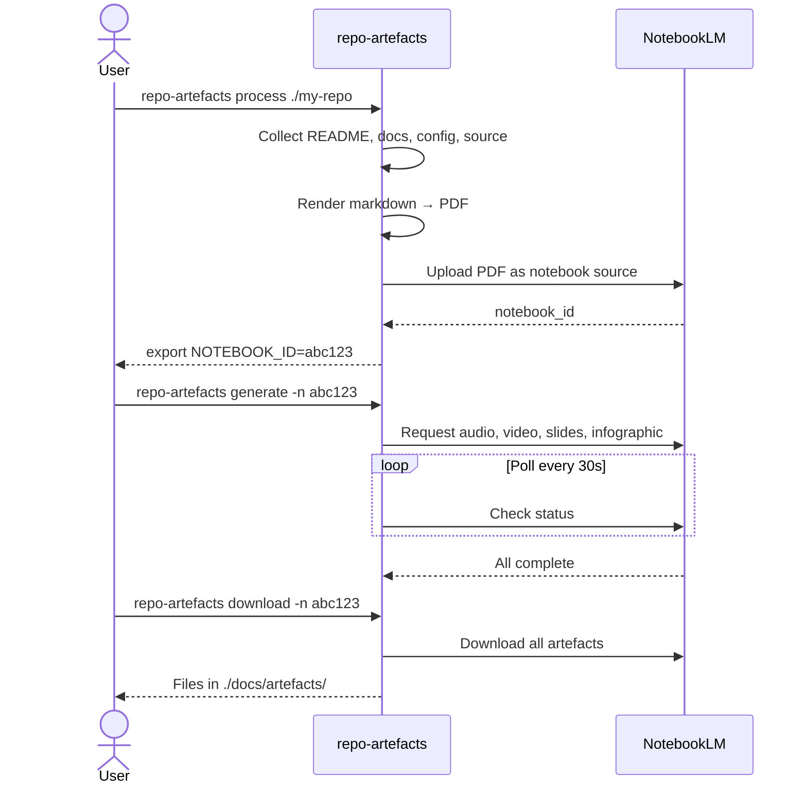

# Use Cases — notebooklm-repo-artefacts

## UC1: Generate artefacts for a new repo

> You have a git repo and want audio, video, slides, and infographic overviews.



**Steps:**
```bash
# 1. Collect and upload
repo-artefacts process ./my-repo -n NOTEBOOK_ID
# or let it create a new notebook:
repo-artefacts process ./my-repo

# 2. Generate all artefacts
export NOTEBOOK_ID=<id from step 1>
repo-artefacts generate

# 3. Download
repo-artefacts download -o ./docs/artefacts
```

## UC2: Publish with GitHub Pages (one command)

> You have artefacts already generated and want to publish them with a player page.

```bash
# Full pipeline (skip generation, use existing files)
repo-artefacts publish ./my-repo --skip-generate --remote origin

# Full pipeline including generation
repo-artefacts publish ./my-repo -n $NOTEBOOK_ID
```

This will:
1. Check standard files exist (`audio_overview.mp3`, `video_overview.mp4`, `infographic.png`, `slides.pdf`)
2. Create `docs/artefacts/index.html` player page
3. Update README.md with "Generated Artefacts" links
4. Enable GitHub Pages via API
5. Git commit and push
6. Verify the Pages URL returns 200

## UC3: Set up GitHub Pages only

> Artefacts are already in `docs/artefacts/`, you just need the player page.

```bash
repo-artefacts pages ./my-repo
```

This creates the player page and README links without touching NotebookLM.

## UC4: List and manage notebooks

```bash
# List all notebooks
repo-artefacts list

# List sources in a notebook
repo-artefacts list -n $NOTEBOOK_ID

# Delete a notebook
repo-artefacts delete -n $NOTEBOOK_ID
```

## UC5: Update README after manual artefact changes

```bash
repo-artefacts update-readme --artefacts-dir ./docs/artefacts
```

## UC6: Publish to a centralised artefact store

> You want to keep source repos lean — no binary files committed.

```bash
# One-time: set default store
mkdir -p ~/.config/repo-artefacts
echo 'default_store = "NetDevAutomate/artefact-store"' > ~/.config/repo-artefacts/config.toml

# Full pipeline — artefacts go to the store, source repo gets README links only
repo-artefacts pipeline ./my-repo

# Or explicitly specify the store
repo-artefacts pipeline ./my-repo --store NetDevAutomate/artefact-store
```

This will:
1. Generate artefacts via NotebookLM (same as local mode)
2. Clone the artefact store (shallow, cached)
3. Copy artefacts + player page to `store/<repo>/artefacts/`
4. Update `manifest.json` in the store
5. Push the store
6. Update source repo README with links to the store
7. Push source repo (README only — zero binary files)

Artefacts are served via GitHub Pages from the store (e.g., `artefacts.netdevautomate.dev/my-repo/artefacts/`).

## Standard Artefact Filenames

These filenames are used in both local and store modes:

| File | Type |
|------|------|
| `audio_overview.mp3` | Audio deep dive |
| `video_overview.mp4` | Video explainer |
| `infographic.png` | Architecture infographic |
| `slides.pdf` | Slide deck |
