# Use Cases and How-To Guide — notebooklm-repo-artefacts v0.1.0

This guide covers every supported workflow for `repo-artefacts`, from the recommended one-command pipeline to fine-grained manual control. Each use case includes a diagram, working commands, and step-by-step instructions.

---

## Contents

- [Application Architecture](#application-architecture)
- [User Onboarding Flow](#user-onboarding-flow)
- [UC1: Full Pipeline — New Repository (Recommended)](#uc1-full-pipeline--new-repository-recommended)
- [UC2: Step-by-Step Manual Workflow](#uc2-step-by-step-manual-workflow)
- [UC3: Selective Artefact Generation](#uc3-selective-artefact-generation)
- [UC4: Resume After Failure](#uc4-resume-after-failure)
- [UC5: Centralised Artefact Store](#uc5-centralised-artefact-store)
- [UC6: Migrate Existing Artefacts to Store](#uc6-migrate-existing-artefacts-to-store)
- [UC7: Notebook Management](#uc7-notebook-management)
- [UC8: Validate Artefact Links](#uc8-validate-artefact-links)
- [UC9: Clean Orphaned Store Artefacts](#uc9-clean-orphaned-store-artefacts)
- [UC10: GitHub Pages Setup Only](#uc10-github-pages-setup-only)
- [Data Model Reference](#data-model-reference)
- [Exception Hierarchy](#exception-hierarchy)
- [Standard Artefact Filenames](#standard-artefact-filenames)
- [Quick Reference](#quick-reference)

---

## Application Architecture

The diagram below shows how the major components relate to each other and to external services.

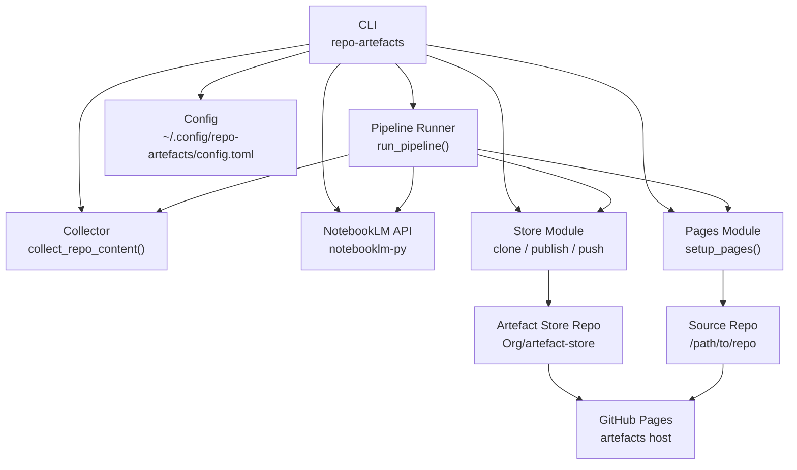
```mermaid
flowchart TD
    CLI["CLI\nrepo-artefacts"]
    Pipeline["Pipeline Runner\nrun_pipeline()"]
    Collector["Collector\ncollect_repo_content()"]
    NotebookLM["NotebookLM API\nnotebooklm-py"]
    Store["Store Module\nclone / publish / push"]
    Pages["Pages Module\nsetup_pages()"]
    Config["Config\n~/.config/repo-artefacts/config.toml"]

    GHPages["GitHub Pages\nartefacts host"]
    StoreRepo["Artefact Store Repo\nOrg/artefact-store"]
    SourceRepo["Source Repo\n/path/to/repo"]

    CLI --> Pipeline
    CLI --> Collector
    CLI --> NotebookLM
    CLI --> Store
    CLI --> Pages
    CLI --> Config

    Pipeline --> Collector
    Pipeline --> NotebookLM
    Pipeline --> Store
    Pipeline --> Pages

    Store --> StoreRepo
    Pages --> SourceRepo
    StoreRepo --> GHPages
    SourceRepo --> GHPages
```

### How commands map to pipeline stages

| Stage | `pipeline` | `process` | `generate` | `download` | `publish` | `pages` |
|-------|:----------:|:---------:|:----------:|:----------:|:---------:|:-------:|
| collect | yes | yes | — | — | — | — |
| upload | yes | yes | — | — | — | — |
| generate | yes | — | yes | — | yes | — |
| download | yes | — | — | yes | yes | — |
| publish (store) | yes | — | — | — | yes | — |
| local_publish | yes | — | — | — | yes | yes |
| verify | yes | — | — | — | yes (opt) | — |
| cleanup | yes | — | — | — | — | — |

---

## User Onboarding Flow

Complete this flow once before running any use case.

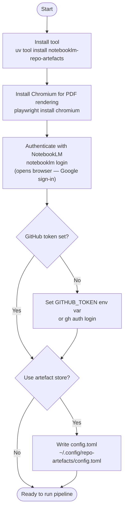
```mermaid
flowchart TD
    Start([Start]) --> Install["Install tool\nuv tool install notebooklm-repo-artefacts"]
    Install --> Chromium["Install Chromium for PDF rendering\nplaywright install chromium"]
    Chromium --> NotebookLMAuth["Authenticate with NotebookLM\nnotebooklm login\n(opens browser — Google sign-in)"]
    NotebookLMAuth --> GHToken{"GitHub token set?"}
    GHToken -->|No| SetToken["Set GITHUB_TOKEN env var\nor gh auth login"]
    GHToken -->|Yes| StoreDecision{"Use artefact store?"}
    SetToken --> StoreDecision
    StoreDecision -->|Yes| ConfigStore["Write config.toml\n~/.config/repo-artefacts/config.toml"]
    StoreDecision -->|No| Ready([Ready to run pipeline])
    ConfigStore --> Ready
```

### Prerequisites

```bash
# 1. Install the tool
uv tool install notebooklm-repo-artefacts

# 2. Install Chromium (required for PDF rendering)
playwright install chromium

# 3. Authenticate with NotebookLM
uv pip install notebooklm-py[browser]
notebooklm login

# 4. Set a GitHub token (required for GitHub Pages API)
export GITHUB_TOKEN=ghp_your_token_here
# or use the GitHub CLI:
gh auth login
```

---

## UC1: Full Pipeline — New Repository (Recommended)

**Goal**: Generate all four artefact types for a new repository and publish them to GitHub Pages in one command.

The `pipeline` command is the recommended entry point. It runs every stage — collect, upload, generate, download, publish, verify, and cleanup — with state saved after each stage for resumability.

### Sequence diagram

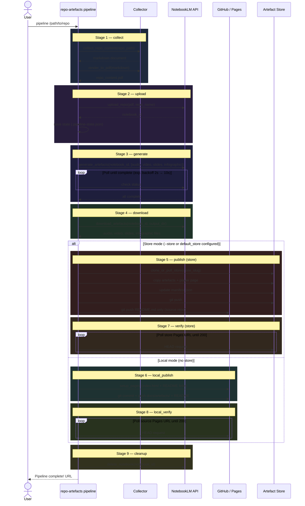
```mermaid
sequenceDiagram
    actor User
    participant CLI as repo-artefacts pipeline
    participant Col as Collector
    participant NLM as NotebookLM API
    participant GH as GitHub / Pages
    participant Store as Artefact Store

    User->>CLI: pipeline /path/to/repo

    rect rgb(30, 40, 60)
        Note over CLI,Col: Stage 1 — collect
        CLI->>Col: collect_repo_content(repo_path)
        Col-->>CLI: markdown document
        CLI->>Col: render_to_pdf(markdown)
        Col-->>CLI: repo_content.pdf
    end

    rect rgb(40, 30, 60)
        Note over CLI,NLM: Stage 2 — upload
        CLI->>NLM: upload_repo(pdf, repo_name)
        NLM-->>CLI: notebook_id
        CLI->>CLI: save state (.pipeline-state.json)
    end

    rect rgb(30, 30, 60)
        Note over CLI,NLM: Stage 3 — generate
        CLI->>NLM: generate_artefacts(notebook_id, [audio, video, slides, infographic])
        loop Poll until complete (exp. backoff 2s → 10s)
            CLI->>NLM: check status
        end
        NLM-->>CLI: all complete
    end

    rect rgb(30, 50, 40)
        Note over CLI,NLM: Stage 4 — download
        CLI->>NLM: download_artefacts(notebook_id, output_dir)
        NLM-->>CLI: audio, video, slides, infographic files
    end

    alt Store mode (--store or default_store configured)
        rect rgb(50, 30, 30)
            Note over CLI,Store: Stage 5 — publish (store)
            CLI->>Store: clone_or_pull_store(store_slug)
            CLI->>Store: copy artefacts + player page
            CLI->>Store: update manifest.json
            CLI->>Store: git push
            CLI->>GH: git push README.md only (source repo)
        end

        rect rgb(50, 40, 30)
            Note over CLI,Store: Stage 7 — verify (store)
            loop Poll store Pages URL until 200
                CLI->>Store: HEAD request
            end
        end
    else Local mode (no store)
        rect rgb(30, 50, 50)
            Note over CLI,GH: Stage 6 — local_publish
            CLI->>GH: setup_pages (index.html + README links)
            CLI->>GH: git commit + push docs/artefacts/ + README
        end

        rect rgb(40, 50, 30)
            Note over CLI,GH: Stage 8 — local_verify
            loop Poll source Pages URL until 200
                CLI->>GH: HEAD request
            end
        end
    end

    rect rgb(50, 50, 30)
        Note over CLI,NLM: Stage 9 — cleanup
        CLI->>NLM: delete_notebook(notebook_id)
    end

    CLI-->>User: Pipeline complete! URL
```

### Basic usage

```bash
# Recommended: generate all artefacts and publish to local GitHub Pages
repo-artefacts pipeline /path/to/repo
```

### Common variations

```bash
# Publish to a centralised artefact store
repo-artefacts pipeline /path/to/repo --store YourOrg/artefact-store

# Use an existing notebook (skips collect and upload stages)
repo-artefacts pipeline /path/to/repo -n ba6fa92e-f174-4a77-8fc6-fc4fc12a625d

# Generate only audio and video (skip slides and infographic)
repo-artefacts pipeline /path/to/repo --audio --video

# Generate everything except infographic
repo-artefacts pipeline /path/to/repo --exclude infographic

# Resume after a failure (skips already-passed stages)
repo-artefacts pipeline /path/to/repo --resume

# Keep the notebook after publishing (useful for debugging)
repo-artefacts pipeline /path/to/repo --keep-notebook

# Force regeneration of all artefacts, even completed ones
repo-artefacts pipeline /path/to/repo --force-regen

# Delete artefacts directory and state before running (clean start)
repo-artefacts pipeline /path/to/repo --clean

# Increase timeout for slow generation (default: 900s per artefact)
repo-artefacts pipeline /path/to/repo --timeout 1800
```

### Step-by-step instructions

1. Ensure you have completed the [onboarding flow](#user-onboarding-flow).
2. Change directory to your project or pass the full path:
   ```bash
   repo-artefacts pipeline /path/to/my-repo
   ```
3. Wait. Generation takes 5–20 minutes per artefact type. The tool polls NotebookLM and prints progress.
4. When complete, the tool prints the published URL. Open it to verify the player page loads.
5. If generation fails partway through, see [UC4: Resume After Failure](#uc4-resume-after-failure).

---

## UC2: Step-by-Step Manual Workflow

**Goal**: Execute pipeline stages individually for debugging, scripting, or fine-grained control.

Use the individual commands when you need to inspect output between stages, incorporate the tool into an existing script, or retry a specific stage without running the full pipeline.

### User flow diagram

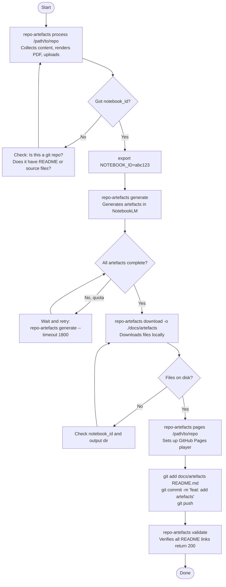
```mermaid
flowchart TD
    Start([Start]) --> Process["repo-artefacts process /path/to/repo\nCollects content, renders PDF, uploads"]
    Process --> GotID{"Got notebook_id?"}
    GotID -->|No| DebugCollect["Check: Is this a git repo?\nDoes it have README or source files?"]
    GotID -->|Yes| ExportID["export NOTEBOOK_ID=abc123"]
    DebugCollect --> Process

    ExportID --> Generate["repo-artefacts generate\nGenerates artefacts in NotebookLM"]
    Generate --> GenerateOK{"All artefacts complete?"}
    GenerateOK -->|No, quota| Resume["Wait and retry:\nrepo-artefacts generate --timeout 1800"]
    GenerateOK -->|Yes| Download["repo-artefacts download -o ./docs/artefacts\nDownloads files locally"]
    Resume --> GenerateOK

    Download --> FilesOK{"Files on disk?"}
    FilesOK -->|No| DebugDL["Check notebook_id and output dir"]
    FilesOK -->|Yes| Pages["repo-artefacts pages /path/to/repo\nSets up GitHub Pages player"]
    DebugDL --> Download

    Pages --> GitPush["git add docs/artefacts README.md\ngit commit -m 'feat: add artefacts'\ngit push"]
    GitPush --> Validate["repo-artefacts validate\nVerifies all README links return 200"]
    Validate --> Done([Done])
```

### Step-by-step instructions

**Step 1 — Collect and upload:**
```bash
repo-artefacts process /path/to/repo
# Output includes the notebook ID:
#   export NOTEBOOK_ID=ba6fa92e-f174-4a77-8fc6-fc4fc12a625d
```

**Step 2 — Set the notebook ID in your shell:**
```bash
export NOTEBOOK_ID=ba6fa92e-f174-4a77-8fc6-fc4fc12a625d
```

**Step 3 — Generate artefacts:**
```bash
# Generate all four types
repo-artefacts generate

# Or generate specific types
repo-artefacts generate --audio --slides
```

**Step 4 — Download artefacts:**
```bash
repo-artefacts download -o ./docs/artefacts
```

**Step 5 — Set up the GitHub Pages player:**
```bash
repo-artefacts pages /path/to/repo
```

**Step 6 — Commit and push (manual):**
```bash
cd /path/to/repo
git add docs/artefacts/ README.md
git commit -m "feat: add NotebookLM artefacts"
git push
```

**Step 7 — Verify links are live:**
```bash
repo-artefacts validate /path/to/repo
```

---

## UC3: Selective Artefact Generation

**Goal**: Generate only the artefact types you need — to save quota, reduce generation time, or add artefacts incrementally.

### Artefact selection logic

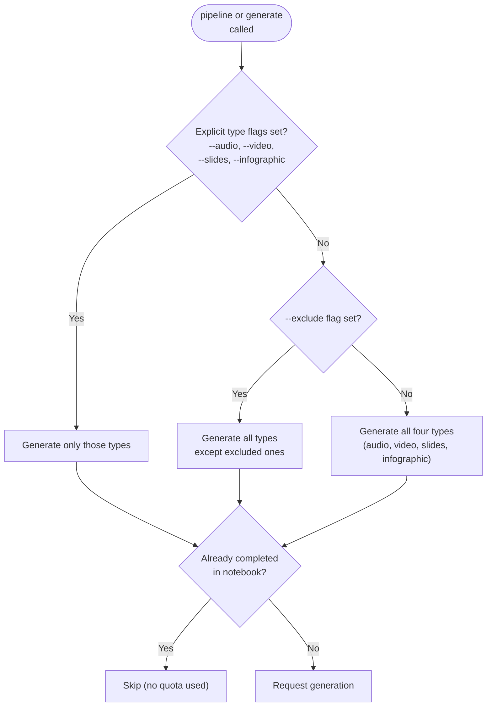
```mermaid
flowchart TD
    Start(["pipeline or generate\ncalled"]) --> ExplicitFlags{"Explicit type flags set?\n--audio, --video,\n--slides, --infographic"}
    ExplicitFlags -->|Yes| UseExplicit["Generate only those types"]
    ExplicitFlags -->|No| ExcludeSet{"--exclude flag set?"}
    ExcludeSet -->|Yes| UseExclude["Generate all types\nexcept excluded ones"]
    ExcludeSet -->|No| DefaultAll["Generate all four types\n(audio, video, slides, infographic)"]

    UseExplicit --> SkipCompleted{"Already completed\nin notebook?"}
    UseExclude --> SkipCompleted
    DefaultAll --> SkipCompleted
    SkipCompleted -->|Yes| Skip["Skip (no quota used)"]
    SkipCompleted -->|No| Generate["Request generation"]
```

### Usage

```bash
# Generate only audio and video (omits slides and infographic)
repo-artefacts pipeline /path/to/repo --audio --video

# Generate everything except infographic (preserves quota for other repos)
repo-artefacts pipeline /path/to/repo --exclude infographic

# Exclude multiple types
repo-artefacts pipeline /path/to/repo --exclude infographic --exclude video

# Generate a single type for an existing notebook (no repo collection needed)
export NOTEBOOK_ID=ba6fa92e-f174-4a77-8fc6-fc4fc12a625d
repo-artefacts generate --slides

# Combine with pipeline for a notebook you already have
repo-artefacts pipeline /path/to/repo -n $NOTEBOOK_ID --slides
```

### Notes

- Explicit flags (`--audio`, `--video`, `--slides`, `--infographic`) and `--exclude` are mutually exclusive within `pipeline`. Use one mode or the other.
- The `generate` command supports `--all` as an explicit alias for all four types.
- The pipeline automatically skips artefact types that are already completed in the notebook. `--resume` extends this to skip pipeline stages that already passed.

---

## UC4: Resume After Failure

**Goal**: Continue a pipeline that failed partway through, without repeating expensive completed work.

The pipeline saves state to `.pipeline-state.json` in `docs/artefacts/` after each stage. `--resume` loads that state and skips any stage marked `pass`.

### State machine diagram

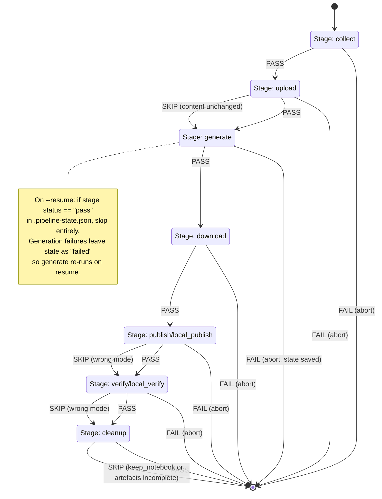
```mermaid
stateDiagram-v2
    [*] --> collect

    state "Stage: collect" as collect
    collect --> upload : PASS
    collect --> [*] : FAIL (abort)

    state "Stage: upload" as upload
    upload --> generate : PASS
    upload --> [*] : FAIL (abort)
    upload --> generate : SKIP (content unchanged)

    state "Stage: generate" as generate
    generate --> download : PASS
    generate --> [*] : FAIL (abort, state saved)

    state "Stage: download" as download
    download --> publish : PASS
    download --> [*] : FAIL (abort)

    state "Stage: publish/local_publish" as publish
    publish --> verify : PASS
    publish --> [*] : FAIL (abort)
    publish --> verify : SKIP (wrong mode)

    state "Stage: verify/local_verify" as verify
    verify --> cleanup : PASS
    verify --> [*] : FAIL (abort)
    verify --> cleanup : SKIP (wrong mode)

    state "Stage: cleanup" as cleanup
    cleanup --> [*] : PASS
    cleanup --> [*] : SKIP (keep_notebook or artefacts incomplete)

    note right of generate
        On --resume: if stage status == "pass"
        in .pipeline-state.json, skip entirely.
        Generation failures leave state as "failed"
        so generate re-runs on resume.
    end note
```

### Usage

```bash
# First run — fails during generate (e.g. NotebookLM quota exhausted)
repo-artefacts pipeline /path/to/repo
# ...
# Stage: generate
#   Failed: slides. Completed: audio, video, infographic
# Pipeline failed. State saved to: docs/artefacts/.pipeline-state.json
# Resume with: repo-artefacts pipeline --resume ...

# Resume — skips collect, upload (already passed), retries generate
repo-artefacts pipeline /path/to/repo --resume
```

### What `--resume` skips vs retries

| Stage | `--resume` behaviour |
|-------|----------------------|
| `collect` | Skipped if previously passed |
| `upload` | Skipped if previously passed AND content hash unchanged |
| `generate` | Re-runs (failed stages are not skipped) |
| `download` | Skipped if previously passed |
| `publish` / `local_publish` | Skipped if previously passed |
| `verify` / `local_verify` | Skipped if previously passed |
| `cleanup` | Runs if all artefacts now complete |

### Inspecting saved state

```bash
cat docs/artefacts/.pipeline-state.json
```

The state file contains `notebook_id`, per-artefact status (`completed`, `failed`, `quota_exhausted`), per-stage status, and timestamps. This is the authoritative record for `--resume`.

---

## UC5: Centralised Artefact Store

**Goal**: Publish artefacts to a dedicated store repository so source repositories contain no binary files.

In store mode, the source repository receives only updated README links. All artefact files (`audio_overview.mp3`, etc.) and the player page are committed to the store repo and served from its GitHub Pages site.

### Local mode vs store mode

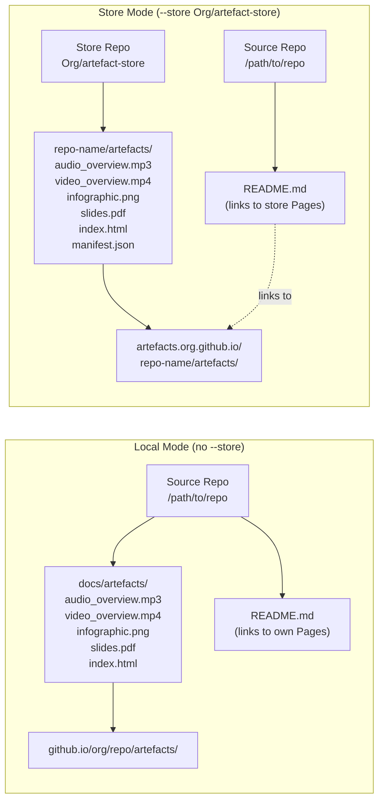
```mermaid
flowchart LR
    subgraph LocalMode["Local Mode (no --store)"]
        direction TB
        LSource["Source Repo\n/path/to/repo"]
        LFiles["docs/artefacts/\naudio_overview.mp3\nvideo_overview.mp4\ninfographic.png\nslides.pdf\nindex.html"]
        LREADME["README.md\n(links to own Pages)"]
        LGH["github.io/org/repo/artefacts/"]
        LSource --> LFiles
        LSource --> LREADME
        LFiles --> LGH
    end

    subgraph StoreMode["Store Mode (--store Org/artefact-store)"]
        direction TB
        SSource["Source Repo\n/path/to/repo"]
        SREADME["README.md\n(links to store Pages)"]
        SStore["Store Repo\nOrg/artefact-store"]
        SFiles["repo-name/artefacts/\naudio_overview.mp3\nvideo_overview.mp4\ninfographic.png\nslides.pdf\nindex.html\nmanifest.json"]
        SGH["artefacts.org.github.io/\nrepo-name/artefacts/"]
        SSource --> SREADME
        SStore --> SFiles
        SFiles --> SGH
        SREADME -.->|links to| SGH
    end
```

### One-time setup

```bash
mkdir -p ~/.config/repo-artefacts
cat > ~/.config/repo-artefacts/config.toml << 'EOF'
default_store = "YourOrg/artefact-store"
EOF
```

### Usage

```bash
# With default_store configured — store is used automatically
repo-artefacts pipeline /path/to/repo

# Override the configured default for a single run
repo-artefacts pipeline /path/to/repo --store YourOrg/artefact-store

# The source repo only gets a README update. Verify it:
git -C /path/to/repo diff HEAD README.md
```

### What happens in the store

The store repo receives:
- `<repo-name>/artefacts/audio_overview.mp3` (and other artefact files)
- `<repo-name>/artefacts/index.html` (the player page)
- `manifest.json` (updated with repo entry)

The store is cloned shallowly (`--depth 1`) and cached at `~/.cache/repo-artefacts/stores/<store-slug>/` for fast subsequent runs.

### Config file reference

```toml
# ~/.config/repo-artefacts/config.toml

# GitHub org/repo for the centralised artefact store
default_store = "YourOrg/artefact-store"

# Generation timeout per artefact in seconds (default: 900)
default_timeout = 900

# Override store cache directory (default: ~/.cache/repo-artefacts/stores)
# store_cache_dir = "/path/to/custom/cache"
```

---

## UC6: Migrate Existing Artefacts to Store

**Goal**: Move artefacts already committed to a source repository into a centralised store, updating README links and removing binary files from the source repo.

### Migration flowchart

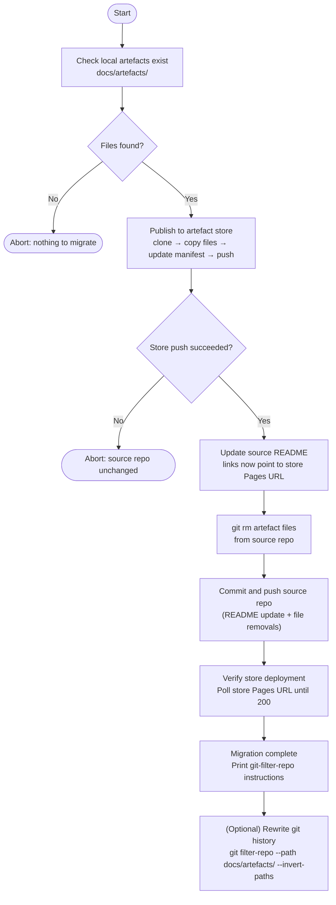
```mermaid
flowchart TD
    Start([Start]) --> CheckLocal["Check local artefacts exist\ndocs/artefacts/"]
    CheckLocal --> LocalOK{"Files found?"}
    LocalOK -->|No| Abort([Abort: nothing to migrate])
    LocalOK -->|Yes| PublishStore["Publish to artefact store\nclone → copy files → update manifest → push"]
    PublishStore --> PushOK{"Store push succeeded?"}
    PushOK -->|No| AbortSafe([Abort: source repo unchanged])
    PushOK -->|Yes| UpdateREADME["Update source README\nlinks now point to store Pages URL"]
    UpdateREADME --> RemoveFiles["git rm artefact files\nfrom source repo"]
    RemoveFiles --> PushSource["Commit and push source repo\n(README update + file removals)"]
    PushSource --> Verify["Verify store deployment\nPoll store Pages URL until 200"]
    Verify --> Done["Migration complete\nPrint git-filter-repo instructions"]
    Done --> HistoryCleanup["(Optional) Rewrite git history\ngit filter-repo --path docs/artefacts/ --invert-paths"]
```

### Usage

```bash
repo-artefacts migrate /path/to/repo --store YourOrg/artefact-store

# Skip deployment verification
repo-artefacts migrate /path/to/repo --store YourOrg/artefact-store --skip-verify

# Add a description to the store manifest entry
repo-artefacts migrate /path/to/repo \
  --store YourOrg/artefact-store \
  --description "Ansible collection for network automation"
```

### Notes

- The migrate command is safe-by-default: if the store push fails, the source repo is not modified.
- After migration, artefact binary files are removed from the working tree and staged for removal, but the objects remain in git history. The tool prints the `git filter-repo` command to fully purge them.
- History rewriting requires a force push and all collaborators to re-clone. Do this at a quiet time.

### Optional history cleanup

```bash
cd /path/to/repo
pip install git-filter-repo
git filter-repo --path docs/artefacts/ --invert-paths
git push --force-with-lease
```

---

## UC7: Notebook Management

**Goal**: List, inspect, and delete NotebookLM notebooks created by `repo-artefacts`.

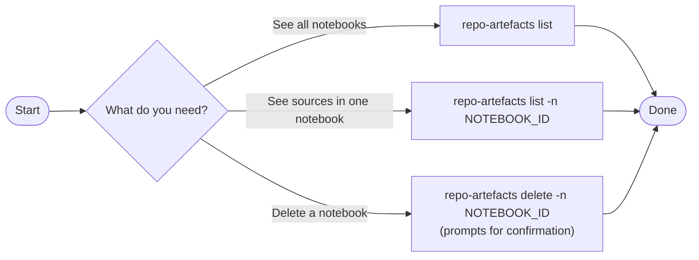
```mermaid
flowchart LR
    Start([Start]) --> Action{"What do you need?"}
    Action -->|"See all notebooks"| List["repo-artefacts list"]
    Action -->|"See sources in one notebook"| ListSources["repo-artefacts list -n NOTEBOOK_ID"]
    Action -->|"Delete a notebook"| Delete["repo-artefacts delete -n NOTEBOOK_ID\n(prompts for confirmation)"]
    List --> Done([Done])
    ListSources --> Done
    Delete --> Done
```

### Usage

```bash
# List all notebooks in your NotebookLM account
repo-artefacts list

# List the uploaded sources within a specific notebook
repo-artefacts list -n ba6fa92e-f174-4a77-8fc6-fc4fc12a625d

# Using the environment variable
export NOTEBOOK_ID=ba6fa92e-f174-4a77-8fc6-fc4fc12a625d
repo-artefacts list -n $NOTEBOOK_ID

# Delete a notebook (will prompt: "Delete notebook <id>? [y/N]")
repo-artefacts delete -n $NOTEBOOK_ID
```

### Notes

- The `pipeline` command deletes its notebook automatically after a successful run (unless `--keep-notebook` is set).
- Use `--keep-notebook` during development to avoid re-uploading on every run. Clean up with `repo-artefacts delete` when finished.
- `repo-artefacts list` shows all notebooks, not just those created by this tool.

---

## UC8: Validate Artefact Links

**Goal**: Verify that artefact URLs in a README are reachable, or check all repos in a store at once.

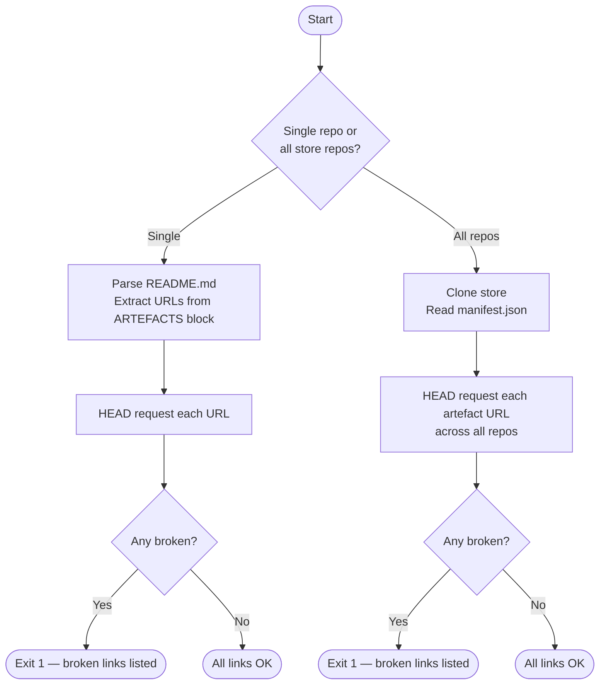
```mermaid
flowchart TD
    Start([Start]) --> Mode{"Single repo or\nall store repos?"}
    Mode -->|Single| ParseREADME["Parse README.md\nExtract URLs from ARTEFACTS block"]
    Mode -->|All repos| ReadManifest["Clone store\nRead manifest.json"]
    ParseREADME --> HeadSingle["HEAD request each URL"]
    ReadManifest --> HeadAll["HEAD request each artefact URL\nacross all repos"]
    HeadSingle --> ResultSingle{"Any broken?"}
    HeadAll --> ResultAll{"Any broken?"}
    ResultSingle -->|Yes| FailSingle([Exit 1 — broken links listed])
    ResultSingle -->|No| PassSingle([All links OK])
    ResultAll -->|Yes| FailAll([Exit 1 — broken links listed])
    ResultAll -->|No| PassAll([All links OK])
```

### Usage

```bash
# Validate the artefact links in a single repo's README
repo-artefacts validate /path/to/repo

# Validate all repos listed in a store's manifest
repo-artefacts validate --all --store YourOrg/artefact-store

# Use the configured default store
repo-artefacts validate --all
```

### Notes

- Single-repo mode parses the `<!-- ARTEFACTS:START --> ... <!-- ARTEFACTS:END -->` block in `README.md` and issues a `HEAD` request to each URL.
- All-store mode reads `manifest.json` from the store repo and checks every artefact URL for every listed repo.
- The command exits with code `1` if any link returns a non-200 response or times out. This makes it suitable for use in CI health checks.

---

## UC9: Clean Orphaned Store Artefacts

**Goal**: Find artefact directories in the store that correspond to source repositories that no longer exist on GitHub, and optionally remove them.

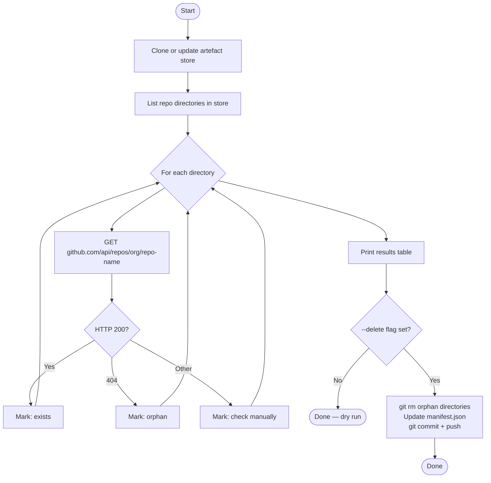
```mermaid
flowchart TD
    Start([Start]) --> CloneStore["Clone or update artefact store"]
    CloneStore --> ListDirs["List repo directories in store"]
    ListDirs --> ForEach{"For each directory"}
    ForEach --> CheckGH["GET github.com/api/repos/org/repo-name"]
    CheckGH --> Exists{"HTTP 200?"}
    Exists -->|Yes| Mark200["Mark: exists"]
    Exists -->|"404"| Mark404["Mark: orphan"]
    Exists -->|Other| MarkWarn["Mark: check manually"]
    Mark200 --> ForEach
    Mark404 --> ForEach
    MarkWarn --> ForEach
    ForEach --> PrintTable["Print results table"]
    PrintTable --> DeleteFlag{"--delete flag set?"}
    DeleteFlag -->|No| Done([Done — dry run])
    DeleteFlag -->|Yes| RemoveOrphans["git rm orphan directories\nUpdate manifest.json\ngit commit + push"]
    RemoveOrphans --> Done2([Done])
```

### Usage

```bash
# List orphans without removing them (safe dry-run)
repo-artefacts clean --store YourOrg/artefact-store

# Remove orphaned artefact directories and push
repo-artefacts clean --store YourOrg/artefact-store --delete

# Use the configured default store
repo-artefacts clean
repo-artefacts clean --delete
```

### Notes

- Without `--delete`, the command is read-only. It clones the store and the GitHub API, then prints a table. Nothing is modified.
- With `--delete`, orphaned directories are removed from the store repo, `manifest.json` is updated, and the changes are pushed.
- The command requires a GitHub token with `repo` scope to call the GitHub API for existence checks.

---

## UC10: GitHub Pages Setup Only

**Goal**: Set up the player page and README links without any NotebookLM interaction. Use this when artefact files are already in `docs/artefacts/`.

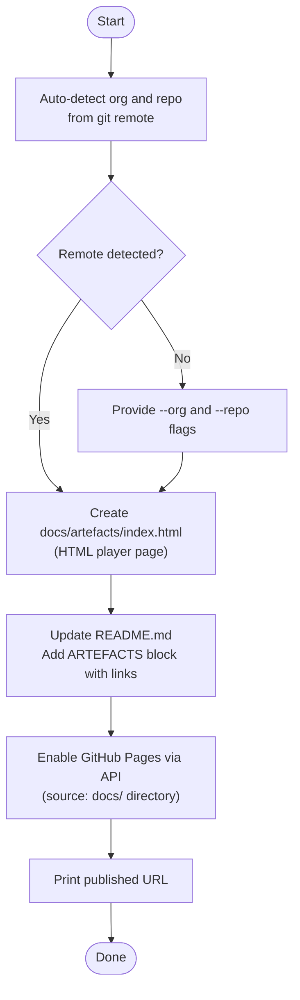
```mermaid
flowchart TD
    Start([Start]) --> AutoDetect["Auto-detect org and repo\nfrom git remote"]
    AutoDetect --> DetectOK{"Remote detected?"}
    DetectOK -->|No| ManualArgs["Provide --org and --repo flags"]
    DetectOK -->|Yes| SetupPages["Create docs/artefacts/index.html\n(HTML player page)"]
    ManualArgs --> SetupPages
    SetupPages --> UpdateREADME["Update README.md\nAdd ARTEFACTS block with links"]
    UpdateREADME --> EnablePages["Enable GitHub Pages via API\n(source: docs/ directory)"]
    EnablePages --> PrintURL["Print published URL"]
    PrintURL --> Done([Done])
```

### Usage

```bash
# Auto-detect org and repo from git remote
repo-artefacts pages /path/to/repo

# Specify org and repo explicitly (useful for forks or non-standard remotes)
repo-artefacts pages /path/to/repo --org MyOrg --repo my-repo

# Then commit and push manually
cd /path/to/repo
git add docs/artefacts/index.html README.md
git commit -m "feat: add NotebookLM artefacts player"
git push
```

### Notes

- The `pages` command only creates `index.html` and updates `README.md`. It does not commit or push.
- If artefact files are not present in `docs/artefacts/`, the player page is created with placeholder links.
- Use `repo-artefacts validate` after pushing to verify the Pages deployment is live.

---

## Data Model Reference

### Pipeline class diagram

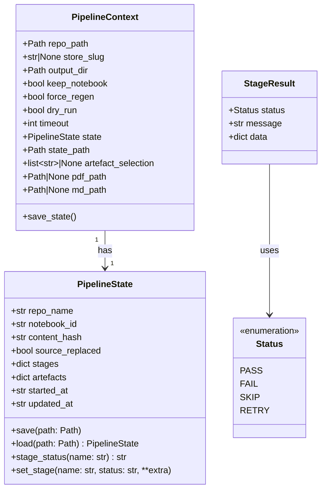
```mermaid
classDiagram
    class PipelineContext {
        +Path repo_path
        +str|None store_slug
        +Path output_dir
        +bool keep_notebook
        +bool force_regen
        +bool dry_run
        +int timeout
        +PipelineState state
        +Path state_path
        +list~str~|None artefact_selection
        +Path|None pdf_path
        +Path|None md_path
        +save_state()
    }

    class PipelineState {
        +str repo_name
        +str notebook_id
        +str content_hash
        +bool source_replaced
        +dict stages
        +dict artefacts
        +str started_at
        +str updated_at
        +save(path: Path)
        +load(path: Path) PipelineState
        +stage_status(name: str) str
        +set_stage(name: str, status: str, **extra)
    }

    class StageResult {
        +Status status
        +str message
        +dict data
    }

    class Status {
        <<enumeration>>
        PASS
        FAIL
        SKIP
        RETRY
    }

    PipelineContext "1" --> "1" PipelineState : has
    StageResult --> Status : uses
```

### Stage class diagram


```mermaid
classDiagram
    class StageProtocol {
        <<interface>>
        +str name
        +pre_check(ctx: PipelineContext) StageResult
        +execute(ctx: PipelineContext) StageResult
        +post_check(ctx: PipelineContext) StageResult
    }

    class CollectStage {
        +name = "collect"
        +pre_check(ctx) StageResult
        +execute(ctx) StageResult
        +post_check(ctx) StageResult
    }

    class UploadStage {
        +name = "upload"
        +pre_check(ctx) StageResult
        +execute(ctx) StageResult
        +post_check(ctx) StageResult
    }

    class GenerateStage {
        +name = "generate"
        +pre_check(ctx) StageResult
        +execute(ctx) StageResult
        +post_check(ctx) StageResult
    }

    class DownloadStage {
        +name = "download"
        +pre_check(ctx) StageResult
        +execute(ctx) StageResult
        +post_check(ctx) StageResult
    }

    class PublishStage {
        +name = "publish"
        +pre_check(ctx) StageResult
        +execute(ctx) StageResult
        +post_check(ctx) StageResult
    }

    class LocalPublishStage {
        +name = "local_publish"
        +pre_check(ctx) StageResult
        +execute(ctx) StageResult
        +post_check(ctx) StageResult
    }

    class VerifyStage {
        +name = "verify"
        +pre_check(ctx) StageResult
        +execute(ctx) StageResult
        +post_check(ctx) StageResult
    }

    class LocalVerifyStage {
        +name = "local_verify"
        +pre_check(ctx) StageResult
        +execute(ctx) StageResult
        +post_check(ctx) StageResult
    }

    class CleanupStage {
        +name = "cleanup"
        +pre_check(ctx) StageResult
        +execute(ctx) StageResult
        +post_check(ctx) StageResult
    }

    CollectStage ..|> StageProtocol
    UploadStage ..|> StageProtocol
    GenerateStage ..|> StageProtocol
    DownloadStage ..|> StageProtocol
    PublishStage ..|> StageProtocol
    LocalPublishStage ..|> StageProtocol
    VerifyStage ..|> StageProtocol
    LocalVerifyStage ..|> StageProtocol
    CleanupStage ..|> StageProtocol
```

### Config class diagram

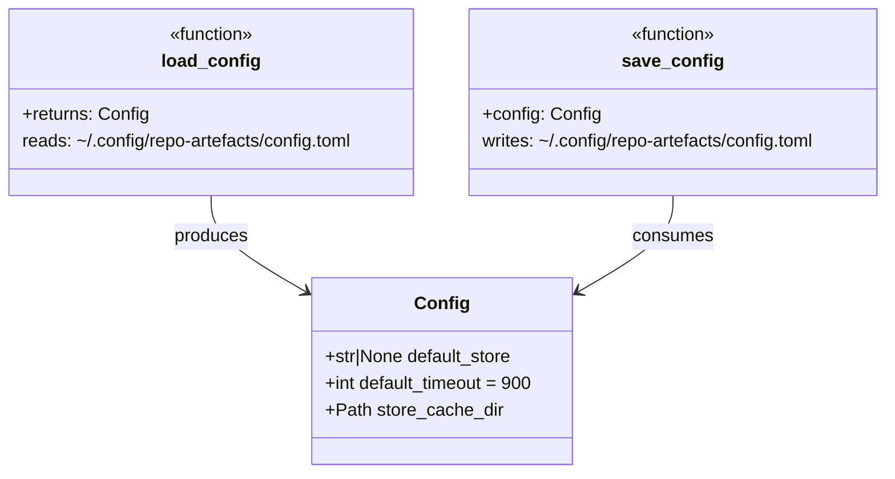
```mermaid
classDiagram
    class Config {
        +str|None default_store
        +int default_timeout = 900
        +Path store_cache_dir
    }

    class load_config {
        <<function>>
        +returns: Config
        reads: ~/.config/repo-artefacts/config.toml
    }

    class save_config {
        <<function>>
        +config: Config
        writes: ~/.config/repo-artefacts/config.toml
    }

    load_config --> Config : produces
    save_config --> Config : consumes
```

---

## Exception Hierarchy

```mermaid
classDiagram
    class Exception {
        <<builtin>>
    }

    class RepoArtefactsError {
        Catch this to handle any library error
        in one except clause.
    }

    class GitRemoteError {
        Could not determine GitHub org/repo
        from git remote URL.
    }

    class CollectionError {
        Failed to collect repository content
        (empty repo, unreadable files).
    }

    class StoreError {
        Store operation failed
        (invalid slug, push failure).
    }

    Exception <|-- RepoArtefactsError
    RepoArtefactsError <|-- GitRemoteError
    RepoArtefactsError <|-- CollectionError
    RepoArtefactsError <|-- StoreError
```

The CLI catches `RepoArtefactsError` and its subclasses, prints the message in red, and exits with code `1`. Library consumers can catch the base class or specific subclasses:

```python
from repo_artefacts.exceptions import RepoArtefactsError, GitRemoteError

try:
    run_pipeline(repo_path)
except GitRemoteError as e:
    print(f"Could not detect GitHub remote: {e}")
except RepoArtefactsError as e:
    print(f"Pipeline error: {e}")
```

---

## Standard Artefact Filenames

The tool recognises these filenames when checking for local artefacts and building player pages. Multiple extensions are accepted because NotebookLM may return different formats over time.

| Filename | Type | Description |
|----------|------|-------------|
| `audio_overview.mp3` or `.m4a` | Audio | Two AI hosts discuss the project — good for commutes |
| `video_overview.mp4` or `.webm` | Video | Visual walkthrough of architecture and concepts |
| `infographic.png`, `.jpg`, or `.webp` | Infographic | Architecture and flow at a glance |
| `slides.pdf` | Slides | Presentation-ready project overview |

Place files at `<repo>/docs/artefacts/<filename>` for local mode, or `<store>/<repo-name>/artefacts/<filename>` in store mode.

---

## Quick Reference

### Command summary

| Command | Purpose |
|---------|---------|
| `repo-artefacts pipeline <repo>` | Full pipeline: collect → upload → generate → download → publish → verify → cleanup |
| `repo-artefacts process <repo>` | Collect repo content and upload to NotebookLM; prints notebook ID |
| `repo-artefacts generate` | Generate artefacts from an existing notebook |
| `repo-artefacts download` | Download generated artefacts to disk |
| `repo-artefacts publish <repo>` | Generate (optional), publish, verify (no collect/upload) |
| `repo-artefacts pages <repo>` | Set up GitHub Pages player without NotebookLM |
| `repo-artefacts list` | List all notebooks |
| `repo-artefacts list -n <id>` | List sources in a notebook |
| `repo-artefacts delete -n <id>` | Delete a notebook |
| `repo-artefacts validate <repo>` | Check artefact URLs in README are reachable |
| `repo-artefacts validate --all` | Check all repos in the configured store |
| `repo-artefacts migrate <repo>` | Move artefacts from source repo to store |
| `repo-artefacts clean` | List orphaned artefacts in store |
| `repo-artefacts clean --delete` | Remove orphaned artefacts from store |

### Options reference

| Option | Commands | Description | Default |
|--------|----------|-------------|---------|
| `repo_path` | `pipeline`, `process`, `publish`, `pages`, `migrate`, `validate` | Path to git repository (positional) | `.` |
| `-n, --notebook-id` | `process`, `generate`, `download`, `list`, `delete`, `publish`, `pipeline` | NotebookLM notebook ID (also reads `NOTEBOOK_ID` env var) | — |
| `-o, --output-dir` | `process`, `download` | Output directory for collected content and artefacts | `./docs/artefacts` |
| `--audio` | `generate`, `pipeline` | Generate audio overview | `false` |
| `--video` | `generate`, `pipeline` | Generate video explainer | `false` |
| `--slides` | `generate`, `pipeline` | Generate slide deck | `false` |
| `--infographic` | `generate`, `pipeline` | Generate infographic | `false` |
| `--all` | `generate` | Generate all four types (default when no type flag is given) | `false` |
| `--exclude` | `pipeline` | Artefact type to skip; repeatable | — |
| `-t, --timeout` | `generate`, `publish`, `pipeline` | Timeout in seconds per artefact | `900` |
| `--resume` | `pipeline` | Skip stages that already passed in a previous run | `false` |
| `--keep-notebook` | `pipeline` | Do not delete the notebook after publishing | `false` |
| `--force-regen` | `pipeline` | Delete all existing artefacts and regenerate from scratch | `false` |
| `--clean` | `pipeline` | Delete `docs/artefacts/` and state file before running | `false` |
| `-s, --store` | `pipeline`, `publish`, `migrate`, `validate`, `clean` | Artefact store repo (`org/repo`); falls back to `default_store` in config | — |
| `-r, --remote` | `publish`, `pipeline`, `migrate` | Git remote to push to | `origin` |
| `--skip-generate` | `publish` | Skip artefact generation; use existing files in `docs/artefacts/` | `false` |
| `--skip-verify` | `publish`, `migrate` | Skip GitHub Pages deployment verification | `false` |
| `--verify-timeout` | `publish`, `migrate` | Maximum seconds to wait for Pages deployment | `120` |
| `--org` | `pages` | GitHub organisation or user (auto-detected from remote) | — |
| `--repo` | `pages` | GitHub repository name (auto-detected from remote) | — |
| `-d, --description` | `migrate` | Short description for the store manifest entry | `""` |
| `-a, --all` | `validate` | Validate all repos in the store manifest | `false` |
| `--delete` | `clean` | Remove orphaned directories and push | `false` |

### Environment variables

| Variable | Description |
|----------|-------------|
| `NOTEBOOK_ID` | NotebookLM notebook ID; used by any command that accepts `-n` |
| `GITHUB_TOKEN` | GitHub personal access token; required for Pages API and store operations |
